# Introducción a los sistemas de seguridad electrónica y normativa

**Circuito cerrado de televisión y seguridad electrónica**  
2.º curso del Ciclo Formativo de Grado Medio (CFGM) de Instalaciones de Telecomunicaciones

---

Un **sistema de seguridad electrónica** reúne dispositivos capaces de captar una situación, comunicarla a una unidad de control y producir una respuesta prevista. Puede avisar de un incendio, detectar la apertura de una puerta, registrar imágenes de un acceso o impedir el paso a quien no tenga autorización. La tecnología cambia según el riesgo, pero la protección siempre depende de la relación entre sus componentes: un detector sin comunicación, una cámara sin grabación o una central sin alimentación pueden dar una falsa impresión de seguridad.

La instalación comienza por definir qué se quiere proteger y frente a qué situación. Después se decide qué información hay que captar, dónde se procesará, cómo se avisará y qué sucederá si falla un componente. No es lo mismo detectar humo en un almacén que vigilar un pasillo o controlar la entrada a un laboratorio. La selección de equipos y la normativa aplicable dependen de esa finalidad y del entorno.

<figure class="study-figure">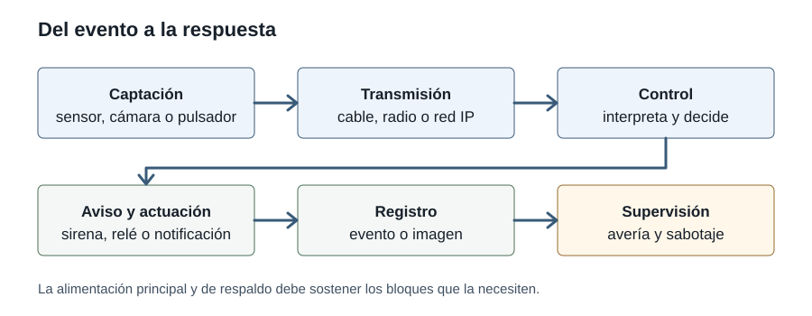<figcaption>La supervisión de averías y la alimentación sostienen la capacidad del sistema para detectar y responder.</figcaption></figure>

La **captación** transforma una condición física en información: una cámara obtiene imágenes, un contacto magnético indica apertura y un detector de humo reconoce un fenómeno asociado al fuego. La **transmisión** lleva esa información a la **unidad de control**, que la interpreta según su programación. La salida puede ser una sirena, una luz, un relé, una comunicación remota o una grabación. El **registro** conserva los eventos necesarios y la **supervisión** informa de cortes, averías, sabotajes o fallos de alimentación. La respuesta debe ser coherente con el riesgo y con el proyecto.

> **Ejemplo razonado — una alarma que parece funcionar**
>
> Un contacto de puerta cambia de estado al abrirse, pero el cable que lo une a la central está cortado. Si la línea está supervisada, la central mostrará una avería o un sabotaje aunque nadie abra la puerta. Si no vigila la integridad de la línea, el fallo puede pasar inadvertido. La diferencia no está en el contacto, sino en el diseño del circuito y en la programación de la central.

## 1. Cadenas funcionales de los principales sistemas

Una **cadena funcional** representa el recorrido de la información desde que se capta un fenómeno hasta que el sistema genera una respuesta. Su forma general es **captación o detección → transmisión → control o procesamiento → aviso, actuación o registro**. No debe confundirse con el recorrido de la corriente: la señal y la energía pueden circular por conductores distintos o compartir el mismo medio, como sucede con Ethernet y la alimentación a través de Ethernet (PoE, *Power over Ethernet*).

La **alimentación** es un bloque transversal. Suministra energía a cámaras, detectores, centrales, grabadores, equipos de red y actuadores; cuando la continuidad del servicio resulta necesaria, incorpora una fuente secundaria o una batería. Un diagrama funcional ayuda a reconocer relaciones entre equipos, pero no sustituye un esquema de conexión, las instrucciones del fabricante ni los cálculos del proyecto.

> **Idea clave**
>
> La cadena funcional explica cómo se obtiene información, cómo llega a la unidad que decide y qué respuesta produce. La alimentación permite que esas funciones se mantengan, pero no constituye el último paso de la cadena.

### 1.1. Detección de incendios convencional

En un sistema convencional, los detectores automáticos y los pulsadores modifican el estado eléctrico de una **zona supervisada**. La central interpreta ese cambio, identifica la zona afectada y gobierna las salidas previstas, como los avisadores acústicos. La **resistencia de fin de línea (EOL, *End Of Line*)** permite supervisar el circuito según el diseño del fabricante. Por tanto, el detector no alimenta ni activa directamente la sirena: ambos se relacionan a través de la central.

<figure class="study-figure"><a href="../img/cadena-incendios-convencional.webp" target="_blank" rel="noopener noreferrer" aria-label="Ampliar el diagrama funcional de detección de incendios convencional en una pestaña nueva">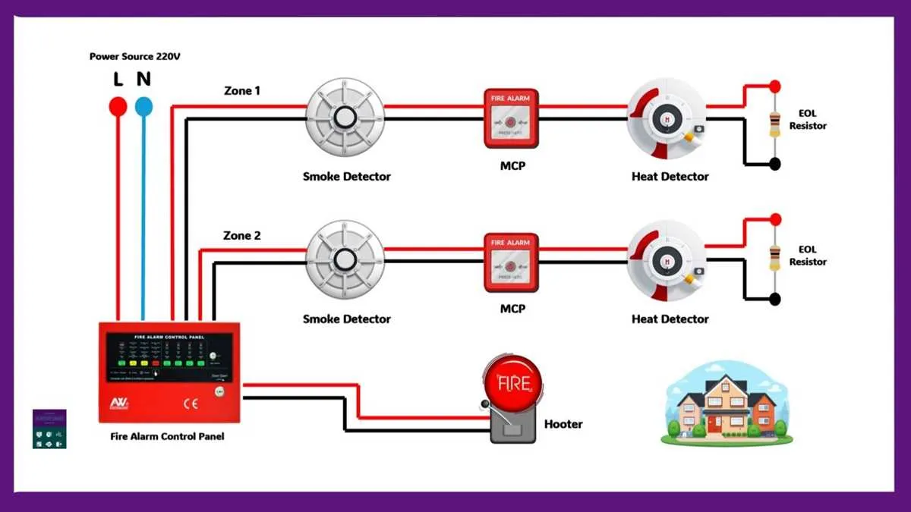</a><figcaption>Cadena funcional: detector o pulsador → zona supervisada → central → avisador. La resistencia EOL permite supervisar el estado de la línea; no es un dispositivo de detección. Es un esquema simplificado y no sirve como instrucción de conexionado. Fuente: <a href="https://wiringall.com/fire-alarm-system-wiring-diagram.html">WiringAll, «Fire Alarm System Wiring Diagram»</a>. Pulsa para ampliar.</figcaption></figure>

Esta resistencia permite que la central diferencie determinados estados de la zona, como reposo, alarma o fallo. En el dibujo aparece situada al final de cada circuito para que también pueda detectarse una interrupción anterior. La alimentación de red y la batería de la central sostienen la función, pero quedan fuera de la secuencia detector → decisión → aviso.

### 1.2. Intrusión

Un sistema de intrusión combina entradas diferentes —contactos magnéticos, detectores infrarrojos pasivos (PIR, *Passive Infrared*), barreras o pulsadores— con una central que procesa sus estados. La comunicación puede ser cableada, por bus o inalámbrica. Cuando la programación reconoce una condición de alarma, la respuesta puede ser local, mediante sirena o señal luminosa, y remota, mediante una comunicación hacia una central receptora u otra persona autorizada.

<figure class="study-figure"><a href="../img/cadena-intrusion.webp" target="_blank" rel="noopener noreferrer" aria-label="Ampliar el diagrama funcional de un sistema de intrusión en una pestaña nueva">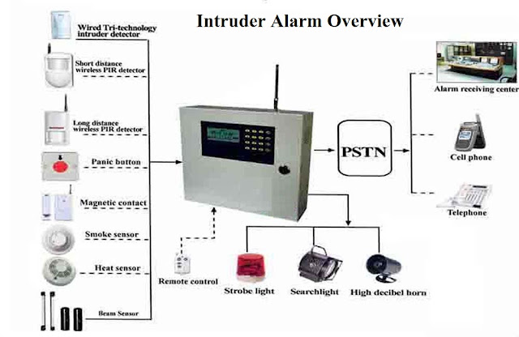</a><figcaption>Cadena funcional: detector o pulsador → enlace cableado o radio → central de intrusión → aviso local y transmisión remota. El esquema muestra la red telefónica pública conmutada (PSTN, <em>Public Switched Telephone Network</em>), una tecnología histórica; en instalaciones actuales son habituales el protocolo de Internet (IP, <em>Internet Protocol</em>) y las redes móviles. Los detectores de humo o temperatura dibujados no convierten esta central en un sistema reglamentario de detección de incendios. Fuente: <a href="https://arindamcctvaccesscontrol.blogspot.com/2016/11/british-and-european-intruder-alarm.html">Arindam, «Intruder Alarm Overview»</a>. Pulsa para ampliar.</figcaption></figure>

La cadena no termina necesariamente en una sirena. Una salida local puede advertir en el edificio, mientras una ruta de comunicación transmite el evento para su verificación. Debe distinguirse también el **sensor** que origina la información del **actuador** que produce el aviso: aunque ambos estén conectados a la misma central, cumplen funciones opuestas.

### 1.3. Circuito cerrado de televisión (CCTV) sobre coaxial

En CCTV sobre coaxial, la cámara genera la señal de vídeo y la conduce hasta un **grabador digital de vídeo (DVR, *Digital Video Recorder*)**. El grabador recibe los canales, los procesa, los almacena y entrega imagen al monitor. Su interfaz de red permite consultar el sistema desde equipos autorizados, pero esa conexión exterior no sustituye el enlace de vídeo existente entre cada cámara y el DVR.

<figure class="study-figure"><a href="../img/cadena-cctv-coaxial.webp" target="_blank" rel="noopener noreferrer" aria-label="Ampliar el diagrama funcional de CCTV sobre coaxial en una pestaña nueva">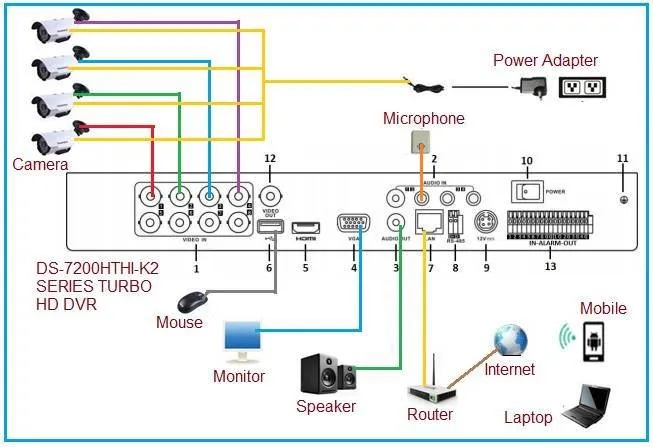</a><figcaption>Cadena funcional: cámara → enlace de vídeo sobre coaxial → DVR → almacenamiento y visualización; el router añade acceso remoto. El equipo Turbo HD (<em>High Definition</em>, alta definición) representa vídeo de alta definición sobre coaxial, no el sistema analógico PAL (<em>Phase Alternating Line</em>) clásico. Fuente: <a href="https://www.rfwireless-world.com/terminology/analog-cctv-vs-ip-cctv">RF Wireless World, «Analog CCTV vs IP CCTV»</a>. Pulsa para ampliar.</figcaption></figure>

El dibujo reúne funciones principales y auxiliares. Las cámaras, el medio de transmisión y el DVR forman la cadena de vídeo; el monitor y el ratón permiten operar; el router proporciona comunicación con la red; el micrófono y el altavoz añaden audio cuando el sistema y su uso lo permiten. Identificar esas funciones evita interpretar todos los cables como si transportasen la misma señal.

### 1.4. CCTV IP

Una **cámara IP** es un dispositivo de red: capta la escena, codifica el vídeo y genera datos que circulan por Ethernet. Si la cámara y el conmutador admiten **PoE**, el mismo cable transporta comunicación y alimentación, aunque ambas funciones siguen siendo conceptualmente distintas. El **grabador de vídeo en red (NVR, *Network Video Recorder*)** recibe los flujos de vídeo a través de la red, los registra y facilita su consulta.

<figure class="study-figure"><a href="../img/cadena-cctv-ip.webp" target="_blank" rel="noopener noreferrer" aria-label="Ampliar el diagrama funcional de CCTV IP con PoE en una pestaña nueva">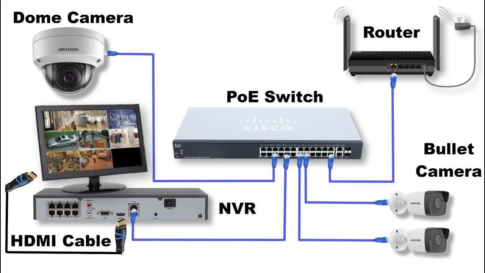</a><figcaption>Cadena funcional: cámara IP → Ethernet y PoE → conmutador → NVR → almacenamiento y visualización; el router comunica la red con otros equipos autorizados. El esquema muestra relaciones funcionales, no todos los requisitos de configuración o ciberseguridad. Fuente: <a href="https://dk.delgatdataentry.com/">Delgat Data Entry</a>. Pulsa para ampliar.</figcaption></figure>

En esta arquitectura, el conmutador transporta los datos entre cámaras, grabador y otros equipos de la red. El router solo es necesario cuando se requiere comunicación entre redes o acceso exterior; no debe suponerse que toda cámara tenga que quedar expuesta a Internet. La dirección IP, los permisos, la segmentación y las actualizaciones forman parte del funcionamiento seguro del sistema.

### 1.5. Control de accesos

La cadena básica de una puerta es **credencial → lector → controlador → elemento de cierre y registro**. El lector obtiene un identificador de una tarjeta, huella o código y lo transmite al controlador. El controlador aplica las reglas de autorización; si permite el paso, gobierna la cerradura y registra el resultado junto con la puerta, la identidad y la hora cuando esa información forma parte del sistema.

<figure class="study-figure"><a href="../img/cadena-control-accesos.webp" target="_blank" rel="noopener noreferrer" aria-label="Ampliar el diagrama funcional de control de accesos en una pestaña nueva">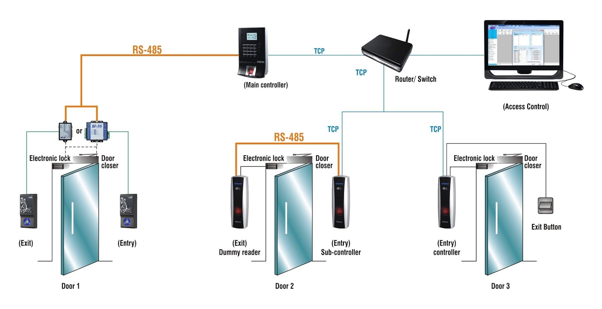</a><figcaption>Para leer el conjunto, seguid primero una sola puerta: credencial → lector → controlador → cerradura; después incorporad el registro y la gestión centralizada. La interfaz serie RS-485 permite comunicar equipos mediante un bus. El protocolo de control de transmisión (TCP, <em>Transmission Control Protocol</em>) aparece como abreviatura gráfica de comunicación de red y no identifica por sí solo un tipo de cable. Fuente: <a href="https://andy811geglibguide.z21.web.core.windows.net/access-control-system-block-diagram.html">Andy811 Geglib Guide, «Access Control System Block Diagram»</a>. Pulsa para ampliar.</figcaption></figure>

El pulsador de salida, el contacto de puerta y el cierrapuertas completan la operación física. El contacto confirma si la hoja está abierta o cerrada; por ello una orden de apertura registrada no demuestra que la puerta se haya movido. La comunicación RS-485 o de red permite integrar varias puertas y un ordenador de gestión, pero la decisión puede residir en el controlador local según la arquitectura.

### 1.6. Comparación de las cadenas

| Sistema | Captación o detección | Transmisión | Control o procesamiento | Respuesta o registro |
|---|---|---|---|---|
| Incendios | Detector de humo o temperatura y pulsador. | Zona o bus. | Central de incendios. | Avisadores, señalización y maniobras previstas. |
| Intrusión | PIR, contacto magnético, barrera o pulsador. | Cable, bus o radio. | Central de intrusión. | Sirena, comunicación y registro. |
| CCTV sobre coaxial | Cámara. | Coaxial u otro medio compatible. | DVR. | Grabación, monitor y acceso remoto. |
| CCTV IP | Cámara IP. | Ethernet e IP. | NVR o software de gestión. | Grabación, monitor y acceso remoto. |
| Control de accesos | Lector de tarjeta, huella o número de identificación personal (PIN, *Personal Identification Number*). | Interfaz de lector, RS-485 o red, según el equipo. | Controlador. | Cerradura, estado de puerta y registro. |

La tabla permite reconocer una función aunque cambie el equipo. Una cámara IP integra captación y codificación; un conmutador transmite datos y puede suministrar PoE; un NVR procesa y registra. En todos los sistemas se comprueba además la alimentación: puede proceder de una fuente de 12 V o 24 V, de una central, de PoE o de equipos independientes, con respaldo cuando lo exijan el diseño y la normativa.

> **Comprueba lo aprendido — CCTV coaxial e IP**
>
> - **Situación:** una instalación utiliza cámaras con conector de bayoneta Neill-Concelman (BNC) y DVR; otra emplea cámaras IP, conmutador PoE y NVR.
> - **Tarea:** dibuja las dos cadenas funcionales desde la cámara hasta la visualización y señala qué cambia en captación, transmisión, alimentación y grabación.
> - **Resultado:** dos esquemas y tres diferencias explicadas con una frase cada una.

## 2. Clasificación de los sistemas de seguridad electrónica

La clasificación más útil atiende a la finalidad. En un mismo edificio pueden coexistir detección de incendios, intrusión, videovigilancia y control de accesos; compartir canalizaciones o una interfaz de gestión no convierte sus requisitos en equivalentes. Cada subsistema identifica fenómenos distintos y obedece a reglas técnicas y legales propias.

| Sistema | Situación que capta | Respuesta habitual |
|---|---|---|
| Incendios | Humo, temperatura, llama o aviso manual. | Alarma, señalización y maniobras previstas en el proyecto. |
| Gases | Concentración de un gas o deficiencia de oxígeno. | Aviso y, si procede, ventilación o corte de suministro. |
| Intrusión | Apertura, movimiento, rotura o intento de acceso. | Alarma local y transmisión para verificación. |
| CCTV | Imágenes de una zona definida. | Visualización, grabación o verificación de un evento. |
| Control de accesos | Credencial y estado de una puerta. | Autorizar, denegar o registrar el paso. |

La tabla no permite intercambiar componentes. Un detector de humo, una cámara y un sensor PIR pueden parecer pequeños dispositivos de techo o pared, pero realizan funciones diferentes. Incluso dentro de una misma familia hay que comprobar la compatibilidad con la central, la alimentación y las condiciones de montaje.

### 2.1. Detección y alarma de incendios

La detección de incendios busca reconocer lo antes posible fenómenos asociados al fuego y avisar a las personas o a otros sistemas. Puede combinar detectores automáticos, pulsadores manuales, una central de control, dispositivos acústicos y ópticos, alimentación principal y batería. La central también debe indicar estados de fallo, como pérdida de comunicación o alimentación defectuosa.

<figure class="content-photo">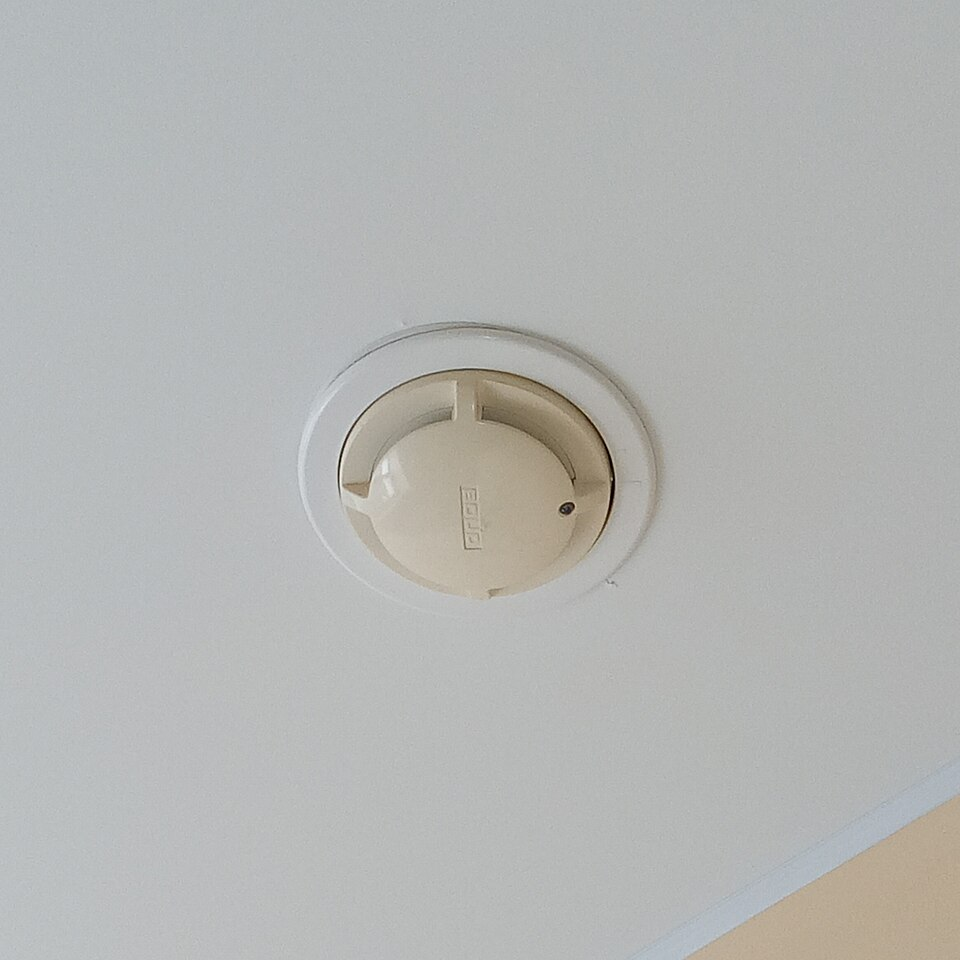<figcaption>Este detector es una entrada automática; su ubicación y tecnología se identifican en el plano y en la ficha del fabricante. La fotografía no acredita que esté conectado a una central. Fotografía: <a href="https://commons.wikimedia.org/wiki/File:Smoke_detector_on_the_stretch_ceiling_(02).jpg">Georg Pik, Creative Commons Zero 1.0 (CC0 1.0)</a>.</figcaption></figure>

**Detectar** no es **extinguir**. El detector o pulsador informa; un sistema de extinción intenta controlar el fuego mediante otro equipamiento. Algunas instalaciones coordinan maniobras sobre puertas, ventilación u otros equipos, pero estas deben estar previstas en el diseño. No todo aviso implica automáticamente cortar la electricidad o activar una extinción. Para comprobar las obligaciones de instalación y mantenimiento se consulta el [Reglamento de instalaciones de protección contra incendios (RIPCI)](https://www.boe.es/buscar/act.php?id=BOE-A-2017-6606), no las reglas de una alarma de intrusión.

### 2.2. Detección de gases

Un detector de gases mide una magnitud del ambiente y la compara con los umbrales establecidos para un riesgo concreto. Puede advertir de una sustancia inflamable o tóxica, de una fuga vinculada a un proceso o de una atmósfera con falta de oxígeno. La **ubicación** resulta decisiva: la densidad del gas, la ventilación, la geometría del recinto y las fuentes probables de fuga determinan dónde conviene medir. Montar todos los detectores a la misma altura por costumbre puede dejar sin vigilancia la zona donde se acumula el gas.

La señal debe llegar a una unidad capaz de advertir a las personas y, cuando esté previsto, activar ventilación o interrumpir un suministro. Esta respuesta necesita coordinación con el proyecto. Un detector que mide una concentración no convierte por sí solo un recinto en seguro ni sustituye el mantenimiento de la instalación que puede originar la fuga.

### 2.3. Intrusión, robo y atraco

Un sistema de **intrusión** intenta reconocer un acceso no autorizado antes o durante su entrada en la zona protegida. Se estudian los recorridos probables, los cerramientos y los puntos vulnerables; después se combinan detectores adecuados. Un contacto magnético vigila la apertura de una puerta o ventana, un detector PIR observa cambios de radiación infrarroja compatibles con movimiento y una barrera activa reconoce la interrupción de un haz. La protección depende tanto de su colocación como de la reacción ante averías o sabotajes.

El aviso de **robo o atraco** responde a una situación diferente: puede comenzar por la activación voluntaria de un dispositivo de aviso cuando una persona está amenazada. Por eso no se trata la señal de atraco como si fuese un detector de movimiento. La forma de verificación y comunicación a una central receptora está regulada en el ámbito de la seguridad privada.

<figure class="study-figure">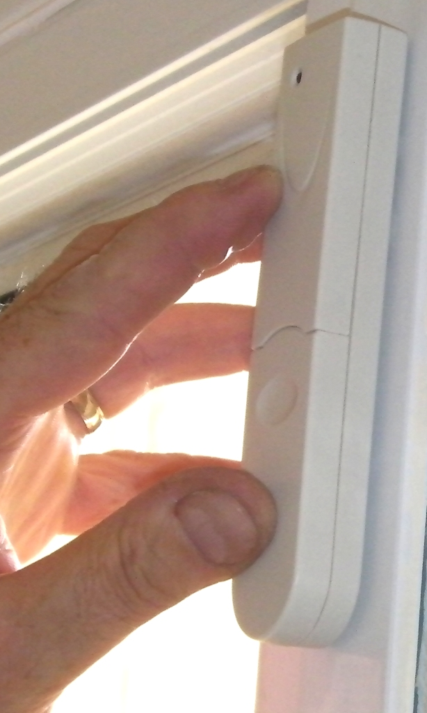<figcaption>El contacto y el imán deben corresponder con el mismo acceso y quedar alineados cuando la puerta cierra. La fotografía muestra el montaje, no permite comprobar por sí sola la supervisión de la zona. Fotografía: <a href="https://commons.wikimedia.org/wiki/File:Installing_a_Magnetic_Door_Contact.JPG">Ndamack, Creative Commons Atribución-CompartirIgual 3.0 (CC BY-SA 3.0)</a>.</figcaption></figure>

<figure class="content-photo">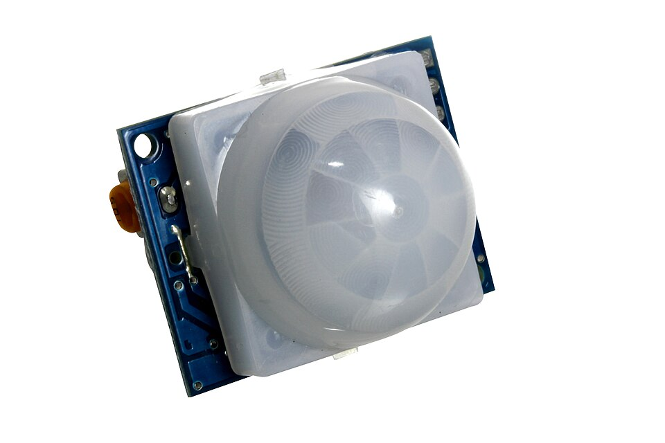<figcaption>La lente segmenta el campo observado por el sensor. Un PIR es pasivo: detecta cambios de radiación infrarroja, no emite un haz de vigilancia. Fotografía: <a href="https://commons.wikimedia.org/wiki/File:PIR_Motion_Detector.jpg">oomlout, CC BY-SA 2.0</a>.</figcaption></figure>

<figure class="study-figure"><a href="../img/pir-barrera-activa.svg" target="_blank" rel="noopener noreferrer" aria-label="Ampliar la comparación entre PIR y barrera infrarroja en una pestaña nueva">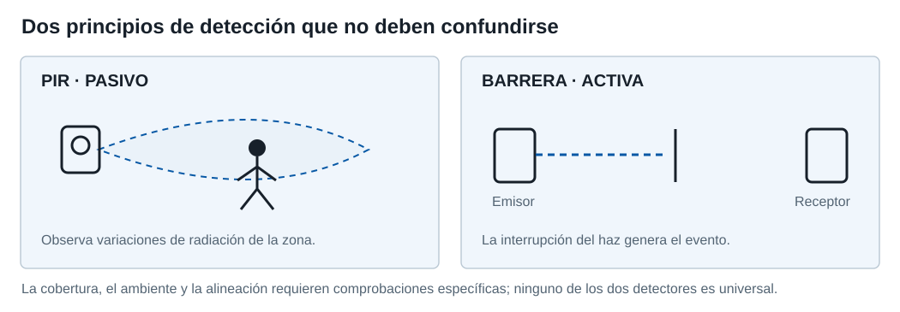</a><figcaption>Una barrera activa emplea emisor y receptor; el PIR no proyecta ese haz. La <a href="https://www.optex-europe.com/products/intrusion-detection/ax-200tf">ficha de una barrera real de OPTEX</a> permite reconocer el conjunto de equipos y sus límites de aplicación. Pulsa para ampliar.</figcaption></figure>

> **Ejemplo razonado — cobertura y falsas alarmas**
>
> Un PIR orientado hacia una ventana soleada puede responder a variaciones del entorno que no corresponden a una intrusión. Cambiar la sensibilidad sin revisar la ubicación quizá reduzca los avisos, pero también puede crear una zona sin detección. Primero se analiza la causa, la cobertura y el ambiente; después se decide si hay que reubicar, cambiar o ajustar el detector.

### 2.4. Circuito cerrado de televisión

Un **circuito cerrado de televisión (CCTV)** capta imágenes destinadas a un grupo limitado de usuarios autorizados. La instalación puede permitir observación en directo, grabación, consulta posterior o verificación de alarmas. Sus bloques básicos son cámara y óptica, transmisión, alimentación, grabador o servidor, almacenamiento e interfaz de visualización. Ver imagen en un monitor no demuestra que el disco esté grabando ni que conserve los archivos.

En un sistema **analógico**, la cámara entrega una señal de vídeo al grabador mediante un enlace apropiado, habitualmente coaxial. En uno **IP**, la cámara codifica imágenes y las comunica por la red; puede obtener alimentación mediante PoE si todos los equipos implicados lo admiten. Existen soluciones híbridas y formatos de alta definición sobre coaxial, de modo que la denominación comercial del grabador no basta para describir la arquitectura. La [introducción técnica de Axis a la videovigilancia](https://newsroom.axis.com/blog/video-surveillance) permite distinguir cámara, red y grabador.

Un sistema puede analizar la imagen para señalar movimiento, cruce de una línea o presencia de determinados objetos. Esta **analítica de vídeo** depende de las prestaciones del equipo, de su configuración y de las condiciones de iluminación; no convierte toda cámara IP en «inteligente» ni implica necesariamente identificar personas. Antes de usar una alerta automática se comprueban su finalidad, los errores posibles y sus efectos sobre la privacidad.

<figure class="study-figure"><a href="../img/video-analitica-evento.svg" target="_blank" rel="noopener noreferrer" aria-label="Ampliar el ejemplo de analítica de vídeo en una pestaña nueva">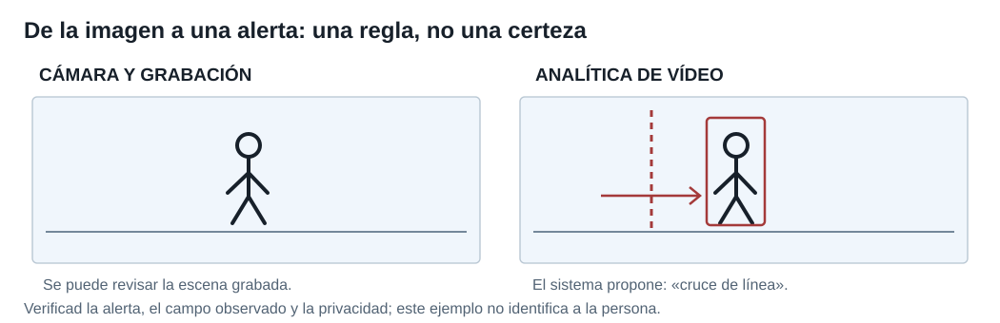</a><figcaption>Una regla configurada puede señalar un evento; la grabación y la alerta no acreditan por sí solas quién aparece ni qué ha ocurrido. Pulsa para ampliar.</figcaption></figure>

**Vídeo — Diferencias entre cámaras IP y analógicas.** Observad qué medio transporta el vídeo, dónde se digitaliza y qué relación tiene cada cámara con el grabador. El vídeo sirve para comparar arquitecturas; precios y prestaciones concretas se verifican en fichas actuales.

https://www.youtube.com/watch?v=u3BXi_ro_rE

<figure class="content-photo">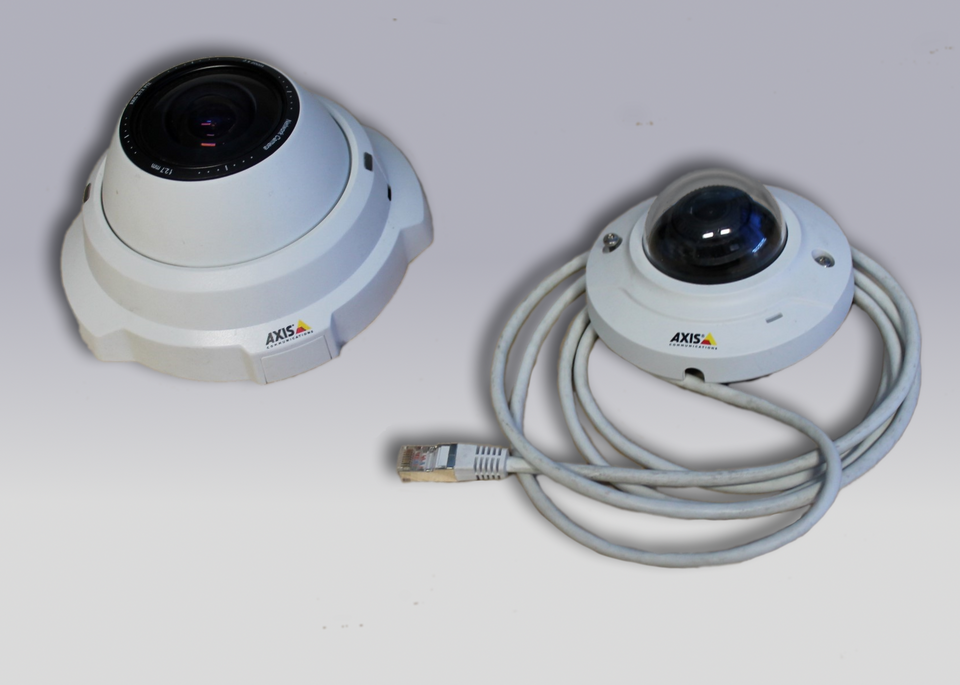<figcaption>La forma «domo» describe la carcasa, no una prestación única. La ficha técnica indica óptica, resolución, interfaz, alimentación y condiciones ambientales. Fotografía: <a href="https://commons.wikimedia.org/wiki/File:Axis_ip_dome_cameras.png">Bungle, CC BY-SA 4.0</a>.</figcaption></figure>

La imagen de una persona identificada o identificable es un dato personal. Una cámara técnicamente viable puede no ser admisible en el lugar o con el encuadre elegido. Antes de fijar su posición se analiza la finalidad, la zona realmente necesaria, quién accederá a las imágenes y cómo se informará a las personas. Estos límites se desarrollan en el apartado de protección de datos.

### 2.5. Accesos, presencia y seguimiento

El **control de accesos** decide si se autoriza el paso por una puerta o a una zona. Combina habitualmente lector, credencial, controladora, elemento de cierre y contacto que informa del estado de la puerta. La autorización no equivale al movimiento físico: la orden de apertura puede haberse emitido y la puerta seguir cerrada por una avería. Por ello se interpretan conjuntamente los eventos de control y las señales de estado.

El **control de presencia** registra entradas, salidas o permanencia según una finalidad concreta. El seguimiento de objetos o vehículos puede utilizar identificación por radiofrecuencia (RFID, *Radio Frequency Identification*), redes móviles o posicionamiento. Aunque todos identifican o registran eventos, no comparten automáticamente legitimación, equipamiento ni plazos de conservación de datos.

> **Comprueba lo aprendido — sistema y función de cada equipo**
>
> - **Elementos:** detector de humo · PIR · cámara · lector · central de incendios · central de intrusión · DVR · NVR · sirena · cerradura eléctrica.
> - **Tarea:** asigna cada elemento a incendios, intrusión, CCTV o control de accesos y clasifícalo como detector o captador, unidad de control, grabador, interfaz o actuador.
> - **Resultado:** una tabla de diez filas; si un equipo realiza más de una función, indica cuál es la principal y cuál es la adicional.

## 3. Elementos que constituyen una instalación

Un esquema profesional relaciona cada **bloque funcional** con un elemento real. Debe incluir una leyenda, identificadores de equipos y conexiones para seguir el recorrido de la señal y de la energía. Un símbolo aislado no basta: una «C» puede representar una cámara o una central según el plano. La leyenda y las conexiones eliminan esa ambigüedad.

La lámina siguiente reúne **dieciocho elementos frecuentes**. Sus formas para CCTV, intrusión y accesos son una convención didáctica: no existe una abreviatura válida para todos los proyectos. Para incendios, la [guía técnica sobre detección y alarma, apartado 15](https://www.diba.cat/documents/467843/96195101/P1E07011GuiaDeteccion_automatica_incendios_Asepeyo.pdf/fea05314-5cd8-4f9d-89c3-09c64f1eeb18) permite contrastar símbolos de plano; utilizadla como referencia gráfica, no como legislación vigente. El [material docente del módulo Circuito cerrado de televisión y seguridad electrónica (CCTSE), apartado 3.2](https://sarreplec.caib.es/pluginfile.php/13809/mod_folder/content/0/IT_CCTSE02_2020_VI.pdf?forcedownload=1) explica por qué la simbología debe acompañarse de convenciones de representación.

<figure class="study-figure"><a href="../img/leyenda-sistemas-seguridad.svg" target="_blank" rel="noopener noreferrer" aria-label="Ampliar la leyenda de sistemas de seguridad en una pestaña nueva">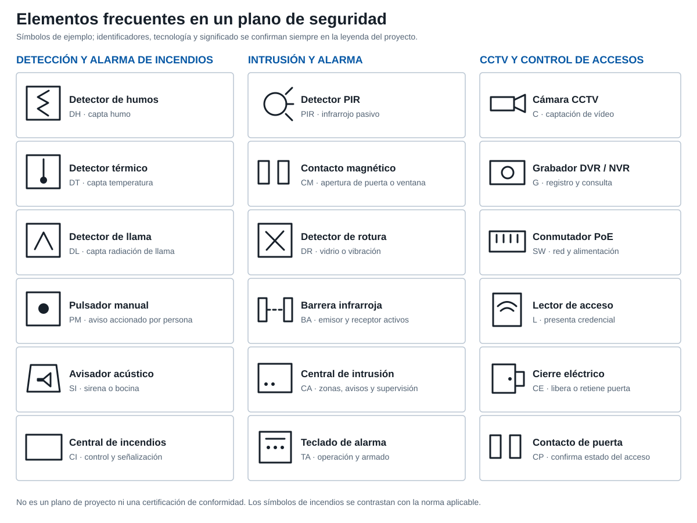</a><figcaption>Reconoced primero la función y después la abreviatura. En una instalación concreta prevalecen la leyenda del plano, la norma aplicable y la ficha del equipo. Pulsa para ampliar.</figcaption></figure>

Un plano de planta muestra habitaciones, cerramientos, puertas y accesos. Antes de colocar equipos en él hay que localizar estas referencias y comprobar su escala. La siguiente imagen es una **planta arquitectónica**, todavía sin seguridad electrónica: sirve para practicar la lectura de espacios y recorridos, no para deducir ubicaciones reglamentarias de detectores o cámaras.

<figure class="study-figure"><a href="../img/plano-planta-ejemplo.jpg" target="_blank" rel="noopener noreferrer" aria-label="Ampliar el plano de planta en una pestaña nueva">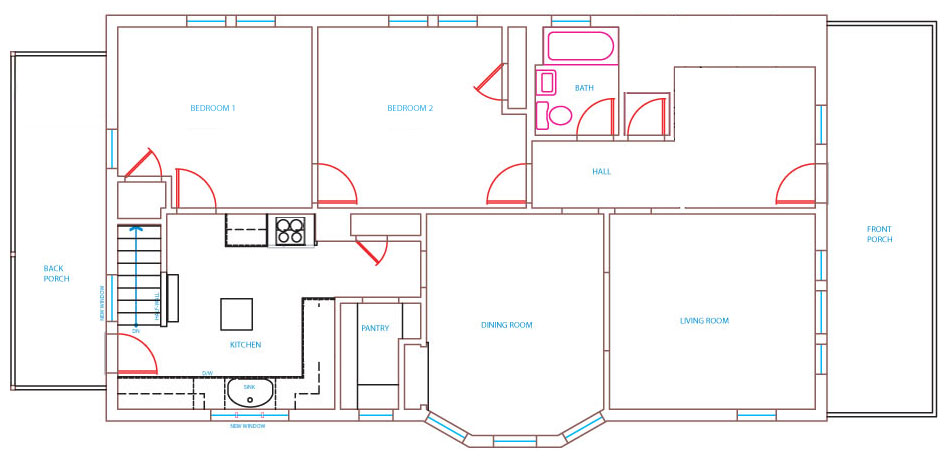</a><figcaption>Localizad la entrada, las puertas entre estancias y los recintos donde habría que comprobar cobertura y recorridos. Plano: <a href="https://commons.wikimedia.org/wiki/File:First_story_floor_plan.jpg">Juhan Sonin, CC BY 2.0</a>. Pulsa para ampliar.</figcaption></figure>

Al añadir elementos de seguridad, cada marca necesita **ubicación, código y significado**. En el ejemplo, «DH1» identifica un detector de humos, «C1» una cámara y «G1» un grabador. Una línea azul representa un recorrido de comunicación, pero no define aún el cable ni el protocolo; las áreas rojas son coberturas ilustrativas que deberían comprobarse sobre el terreno.

<figure class="study-figure"><a href="../img/plano-seguridad-lectura.svg" target="_blank" rel="noopener noreferrer" aria-label="Ampliar el ejemplo de plano de seguridad en una pestaña nueva">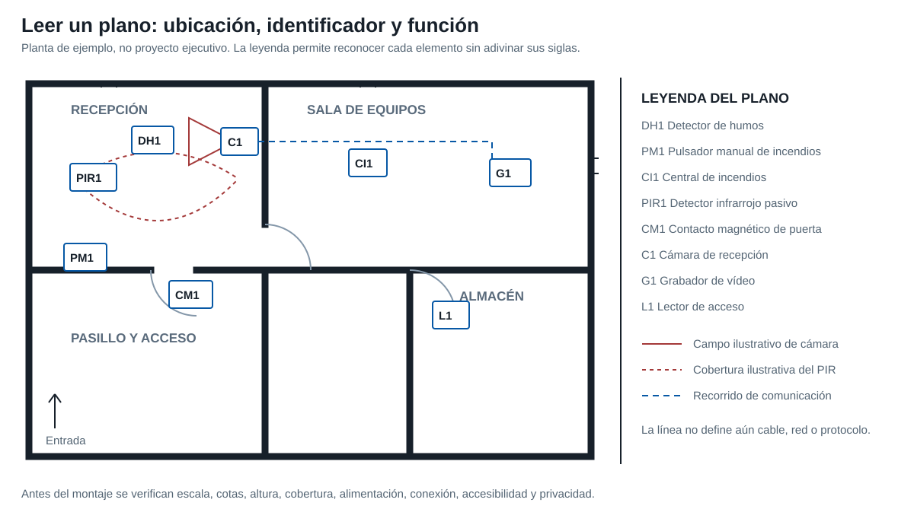</a><figcaption>Leed el plano en este orden: planta y accesos, marca de cada equipo, leyenda, cobertura y conexión. No se trata de un proyecto ejecutivo ni de una propuesta de ubicación normativa. Pulsa para ampliar.</figcaption></figure>

El plano siguiente permite pasar del símbolo aislado al documento técnico. Localizad primero la leyenda y, después, seguid sobre la planta sus cuatro capas de información: los símbolos de cámara, los arcos rojos de cobertura, los recorridos de cable en azul y el grabador digital. La forma gráfica de una cámara puede variar respecto a la leyenda didáctica anterior; por eso el significado debe comprobarse siempre en la leyenda del propio plano.

<figure class="study-figure"><a href="../img/plano-cctv-real-con-simbologia.jpg" target="_blank" rel="noopener noreferrer" aria-label="Ampliar el plano real de CCTV con simbología, cobertura y cableado en una pestaña nueva">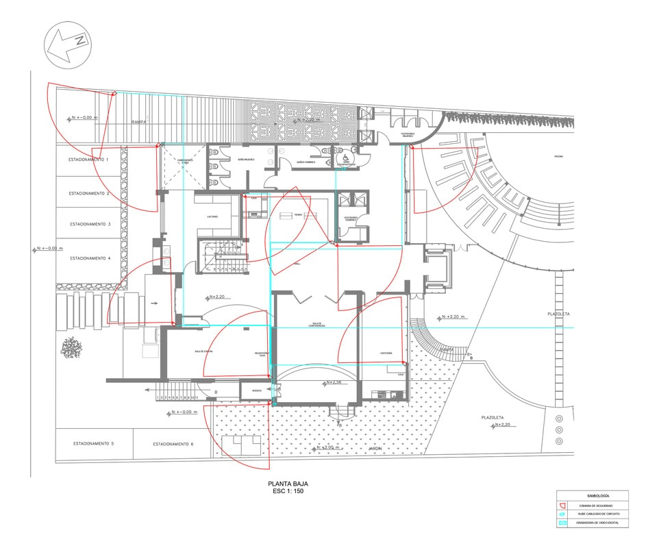</a><figcaption>Plano real de una instalación de CCTV. Comprobad si cada cámara cubre el acceso o espacio previsto y seguid su recorrido hasta el grabador antes de interpretar la instalación. Las convenciones gráficas del documento sirven como ejemplo de lectura y no sustituyen la documentación ni la normativa aplicables al proyecto. Fuente: <a href="https://kiesarquitecturainterior.weebly.com/cctv.html">Estefanía King Baca, «Instalaciones de CCTV»</a>. Pulsa para ampliar.</figcaption></figure>

> **Comprueba lo aprendido — lectura de un plano**
>
> - **Situación:** utiliza el plano real de CCTV anterior y comienza por su leyenda.
> - **Tarea:** localiza un símbolo de cámara, su campo de cobertura, el recorrido del cable y el equipo de grabación; sigue después una conexión completa sobre la planta.
> - **Resultado:** una captura anotada o una lista numerada con cinco indicaciones. No deduzcas del plano datos que no figuren en él.

### 3.1. Unidad de control y alimentación

La **central de control** recibe señales, las interpreta y gobierna salidas. Comprende electrónica de proceso, memoria de programación, entradas, salidas, interfaz de usuario y fuente de alimentación. En grandes instalaciones puede comunicarse con otros equipos o con software de supervisión, pero sigue siendo necesario identificar qué dispositivo toma cada decisión. En CCTV la gestión puede residir en un DVR, un NVR o un servidor de vídeo; no se llama «central de alarmas» a cualquiera de ellos.

Una central diferencia reposo, alarma, avería y sabotaje. La programación define qué hacer ante cada estado. La apertura autorizada de una puerta puede quedar registrada sin activar sirena, mientras que una apertura no autorizada durante el cierre sí genera alarma. Si la batería sostiene el funcionamiento después de perder alimentación de red, el fallo de red debe aparecer como incidencia.

<figure class="content-photo">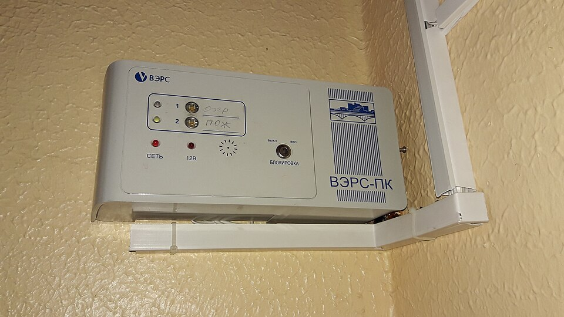<figcaption>Una central procesa estados y permite operación; no es solo un punto de conexión. La imagen ilustra el bloque funcional, no la conformidad del producto con normas españolas. Fotografía: <a href="https://commons.wikimedia.org/wiki/File:Fire_alarm_control_panel_VERS-PK_2.jpg">Georg Pik, CC0 1.0</a>.</figcaption></figure>

La **alimentación principal** suministra la energía ordinaria. La **alimentación de respaldo**, si el sistema la requiere, mantiene los bloques esenciales durante una interrupción. Una batería instalada no garantiza autonomía: se comprueban su estado, capacidad, cargador, consumo y periodicidad de pruebas. Una caída de tensión en un tendido largo también puede impedir el funcionamiento aunque la fuente entregue la tensión nominal. El cálculo y la ficha técnica prevalecen sobre una regla universal de «12 V para todo».

### 3.2. Detectores, pulsadores y zonas

Los **detectores** convierten una magnitud física o un cambio de estado en una señal interpretable. Pueden observar humo, temperatura, movimiento, apertura o rotura; cada principio exige una ubicación adecuada. Un **pulsador manual** permite que una persona genere deliberadamente un aviso. Ambos son entradas, pero su significado operativo difiere: una activación manual no se explica por los mismos factores que una respuesta automática al ambiente.

<figure class="content-photo">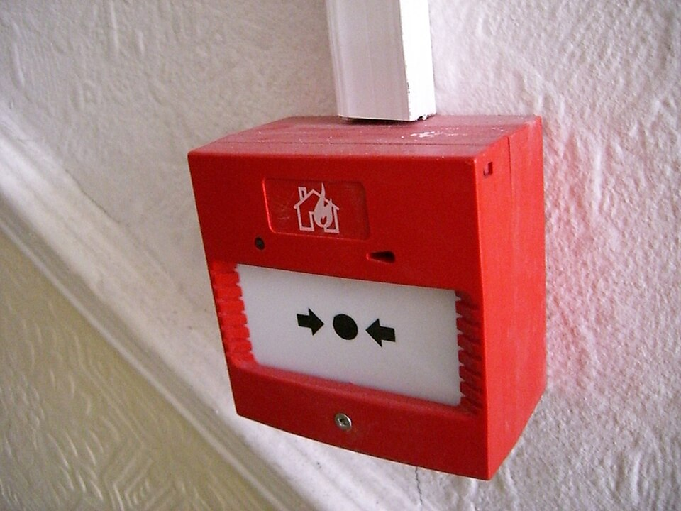<figcaption>El pulsador informa de una activación humana; no mide humo ni temperatura. En el plano debe tener identificador y relación con la central correspondiente. Fotografía: <a href="https://commons.wikimedia.org/wiki/File:Manual_call_point_1.jpg">Edward Betts, dominio público</a>.</figcaption></figure>

Una **zona** agrupa señales que la central interpreta de forma conjunta o identificable. Esta división ayuda a localizar el evento y organizar la respuesta. Un sistema de incendios puede emplear lazos y direccionamiento según su tecnología; uno de intrusión puede supervisar un circuito mediante resistencia de fin de línea para distinguir reposo, alarma, corte y cortocircuito. La **resistencia de fin de línea** permite vigilar la integridad de un circuito compatible y bien configurado; no «mejora» por sí sola el detector.

### 3.3. Actuadores, avisos e interfaces

Los **actuadores** realizan una acción física, como gobernar un relé, una cerradura o una maniobra prevista en el proyecto. Los dispositivos de **señalización** comunican una condición mediante sonido, luz o pantalla. Una sirena de intrusión, una alarma de incendio y una baliza de estado pueden compartir principios electrónicos, pero sus funciones y requisitos de ubicación no son iguales.

Los teclados, lectores, paneles repetidores y aplicaciones de operación son **interfaces**. Permiten autorizar, consultar, programar o reconocer estados; no sustituyen ni la central ni el sensor. La documentación debe indicar quién puede operar cada función y qué ocurre si la interfaz queda fuera de servicio.

### 3.4. Central receptora de alarmas

La **Central Receptora de Alarmas (CRA)** presta un servicio remoto de recepción, verificación y gestión de señales procedentes de instalaciones conectadas. No debe confundirse con la central situada en el edificio: una gestiona procedimientos y avisos a distancia; la otra detecta y gobierna elementos locales. Una señal transmitida no se comunica automáticamente a las Fuerzas y Cuerpos de Seguridad. La [Orden INT/316/2011](https://www.boe.es/buscar/act.php?id=BOE-A-2011-3170) establece métodos y condiciones de verificación cuando corresponde.

La **verificación por vídeo** puede ayudar a interpretar una señal de intrusión si las imágenes corresponden a la zona afectada y se tratan de acuerdo con protección de datos. El enlace hacia la CRA también necesita supervisión: la pérdida de red no prueba que haya un intruso, pero puede dejar la instalación sin aviso exterior.

> **Ejemplo razonado — tres fallos diferentes**
>
> «Zona 2: corte» señala un problema en el circuito de detección; «batería baja» afecta a la alimentación de respaldo; «pérdida de enlace» afecta a la comunicación exterior. Los tres requieren comprobaciones distintas y no se agrupan bajo la etiqueta genérica de «alarma».

Este vídeo introductorio de SATEL muestra la relación entre detectores, central, teclados y avisos, y distingue qué ocurre cuando la alarma está armada, desarmada o parcialmente armada. Los ejemplos son domésticos; en una instalación profesional se comprueban además las exigencias normativas de su uso concreto.

https://www.youtube.com/watch?v=nnBIPDiyRfM

> **Comprueba lo aprendido — estados locales y comunicación con la CRA**
>
> - **Casos:** PIR activado · corte de una zona · batería baja · apertura de la tapa de la central · pérdida de la conexión IP con la CRA.
> - **Tarea:** clasifica cada caso como alarma, avería, sabotaje o fallo de comunicación y representa en un esquema la central local, la sirena, la ruta exterior y la CRA.
> - **Resultado:** una tabla de cinco filas y dos frases que expliquen qué seguiría funcionando si la alarma local se activa, pero la CRA no recibe la señal.

## 4. Medios de comunicación entre componentes

El medio de transmisión transporta señales o datos entre equipos. Elegirlo exige considerar distancia, volumen de información, interferencias, canalización disponible, supervisión del enlace, mantenimiento y coste. «Cableado» no significa infalible y «inalámbrico» no significa que nunca se necesite cable: la alimentación y la comunicación exterior pueden seguir teniendo conexiones físicas.

### 4.1. Cable, coaxial, par trenzado y fibra

Los **conductores multipolares** se emplean para zonas, alimentación, buses o contactos auxiliares. Su continuidad puede vigilarse con circuitos adecuados, pero un tendido mal identificado o próximo a interferencias complica el mantenimiento. Hay que respetar la sección, longitud y condiciones establecidas por fabricante y normativa aplicable.

El **coaxial** fue habitual para vídeo analógico y sigue presente en instalaciones existentes y soluciones de alta definición sobre coaxial. El **par trenzado** se utiliza en Ethernet y puede llevar vídeo IP y alimentación PoE en una misma infraestructura compatible. La **fibra óptica** permite enlaces largos y evita interferencias electromagnéticas en el trayecto óptico, pero requiere interfaces y terminaciones apropiadas. Ninguno se elige solo por su apariencia: se comprueban tipo, conectores, especificación, pérdidas y compatibilidad.

<figure class="content-photo">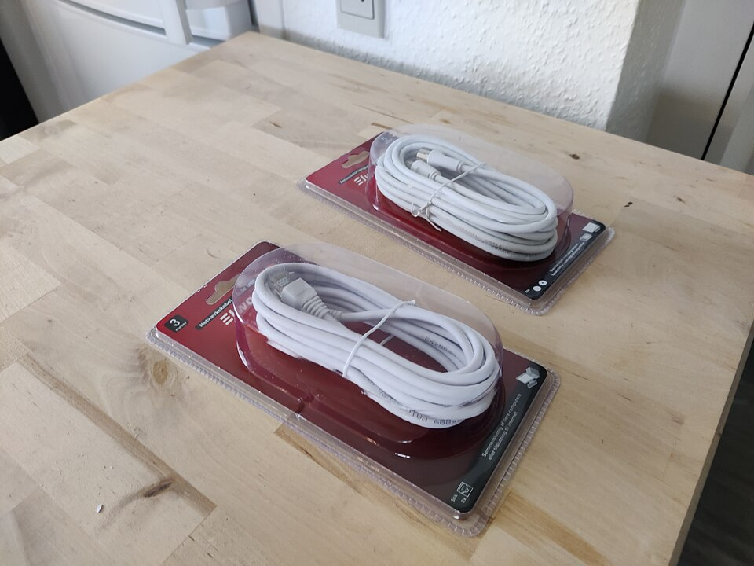<figcaption>El marcaje y la inspección de ambos extremos son más fiables que el color de la cubierta. La foto permite comparar medios físicos, no deducir protocolo o calidad de señal. Fotografía: <a href="https://commons.wikimedia.org/wiki/File:Ethernet_Cat5E_RJ45_cable_%26_coaxial_cable.jpg">Kent Madsen, CC BY-SA 2.0</a>.</figcaption></figure>

### 4.2. Cables, conectores e interfaces habituales

El **cable** es el medio físico, el **conector** termina ese medio y la **interfaz** define características eléctricas, ópticas o lógicas de la comunicación. No son términos equivalentes. Un BNC no indica por sí solo qué formato de vídeo circula por el coaxial; un conector 8P8C no demuestra que exista enlace Ethernet; y RS-485 puede terminar en una borna, un conector modular o una conexión propia del fabricante.

En seguridad electrónica se repiten unas familias concretas. Las demás pueden aparecer en equipos antiguos, ordenadores de gestión o aplicaciones especiales, pero no deben memorizarse todas con la misma prioridad.

| Uso profesional | Cable o medio habitual | Terminación frecuente | Qué debe comprobarse |
|---|---|---|---|
| Vídeo sobre coaxial | Coaxial de 75 Ω adecuado al formato y a la distancia. | BNC. | Impedancia, calidad de terminación, pérdidas y compatibilidad del DVR y la cámara. |
| CCTV IP y equipos de red | Par trenzado de categoría adecuada. | Conector modular de ocho posiciones y ocho contactos (8P8C), denominado habitualmente RJ45 (*Registered Jack 45*). | Categoría, esquema de terminación, longitud, enlace y presupuesto PoE. |
| Zonas, relés, alimentación y buses | Conductores multipolares o pares trenzados según el sistema. | Bornes de tornillo o resorte y conectores del fabricante. | Sección, polaridad, tensión, corriente, supervisión, apantallamiento y comportamiento frente al fuego. |
| Alimentación de equipos | Red de 230 V o baja tensión procedente de una fuente, según el equipo. | Conectores C13/C14 de la Comisión Electrotécnica Internacional (IEC, *International Electrotechnical Commission*), conector cilíndrico de corriente continua o bornes. | Tensión, tipo de corriente, polaridad, potencia, protección y competencia para intervenir. |
| Enlaces de larga distancia o entre edificios | Fibra monomodo o multimodo según el diseño. | Conectores Lucent (LC, *Lucent Connector*) o de abonado (SC, *Subscriber Connector*), normalmente mediante módulos enchufables de pequeño formato (SFP, *Small Form-factor Pluggable*) o convertidores. | Tipo de fibra, longitud de onda, presupuesto óptico, limpieza y compatibilidad de transceptores. |
| Monitor local de DVR o NVR | Cable de vídeo digital; en equipos antiguos puede existir vídeo analógico. | Interfaz multimedia de alta definición (HDMI, *High-Definition Multimedia Interface*); la matriz gráfica de vídeo (VGA, *Video Graphics Array*) permanece en instalaciones existentes. | Resolución, distancia, entrada del monitor y salida configurada. |
| Operación y extracción local | Cable o memoria del bus serie universal (USB, *Universal Serial Bus*). | USB-A, USB-B, micro-USB o USB-C según el equipo. | Función admitida, versión, formato del soporte y procedimiento seguro de exportación. |

El **BNC** emplea un cierre de bayoneta y es la terminación más reconocible del CCTV sobre coaxial. Se instala sobre un coaxial de 75 Ω y debe mantener continuidad de pantalla y conductor central sin cortocircuitos. El conector **F**, también coaxial pero roscado, es común en televisión y radiofrecuencia; no se intercambia con BNC ni se elige para una entrada de cámara solo porque ambos utilicen coaxial. Una instalación puede reunir cable de vídeo y alimentación en una misma cubierta, pero siguen siendo circuitos distintos salvo soluciones específicas de alimentación por coaxial.

En redes IP se utiliza un conector modular **8P8C**, llamado de forma habitual «RJ45» en catálogos y obra. Sus ocho contactos corresponden a cuatro pares trenzados y deben terminarse manteniendo el trenzado y un mismo esquema en todo el enlace. La categoría impresa en el cable no garantiza por sí sola las prestaciones: también influyen conectores, paneles, latiguillos, longitud y ejecución. En Ethernet sobre cobre se toma como referencia un canal de hasta 100 m, pero el límite aplicable se confirma con la tecnología, el proyecto y los equipos utilizados.

Los **bornes** son especialmente frecuentes en centrales, fuentes, detectores, módulos y cerraduras. Pueden transportar alimentación, entradas de zona, contactos de relé, buses o comunicaciones como RS-485. Que dos equipos tengan dos bornes no los hace compatibles: antes de conectarlos se comparan tensión, polaridad, corriente, tipo de entrada o salida y protocolo. Un contacto libre de potencial no proporciona necesariamente tensión, y una entrada de alarma no debe emplearse como salida de alimentación.

Los grabadores, conmutadores y monitores pueden recibir red mediante conectores de la familia **IEC 60320**, mientras cámaras, pequeños equipos de red y periféricos utilizan con frecuencia fuentes externas con conector cilíndrico de corriente continua o bornes. El diámetro de un conector cilíndrico y la polaridad no son universales: que una clavija encaje no garantiza que la tensión, la corriente o el polo central sean correctos. La conexión a 230 V pertenece además a un circuito con requisitos y riesgos distintos de una salida de 12 V o 24 V.

La **fibra óptica** aparece cuando la distancia, el ancho de banda, el aislamiento galvánico o las interferencias justifican su uso. Los conectores LC y SC son habituales, pero además deben coincidir el tipo de fibra, la longitud de onda y los transceptores. La fibra transporta información, no alimentación; una cámara situada al otro extremo sigue necesitando una fuente local o una solución adicional. La limpieza de las terminaciones y el radio de curvatura condicionan el enlace aunque el conector parezca correctamente insertado.

<figure class="study-figure"><a href="../img/tabla-conectores-historicos.webp" target="_blank" rel="noopener noreferrer" aria-label="Ampliar la lámina de familias de conectores en una pestaña nueva">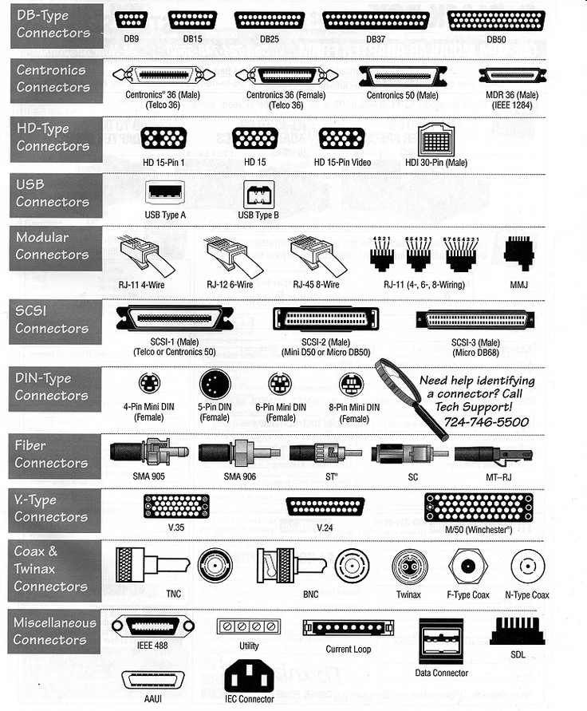</a><figcaption>La lámina ayuda a reconocer familias y muestra BNC, F, SC, conectores modulares y bornes. También incluye la interfaz para sistemas informáticos pequeños (SCSI, <em>Small Computer System Interface</em>) y conectores normalizados históricamente por el Instituto Alemán de Normalización (DIN, <em>Deutsches Institut für Normung</em>), entre otras interfaces antiguas que no son prioritarias en una instalación actual de seguridad. La identificación visual se confirma siempre con el marcaje y la documentación. Fuente facilitada: <a href="https://uk.pinterest.com/pin/508625351640634793/">publicación en Pinterest; autor original no indicado</a>. Pulsa para ampliar.</figcaption></figure>

<figure class="study-figure"><a href="../img/tabla-conectores-puertos.webp" target="_blank" rel="noopener noreferrer" aria-label="Ampliar la tabla fotográfica de conectores y puertos en una pestaña nueva">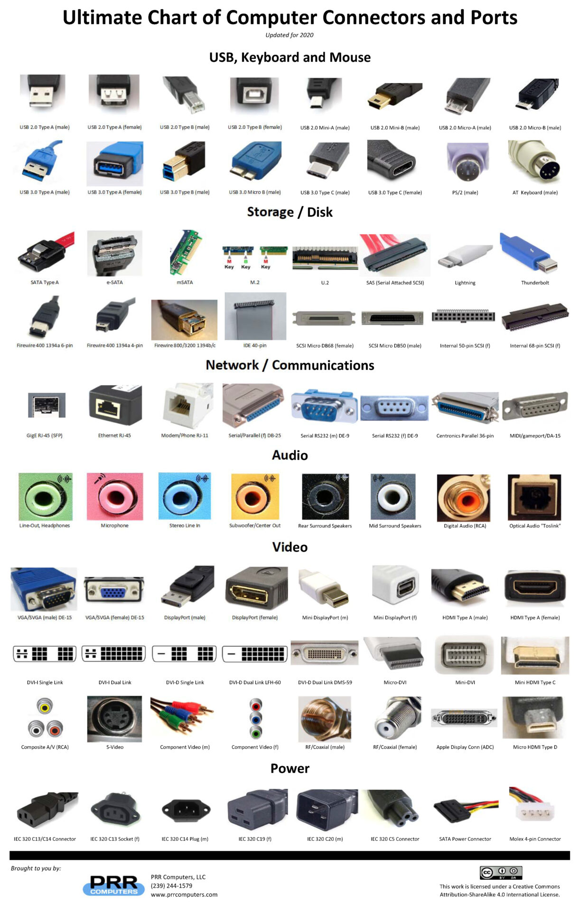</a><figcaption>Para este módulo interesan especialmente Ethernet 8P8C, USB, HDMI, VGA, conectores coaxiales y alimentación IEC. La interfaz serie de conexión de tecnología avanzada (SATA, <em>Serial Advanced Technology Attachment</em>) y otras interfaces internas pueden aparecer dentro de un grabador, pero no son el cableado de campo de una cámara. Imagen: <a href="https://www.prrcomputers.com/blog/ultimate-connectors-chart/">PRR Computers, «Ultimate Chart of Computer Connectors and Ports»</a>, CC BY-SA 4.0. Pulsa para ampliar.</figcaption></figure>

> **Ejemplo razonado — el conector encaja, pero la función no coincide**
>
> Un DVR dispone de un puerto 8P8C para conectarse a la red. Una cámara coaxial termina en BNC y no puede conectarse directamente a ese puerto mediante un simple cambio de forma: su señal y su arquitectura son diferentes. Del mismo modo, la salida HDMI del DVR sirve para un monitor y no para recibir vídeo de una cámara. Antes de usar un adaptador hay que identificar qué señal entrega cada equipo y qué conversión sería necesaria.

> **Comprueba lo aprendido — medio, conector o interfaz**
>
> - **Elementos:** coaxial · BNC · par trenzado · 8P8C/RJ45 · HDMI · VGA · USB · bornera · fibra · LC · RS-485 · PoE.
> - **Tarea:** clasifica cada elemento como medio, conector, interfaz o tecnología. Cuando una denominación no pertenezca a una sola columna, explica en una frase qué describe realmente.
> - **Resultado:** una tabla compacta que distinga la forma física de la señal, el protocolo o la alimentación que puede transportar.

### 4.3. Enlaces inalámbricos

Un enlace **inalámbrico** evita parte de la canalización y facilita ampliaciones, pero depende de propagación radio, alimentación y compatibilidad. Muros, metal, interferencias y cambios en el entorno modifican la cobertura. La batería requiere supervisión y sustitución planificada. La señal se comprueba en la ubicación final y se ensaya el estado que indica la central si se pierde un dispositivo.

La radio está sujeta a condiciones de espectro y compatibilidad electromagnética. La frecuencia y el equipo se verifican en la ficha del producto y en el marco vigente. La protección frente a sabotajes requiere saber qué ocurre si se interfiere el canal o se abre el equipo.

### 4.4. Red IP, PoE y continuidad

Una cámara o controladora **IP** necesita una dirección y una red configuradas. El vídeo sale de la cámara como datos, atraviesa conmutadores y llega al grabador o servidor. La red puede fallar aunque la cámara tenga alimentación; también puede ocurrir lo contrario si un conmutador PoE deja de suministrarla. **Power over Ethernet (PoE)** une datos y energía en un cable compatible, pero el presupuesto de potencia del conmutador ha de alcanzar para los dispositivos conectados.

El conmutador, el panel de conexiones y el grabador no son el mismo elemento. El **panel de conexiones** termina y organiza los cables fijos del edificio; los latiguillos los unen a los puertos de un **conmutador**, que encamina los datos por la red local. El **NVR** recibe el vídeo que corresponda a sus cámaras y lo almacena. Una cámara conectada físicamente a un puerto puede seguir sin vídeo si falta alimentación, si su enlace no negocia correctamente o si la configuración IP impide alcanzar el grabador. En la [guía de un grabador de Axis](https://help.axis.com/es-es/axis-companion-recorder-8ch) pueden identificarse por separado puertos PoE, red, disco y límites de alimentación.

<figure class="content-photo">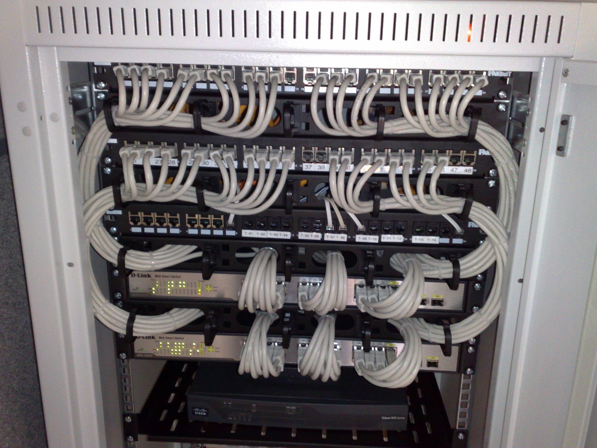<figcaption>El cable fijo termina en un panel; los latiguillos enlazan sus puertos con los conmutadores. Esta distinción permite seguir una avería desde la toma de una cámara hasta la red. Fotografía: <a href="https://commons.wikimedia.org/wiki/File:19-inch_rackmount_Ethernet_switches_and_patch_panels.jpg">Dsimic, CC BY-SA 4.0</a>.</figcaption></figure>

<figure class="study-figure">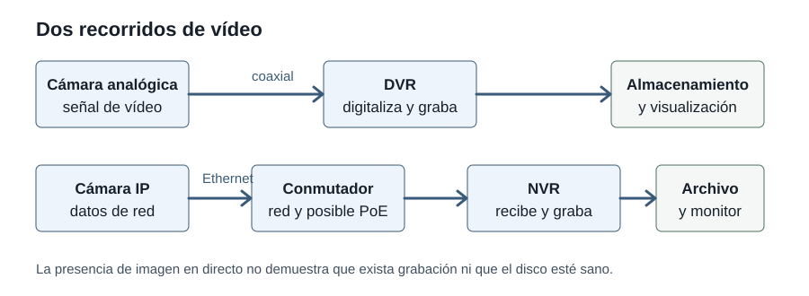<figcaption>Son recorridos simplificados; en ambos se comprueban alimentación, transmisión y almacenamiento. Una arquitectura híbrida combina partes de los dos.</figcaption></figure>

> **Ejemplo razonado — imagen en directo sin grabación**
>
> Se ve la cámara IP en pantalla, pero el disco del NVR está averiado. Captación y enlace funcionan; falla el registro. Comprobar solo que aparece imagen en directo daría un resultado incorrecto. La puesta en servicio y el mantenimiento deben probar también una grabación y su recuperación.

### 4.5. Comunicación hacia el exterior

Hay que distinguir **el enlace interno**, por el que una señal llega del detector a la central, de **la ruta exterior**, por la que la central transmite un aviso a un destinatario autorizado. La central puede seguir detectando y activando una sirena local aunque no consiga comunicar con una CRA. También puede llegar una señal exterior mientras un detector concreto ha dejado de responder. Las pruebas de ambos recorridos son independientes.

La ruta exterior puede emplear red IP, red móvil u otro medio previsto en el sistema. Una línea telefónica tradicional todavía aparece en instalaciones existentes, pero no debe suponerse que esté disponible, sea compatible o permita supervisión adecuada en un proyecto nuevo. Wi-Fi y Bluetooth pueden servir para conexiones locales en determinados productos, pero no sustituyen por sí mismos una ruta de aviso apta para la aplicación. Un enlace de radio local tampoco equivale a una conexión móvil hacia el exterior.

| Ruta o tramo | Qué transporta | Fallo que conviene comprobar |
| --- | --- | --- |
| Detector cableado o bus | Estado de zona, avería o sabotaje hacia la central. | Corte, cortocircuito, conexión incorrecta o dispositivo ausente. |
| Radio entre detector y central | Evento y estados supervisados del dispositivo. | Pérdida de cobertura, interferencia o batería agotada. |
| Red IP hacia destinatario | Avisos y, en sistemas compatibles, datos de verificación. | Alimentación del router, red local, salida a Internet o servicio remoto. |
| Red móvil | Avisos a través de cobertura y módulo de comunicaciones. | Cobertura insuficiente, fallo del módulo o del servicio contratado. |

El medio de comunicación se escoge también por **cómo informa de su propia pérdida**. Una transmisión única de prueba no demuestra continuidad: hay que comprobar si la central detecta la interrupción de la ruta, registra la incidencia y conmuta a una ruta alternativa cuando el diseño la prevé. Dos rutas solo aportan respaldo si no comparten todos los puntos vulnerables, como una misma fuente de alimentación. Los intervalos y métodos de supervisión dependen del equipo y de los requisitos de la instalación; un ejemplo técnico de rutas IP y móvil aparece en la [documentación Conettix de Bosch](https://cdn.commerce.boschsecurity.com/public/documents/B465_IOG_Installation_Manual_enUS_20219655947.pdf).

> **Ejemplo razonado — la alarma local sigue funcionando**
>
> Durante una prueba se abre una puerta protegida. La central registra la zona y suena la sirena, pero la CRA no recibe aviso. La detección local ha funcionado; el diagnóstico se dirige a la ruta exterior y al registro de comunicaciones. Si se corta la conexión IP y el equipo dispone de enlace móvil de respaldo, se comprueba que el aviso llegue por esa segunda ruta y que el cambio quede registrado. Repetir solo la apertura de la puerta no verifica estas funciones.

## 5. Detección de intrusión y niveles de seguridad

Una instalación de intrusión intenta detectar accesos no autorizados y comunicar un aviso verificable. La protección no depende de un único detector: intervienen la delimitación de las zonas, la central, la alimentación de respaldo, la transmisión y la respuesta prevista. La posición de un sensor debe derivarse del recorrido probable de entrada y de las condiciones del lugar; colocar muchos detectores sin estudiar el entorno no garantiza una detección mejor.

En España, los **grados de seguridad** de los sistemas de alarma de intrusión se relacionan con el riesgo y con las características exigidas a los equipos y a la instalación. La [Orden INT/316/2011](https://www.boe.es/buscar/act.php?id=BOE-A-2011-3170) regula su aplicación en el ámbito de seguridad privada. No son una escala para clasificar cámaras de CCTV, centrales de incendios ni todas las instalaciones electrónicas por igual.

| Grado | Riesgo de intrusión previsto | Idea de diseño |
| --- | --- | --- |
| 1 | Bajo | Protección básica frente a intentos poco preparados. |
| 2 | Bajo o medio | Se prevé que el intruso conozca el sistema y disponga de herramientas corrientes. |
| 3 | Medio o alto | Se requieren equipos y comunicaciones adecuados frente a intentos más preparados. |
| 4 | Alto | Se contempla una amenaza especialmente organizada y recursos superiores. |

La tabla resume el concepto de riesgo, pero **no sustituye las obligaciones legales ni la ficha de cada componente**. Un detector con unas prestaciones determinadas no convierte por sí solo toda la instalación en un sistema de ese grado. También cuentan central, comunicación, protección frente a manipulación, supervisión, instalación y mantenimiento. Antes de especificar equipos se identifica la actividad, el nivel exigible y las condiciones ambientales del emplazamiento.

> **Comprueba lo aprendido — grados de seguridad**
>
> - **Situaciones:** intento oportunista sin conocimientos · intruso con conocimientos y herramientas corrientes · ataque planificado con medios especializados · amenaza organizada con recursos elevados.
> - **Tarea:** relaciona cada descripción con los grados 1, 2, 3 o 4 y justifica cada relación con una frase.
> - **Resultado:** una tabla de cuatro filas. Se trata de reconocer el nivel general de amenaza, no de asignar por vuestra cuenta el grado exigible a un establecimiento real.

### 5.1. Zonas, sabotaje y falsas alarmas

Una **zona** agrupa una parte del edificio o un conjunto de dispositivos para poder localizar el origen de una señal. «Alarma» informa de una detección; «avería» indica que algo impide funcionar correctamente; «sabotaje» informa, por ejemplo, de la apertura o manipulación de un equipo protegido. Deben poder distinguirse, porque la respuesta no es la misma.

Una **falsa alarma** es una señal de alarma sin la intrusión que se pretendía detectar. Puede surgir por un sensor mal situado, corrientes de aire, animales, vibraciones, una puerta con holgura, cambios térmicos, interferencias o una configuración inadecuada. También hay avisos causados por errores de uso. Para diagnosticarla se conservan hora, zona, estado de armado y registro de eventos; después se reproduce la situación y se comprueba la instalación. Anular el detector para silenciar el problema deja una zona sin protección.

> **Ejemplo razonado — una alarma repetida en un almacén**
>
> Una zona se dispara siempre al abrir el portón de carga, incluso cuando el sistema está armado y no entra nadie. El registro apunta al mismo detector. Antes de cambiar la central, se revisan el ángulo del sensor, el movimiento de la puerta, posibles corrientes y el cableado. Una prueba controlada permite separar una detección real de un defecto de montaje o ajuste.

## 6. De la planificación al funcionamiento verificable

El montaje comienza con una necesidad concreta: qué se desea detectar, registrar o comunicar y en qué condiciones debe funcionar. El **replanteo** contrasta el plano con el edificio real. Permite comprobar accesos, alturas, canalizaciones, alimentación, cobertura, iluminación, puntos de red y espacios para mantenimiento. Si una cámara prevista queda a contraluz o un detector apunta a una fuente de calor, se corrige su posición antes de tender cable.

Durante la ejecución se identifican los circuitos, se separan las canalizaciones cuando corresponde y se respetan las instrucciones de los equipos. La fijación debe soportar el peso, la exposición y las condiciones del emplazamiento. En los sistemas alimentados desde red, los trabajos eléctricos se realizan con las medidas de protección y por personal competente; la urgencia por terminar el montaje no justifica trabajar sobre partes energizadas.

El emplazamiento de los equipos debe dejar accesibles sus puntos de prueba y sustitución. Una cámara puede cubrir perfectamente una puerta y, sin embargo, quedar instalada donde no se pueda limpiar su óptica con seguridad. Una central situada en un recinto sin ventilación adecuada puede sufrir sobretemperatura; un grabador escondido sin identificación dificulta revisar su disco o reconstruir un evento. El replanteo considera tanto el funcionamiento como las condiciones de mantenimiento.

<figure class="content-photo">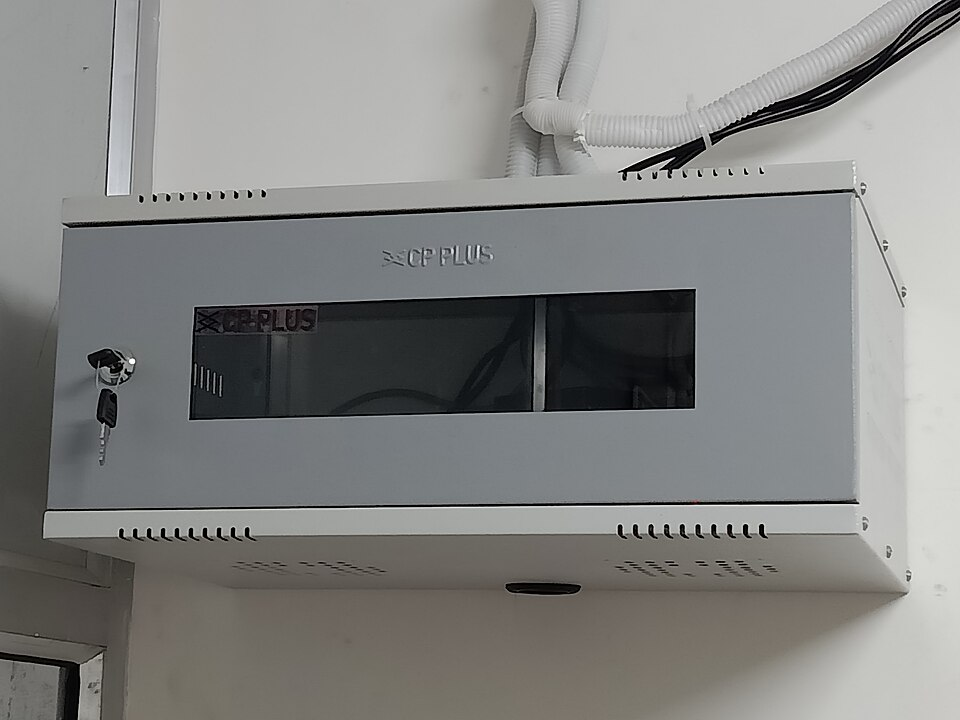<figcaption>En un armario se debe poder identificar cada conexión, acceder a los equipos y comprobar su alimentación sin desordenar el cableado. Fotografía: <a href="https://commons.wikimedia.org/wiki/File:CCTV_Installation.jpg">Support gigates, CC BY 4.0</a>.</figcaption></figure>

### 6.1. Documentación antes y después del montaje

La documentación inicial define **qué se va a instalar y por qué**. Según el tipo y alcance de la instalación puede consistir en una memoria técnica o requerir un proyecto con mayor desarrollo. Una memoria identifica el riesgo o la finalidad, las zonas, los equipos elegidos, la alimentación, las rutas de comunicación y los criterios de funcionamiento. Los planos sitúan dispositivos y canalizaciones; los esquemas muestran el conexionado y el recorrido de señales; las especificaciones, mediciones y presupuesto permiten comprobar compatibilidad y alcance económico. No se exige el mismo expediente para una pequeña instalación privada que para un sistema de protección contra incendios sometido a obligaciones específicas.

Un **plano de ubicación** responde a «¿dónde está el detector?»; un **esquema de conexión** responde a «¿a qué entrada, fuente y salida se une?»; una **lista de equipos** responde a «¿qué modelo y prestaciones se han previsto?». Son documentos complementarios. Si el plano rotula «cámara C3» pero el cable acaba en el puerto identificado «C4», la documentación ya no sirve para localizar una avería. Durante el montaje se anotan cambios y al finalizar se entrega la versión que describe la instalación real, no solo la intención inicial.

> **Ejemplo razonado — un plano que ya no coincide**
>
> El proyecto situaba un detector junto a la puerta principal. En el replanteo se trasladó a otra pared para evitar una corriente de aire, pero nadie actualizó el plano. Meses después una avería aparece como «zona 2» y la persona que revisa el sistema inspecciona el lugar equivocado. El cambio físico era razonable; el fallo fue no dejar constancia del nuevo emplazamiento y del identificador de la zona.

### 6.2. Puesta en servicio

La **puesta en servicio** comprueba la instalación completa, no solo que los aparatos encienden. Se ensayan las zonas de alarma, la indicación de avería y sabotaje, los avisos de la central, las comunicaciones y la autonomía prevista. En CCTV se verifica el campo de visión, la imagen de día y de noche cuando procede, la fecha y hora, el registro, la recuperación de grabaciones y los permisos de acceso. Una prueba debe dejar constancia de resultado, fecha y condiciones; un fallo se corrige y se vuelve a ensayar.

Una secuencia de prueba útil sigue la función completa: provocar un evento controlado, comprobar su detección, observar cómo lo identifica la central, verificar la acción local, confirmar la transmisión cuando proceda y recuperar el registro. Después se prueban fallos previsibles, como pérdida de alimentación principal o de enlace. La prueba se realiza sin generar una falsa intervención externa y con los avisos o autorizaciones necesarios. Anotar únicamente «funciona» no indica qué se ensayó ni permite repetirlo.

| Comprobación | Resultado observable | Si no se cumple |
| --- | --- | --- |
| Activación controlada de un detector | Zona y tipo de evento identificados correctamente. | Revisar cobertura, cableado, dirección o programación. |
| Pérdida simulada de una ruta | Incidencia registrada y aviso por respaldo, si está previsto. | Revisar supervisión, alimentación y configuración de rutas. |
| Grabación de una cámara | Archivo localizado y reproducible con fecha y hora coherentes. | Revisar almacenamiento, programación y sincronización. |
| Fallo de alimentación principal | Incidencia visible y funcionamiento durante la autonomía exigible. | Comprobar fuente, cargador, batería y consumos. |

La tabla recoge **qué evidencia debe obtenerse**, no un procedimiento universal para provocar cada fallo. Las pruebas particulares de una central o grabador se preparan con su manual y con el marco aplicable, de manera que una comprobación no dañe equipos ni cree una alarma real innecesaria.

La documentación final recoge ubicación y referencia de los equipos, esquema real de conexiones, configuración relevante, resultados de pruebas, instrucciones de uso y plan de mantenimiento. Esta información permite que otra persona encuentre una avería sin adivinar cómo quedó instalada la red. La [norma del título y del módulo 0364](https://www.boe.es/buscar/doc.php?id=BOE-A-2009-18404) incluye interpretación de documentación técnica, montaje, verificación y trabajo conforme a seguridad y calidad.

El **manual de uso** explica a la persona responsable los estados del sistema, las acciones permitidas, el procedimiento ante un aviso y a quién comunicar una avería. El **registro de pruebas y mantenimiento** documenta qué se revisó, con qué resultado y qué quedó pendiente. Cuando correspondan certificados, declaraciones, registros o trámites administrativos, se incorporan los exigidos para esa instalación concreta. Una factura o garantía comercial no sustituye por sí sola la documentación técnica ni una comprobación reglamentaria.

### 6.3. Mantenimiento y diagnóstico

El **mantenimiento preventivo** revisa de forma planificada componentes que pueden degradarse: alimentación de respaldo, fijaciones, limpieza, conectores, eventos, calidad de imagen, capacidad de almacenamiento y comunicación. El **correctivo** restablece un equipo tras una avería. Las comprobaciones y sustituciones se ajustan a manuales y, en instalaciones reguladas, a las obligaciones aplicables; no existe una periodicidad universal válida para cualquier sistema.

El **mantenimiento predictivo** utiliza la evolución de medidas o registros para anticipar una degradación. Una batería cuya autonomía disminuye en pruebas sucesivas, una fuente que alcanza temperaturas anómalas o un disco que registra errores repetidos merecen una revisión antes de detener el servicio. No basta con mirar un indicador una vez: hay que comparar resultados obtenidos en condiciones equivalentes y conocer el límite que establece el fabricante. Predictivo no reemplaza preventivo ni convierte cualquier alarma en una predicción fiable.

Una revisión termina con un **parte de mantenimiento**: fecha, sistema y componentes revisados, medidas y pruebas, incidencias, acciones realizadas, piezas sustituidas, resultado final y responsable. Si un detector queda fuera de servicio, se deja indicado qué zona pierde protección y qué medida temporal se ha acordado. La continuidad del servicio no debe suponerse mientras la reparación siga pendiente.

Diagnosticar exige localizar el bloque donde se pierde la función. Si una cámara no aparece en pantalla, se comprueba primero alimentación, enlace, dirección o señal, equipo de registro y visualización, según su arquitectura. Si la imagen existe pero no se guardan grabaciones, se revisan disco, espacio, programación y permisos. El multímetro, un comprobador de cable, una fuente de prueba o las herramientas de red ayudan cuando se emplean en el punto correcto y con seguridad.

El diagnóstico parte del **síntoma reproducible** y del registro de eventos. Antes de desmontar se averigua si el fallo afecta a un equipo, a una zona o a varios elementos que comparten alimentación o red. Se aísla el bloque sospechoso, se mide la magnitud pertinente y se compara con la ficha técnica. Una tensión correcta en la salida de la fuente no demuestra que también llegue al detector bajo carga; un enlace Ethernet activo no demuestra que el grabador reciba vídeo. Tras corregir la causa se repite la prueba funcional completa y se actualiza el parte.

| Síntoma | Primera separación útil | Comprobación siguiente |
| --- | --- | --- |
| Una cámara no tiene imagen | ¿Tiene alimentación y enlace? | Seguir señal o red hasta grabador y visualización. |
| Varias cámaras fallan juntas | ¿Comparten conmutador, fuente o tramo de red? | Comprobar el elemento común antes de cambiar cámaras. |
| Hay imagen, pero no grabación | Captación y transmisión probablemente funcionan. | Revisar disco, horario, eventos y permisos de acceso. |
| La central detecta, pero no avisa fuera | La zona local funciona. | Revisar módulo, ruta exterior, supervisión y registro de envío. |

Un **multímetro** mide tensión, resistencia o continuidad según su configuración; un **comprobador de cable** ayuda a reconocer fallos de pares y terminaciones; las herramientas de red permiten observar dirección, enlace y conectividad. Ninguno identifica automáticamente una causa: se elige instrumento, escala y punto de medida de acuerdo con el esquema. La continuidad se mide en un circuito desenergizado y las mediciones en tensión requieren procedimiento, formación y equipo adecuados. La foto siguiente muestra una medición de una pila pequeña, no una demostración de trabajo seguro en un cuadro alimentado.

<figure class="content-photo">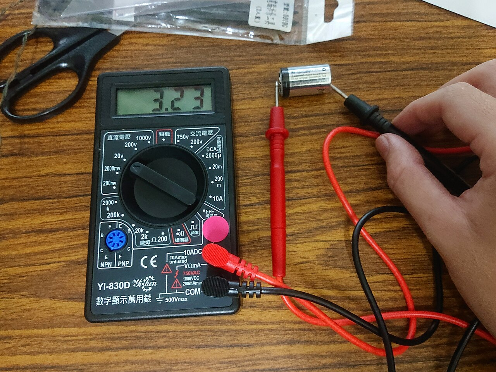<figcaption>La pantalla indica tensión en ese momento; no acredita por sí sola la capacidad restante ni la autonomía de una batería de respaldo. Fotografía: <a href="https://commons.wikimedia.org/wiki/File:Testing_voltage_of_a_battery_using_a_digital_multimeter.jpg">Jiazheng0609, CC BY-SA 4.0</a>.</figcaption></figure>

> **Ejemplo razonado — dos síntomas, dos recorridos**
>
> Tras un corte eléctrico, una central sigue encendida pero ya no envía avisos. La batería ha mantenido la central; puede haber fallado el equipo o el enlace de comunicaciones. En otro edificio, la central está apagada y tampoco hay avisos: la comprobación comienza por la alimentación y su respaldo. El mismo resultado visible para el usuario no implica la misma causa.

> **Comprueba lo aprendido — diagnóstico por bloques**
>
> - **Caso A:** cuatro cámaras conectadas al mismo conmutador dejan de verse al mismo tiempo.
> - **Caso B:** una cámara se ve en directo, pero no aparece ninguna grabación al buscar el evento.
> - **Tarea:** ordena las comprobaciones de alimentación, captación, transmisión, red, grabación y visualización sin sustituir equipos al azar.
> - **Resultado:** un recorrido de diagnóstico para cada caso y una frase que justifique el primer bloque comprobado.

## 7. Normativa vigente y protección de los datos

Una **ley o reglamento** establece obligaciones jurídicas; una **norma técnica** describe requisitos y métodos de ensayo; un **manual de fabricante** concreta la instalación y el uso de un producto. Se complementan, pero no tienen la misma función. La exigencia aplicable depende del tipo de sistema, de la actividad, del emplazamiento y de la fecha de la instalación. Por eso una referencia normativa de un libro o catálogo antiguo debe contrastarse con su texto vigente.

En intrusión conectada con el ámbito de seguridad privada son referencias principales la [Ley 5/2014, de Seguridad Privada](https://www.boe.es/buscar/act.php?id=BOE-A-2014-3649) y la [Orden INT/316/2011](https://www.boe.es/buscar/act.php?id=BOE-A-2011-3170). En detección y alarma de incendios se aplica, cuando corresponde, el [Reglamento de instalaciones de protección contra incendios, aprobado por el Real Decreto 513/2017](https://www.boe.es/buscar/act.php?id=BOE-A-2017-6606), junto con las normas técnicas a las que remite. No se debe utilizar para una instalación nueva el antiguo reglamento de 1993 como si siguiera siendo el marco general vigente.

### 7.1. Videovigilancia responsable

Una cámara no solo capta una escena: puede tratar **datos personales** si las imágenes permiten identificar a alguien. Antes de instalarla se define finalidad, responsable, zonas necesarias, acceso a grabaciones y plazo de conservación. El encuadre debe limitarse a lo imprescindible y evitar captar espacios ajenos; la vía pública solo se graba en los supuestos permitidos. Se informa de la existencia de videovigilancia mediante el distintivo correspondiente y se protege el acceso a las imágenes. La [guía de videovigilancia de la Agencia Española de Protección de Datos (AEPD)](https://www.aepd.es/areas-de-actuacion/videovigilancia) desarrolla estos criterios y las excepciones.

En una red IP, además, se cambian credenciales por defecto, se asignan permisos según funciones, se actualizan equipos cuando procede y se evita exponer cámaras directamente a Internet. Una instalación puede producir buena imagen y, sin embargo, ser deficiente si cualquiera puede consultar las grabaciones. La prueba de funcionamiento incluye privacidad y seguridad de acceso, no solo calidad de vídeo.

> **Ejemplo razonado — cámara en la entrada de un taller**
>
> Si la finalidad es proteger el acceso, se ajusta la cámara para registrar la puerta y la zona necesaria, no toda la calle ni el interior de viviendas próximas. Se comprueba quién puede ver las imágenes, dónde se guardan y cuándo se eliminan. Una mejora técnica de resolución no autoriza a ampliar la captación sin motivo.

## 8. Seguridad laboral e impacto ambiental del montaje

La prevención comienza por reconocer la tarea y sus peligros antes de trabajar. El riesgo eléctrico aparece al intervenir en alimentación, cuadros o equipos averiados; el de caída, al montar cámaras o detectores en altura; el mecánico, al taladrar, cortar o manejar herramientas; y el de exposición ambiental, al desechar baterías y equipos. Las medidas se eligen para cada situación y se priorizan las que eliminan o reducen el riesgo en origen sobre la mera confianza en un equipo de protección individual.

Una evaluación aplicada no se limita a escribir «riesgo de caída» en una ficha. Primero describe la operación —por ejemplo, fijar una cámara en una fachada— y las condiciones reales: altura, suelo, tránsito de personas, alimentación disponible y herramientas. Después identifica qué puede fallar y quién podría resultar afectado. Por último, establece medidas verificables: cambiar el emplazamiento si es posible, elegir un acceso adecuado, aislar y comprobar la alimentación, delimitar la zona inferior y coordinar la intervención. Si cambian las condiciones, se revisa la evaluación antes de continuar.

El [Real Decreto 614/2001](https://www.boe.es/eli/es/rd/2001/06/08/614) establece disposiciones mínimas frente al riesgo eléctrico. Antes de intervenir se identifica el circuito, se asegura la desconexión y se verifica la ausencia de tensión con instrumentos y procedimientos adecuados. El [vídeo del Instituto Nacional de Seguridad y Salud en el Trabajo (INSST) sobre las cinco reglas de oro](https://www.insst.es/documentacion/material-divulgativo-y-audiovisual/videos/riesgo-electrico-cinco-reglas-de-oro-ano-2019) explica por qué desconectar un interruptor, por sí solo, no basta para declarar segura una instalación.

Conviene distinguir el circuito de **230 V** que alimenta una fuente del circuito secundario de menor tensión que llega a un detector o a una cámara. Las precauciones no son idénticas, pero «baja tensión» no significa ausencia de peligro: una batería puede producir corrientes de cortocircuito elevadas y un cable dañado puede afectar a otros equipos. La intervención sobre partes alimentadas y las mediciones que la requieran corresponden a personal capacitado, con procedimiento e instrumentos apropiados. La [documentación del INSST sobre riesgo eléctrico](https://www.insst.es/materias/riesgos/seguridad-en-el-trabajo/riesgo-electrico) permite ampliar estos criterios.

Además del choque eléctrico, una conexión floja, una fuente mal dimensionada o una batería deteriorada pueden provocar calentamiento y pérdida de servicio. Por eso se revisan la protección y la identificación de los circuitos, la ventilación y el estado visible de cables y bornes. Una inspección visual puede orientar el diagnóstico; no sustituye una comprobación segura ni autoriza a abrir un cuadro bajo tensión.

Para los trabajos en altura se planifican el acceso y la estabilidad: la posición de montaje, el estado de la escalera o plataforma, las herramientas y la zona inferior. Al perforar se comprueba la posible presencia de conducciones ocultas y se controla el polvo. Señalizar la zona evita que otras personas entren en el área de caída o tropiecen con cables durante el montaje. Estas precauciones forman parte de la ejecución, no de una revisión posterior.

La elección entre una escalera, una plataforma u otro medio depende de la altura, la duración, el alcance horizontal, el terreno y la tarea; una escalera no debe convertirse en una plataforma de trabajo improvisada. Con una plataforma elevadora se comprueban condiciones de apoyo, entorno y utilización previstas por su fabricante, y el manejo exige formación. La [nota técnica del INSST sobre plataformas elevadoras móviles](https://www.insst.es/documentacion/colecciones-tecnicas/ntp-notas-tecnicas-de-prevencion/30-serie-ntp-numeros-1031-a-1065-ano-2015/ntp-1.039-plataformas-elevadoras-moviles-de-personal-i-gestion-preventiva-para-su-uso-seguro) reúne criterios para planificar su uso seguro. Debajo se controla el paso de terceros y la posible caída de herramientas, materiales o fragmentos de perforación.

<figure class="content-photo">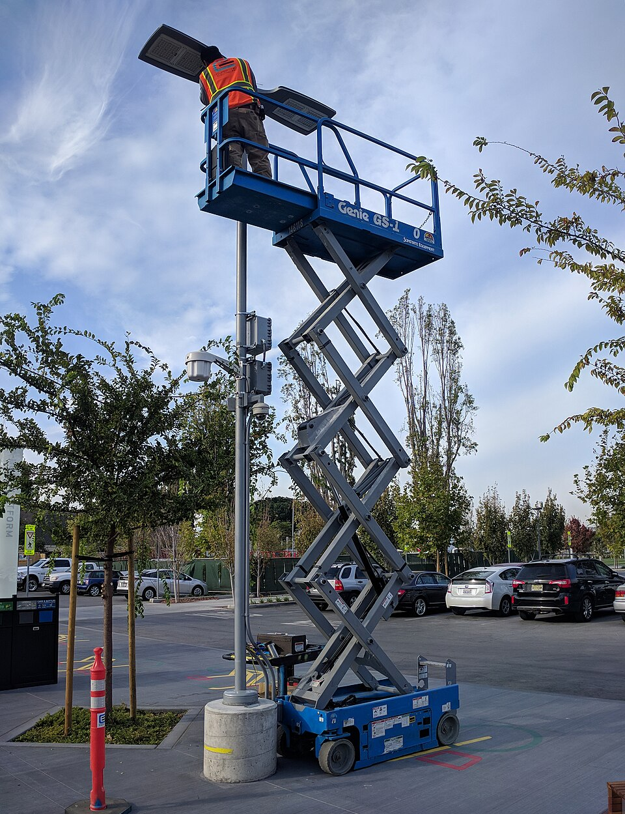<figcaption>El acceso y la zona inferior se planifican antes de iniciar un montaje elevado. La fotografía muestra una intervención en una luminaria, no una instalación CCTV ni una prueba de que sus medidas preventivas sean suficientes. Fotografía: <a href="https://commons.wikimedia.org/wiki/File:Electrician_servicing_an_overhead_light_from_a_scissor_jack.jpg">Grendelkhan, CC BY-SA 3.0</a>.</figcaption></figure>

El taladrado y el tendido de cable también requieren un replanteo preventivo. Antes de perforar se contrasta el plano de servicios con el edificio y se evita atravesar conducciones ocultas. Se fijan herramientas y materiales de forma que no caigan, se controla la proyección de partículas y el polvo y se mantienen despejados los recorridos de evacuación. Un cable provisional que cruza un pasillo puede crear un riesgo de tropiezo aunque el sistema eléctrico todavía no esté conectado.

> **Ejemplo razonado — cámara exterior con varios riesgos**
>
> Una cámara debe cubrir un acceso desde una fachada alta y su fuente se encuentra en un cuadro interior. Cambiar la posición puede permitir un montaje desde un lugar accesible sin perder cobertura. Si no es posible, se selecciona el medio de acceso según la evaluación, se delimita el paso inferior y se programa la intervención eléctrica con personal competente. No basta con escoger una plataforma: también hay que comprobar dónde se apoya, cómo se tiende el cable y cómo se probará la cámara sin exponer a otras personas.

> **Comprueba lo aprendido — antes de instalar una cámara**
>
> - **Situación:** una cámara debe colocarse en altura para vigilar una entrada, pero el encuadre previsto capta también parte de la calle y una ventana de la vivienda vecina.
> - **Tarea:** identifica dos riesgos del montaje y un problema de protección de datos; propone para cada uno una medida concreta que pueda comprobarse antes de poner el sistema en servicio.
> - **Resultado:** cuatro viñetas: dos sobre prevención, una sobre el encuadre y una sobre acceso, conservación o información de las imágenes.

Los equipos retirados no se abandonan ni se mezclan indiscriminadamente con residuos ordinarios. El [Real Decreto 110/2015 sobre residuos de aparatos eléctricos y electrónicos](https://www.boe.es/buscar/act.php?id=BOE-A-2015-1762) regula su gestión; las baterías requieren también el cauce de recogida que corresponda. Antes de entregar un grabador o soporte de almacenamiento para tratamiento se protege la información que pudiera contener. Reutilizar un equipo funcional, cuando resulta seguro y compatible, puede evitar residuos, pero no justifica conservar aparatos inseguros u obsoletos en una instalación crítica.

<figure class="content-photo"><figcaption>El final de vida de cámaras, centrales, grabadores y fuentes de alimentación también forma parte de la instalación. Fotografía: <a href="https://commons.wikimedia.org/wiki/File:Basura_electr%C3%B3nica.jpg">Dolapeart, CC BY-SA 4.0</a>.</figcaption></figure>

## Conceptos que debes reconocer al terminar la unidad

> **Debes poder explicar sin consultar los apuntes:**
>
> **Sistemas:** incendios · gases · intrusión · CCTV · control de accesos. 
> **Equipos y funciones:** detector · central · zona · actuador · CRA · DVR · NVR. 
> **Transmisión y conexiones:** cableado · enlace inalámbrico · PoE · BNC · 8P8C/RJ45 · HDMI · VGA · USB · bornera · coaxial · par trenzado · fibra. 
> **Funcionamiento y seguridad:** cadena funcional · EOL · sabotaje · falsa alarma · grado de seguridad · puesta en servicio · mantenimiento preventivo. 
> **Criterio profesional:** consulta de normativa y manuales · riesgos básicos de montaje · protección de datos en videovigilancia.

## Síntesis de la unidad

Un sistema de seguridad electrónica se entiende siguiendo una cadena de funciones: detectar o captar, transmitir, procesar, avisar o registrar y responder. Cada bloque tiene condiciones de alimentación, comunicación y mantenimiento que deben comprobarse por separado y en conjunto. El diseño parte del riesgo y del uso real del edificio; la puesta en servicio documenta lo que efectivamente funciona; y la normativa, la privacidad, la seguridad laboral y la gestión ambiental delimitan cómo se instala y se utiliza.
