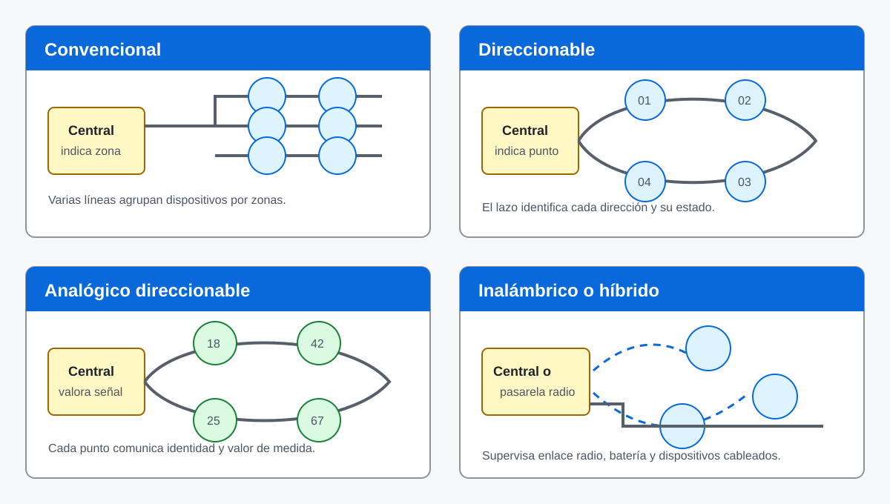
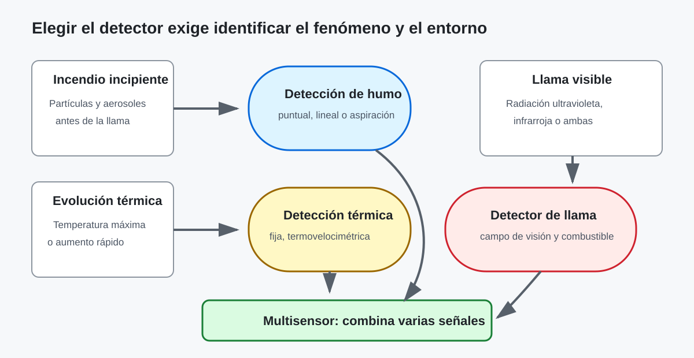
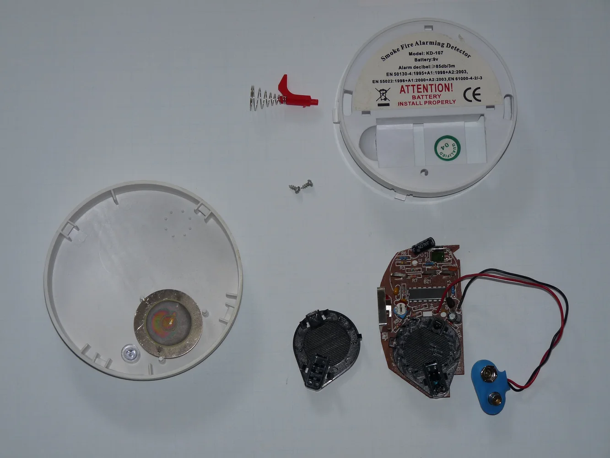
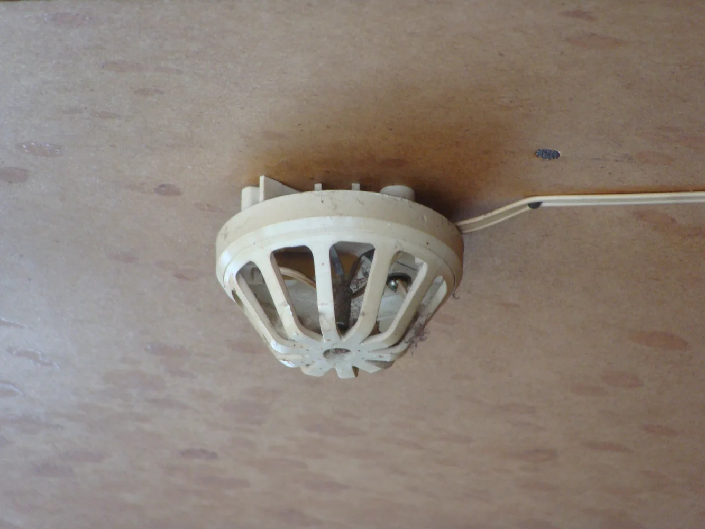
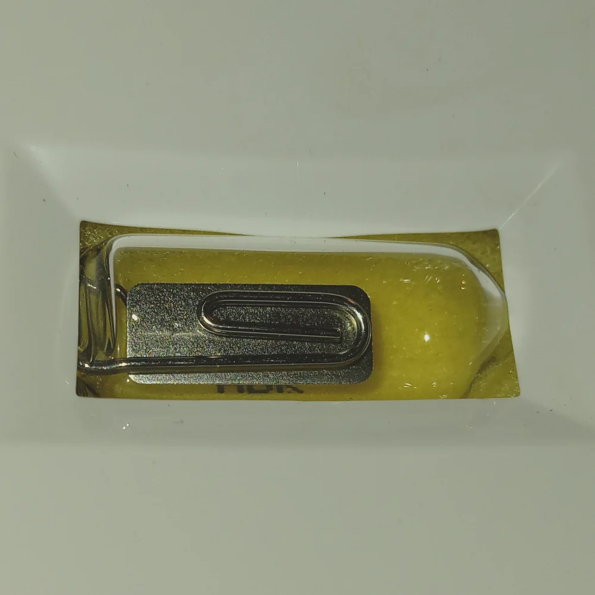
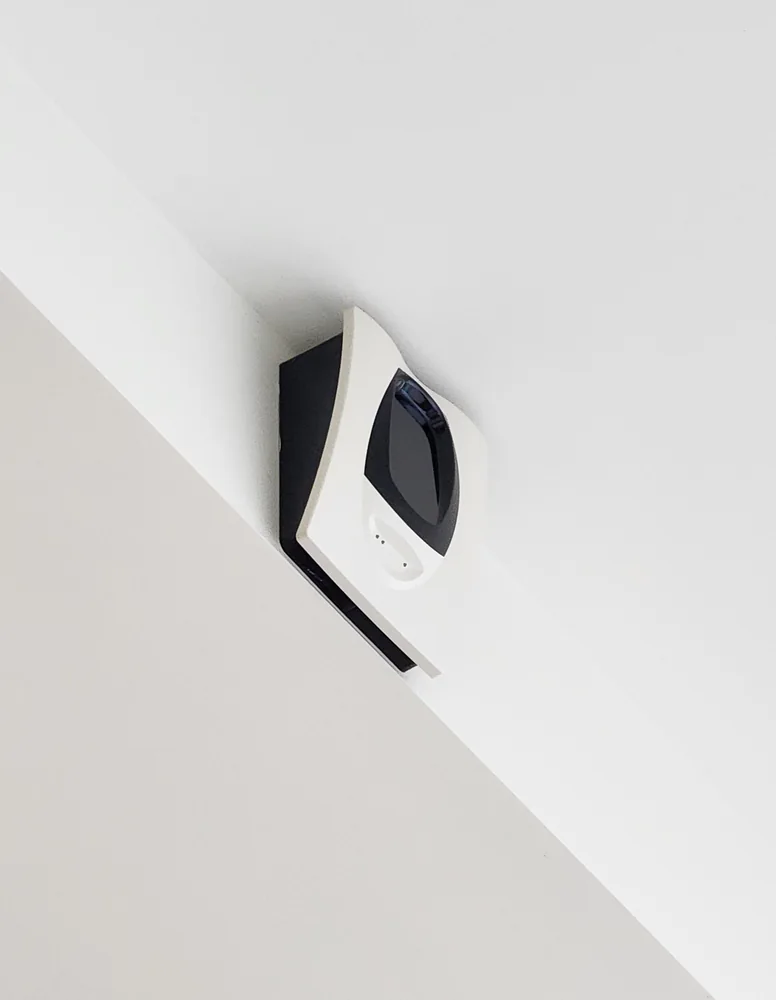
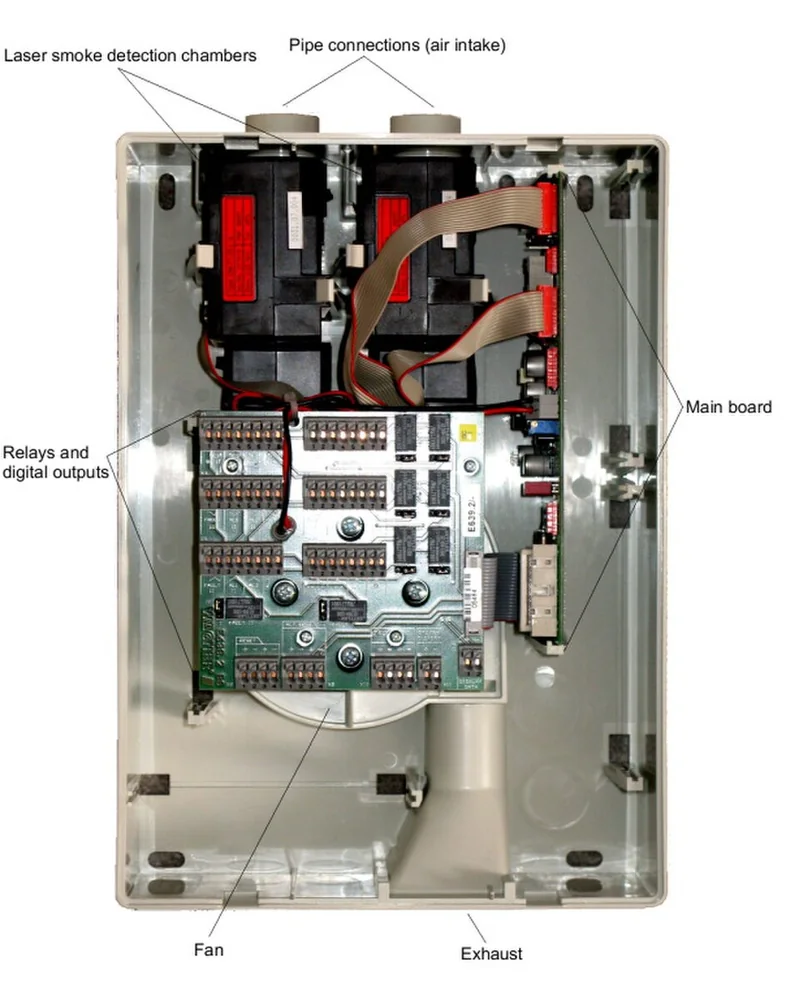
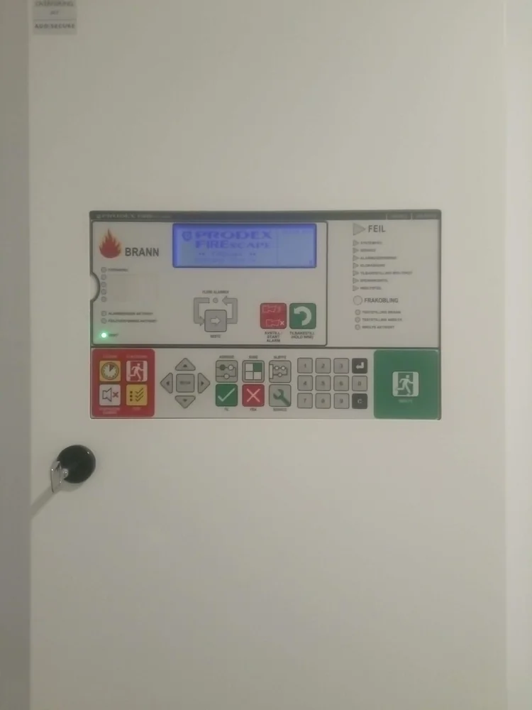
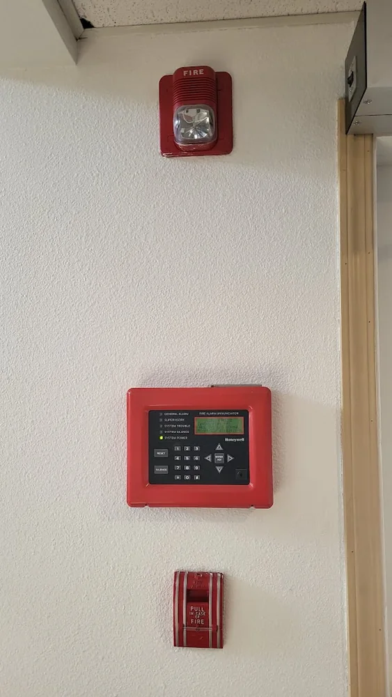
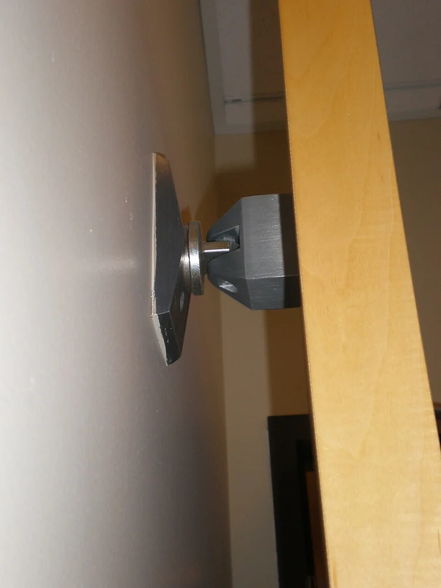

# Instalaciones de alarma contra incendios: equipos y elementos

**Circuito cerrado de televisión y seguridad electrónica**\
2.º curso del Ciclo Formativo de Grado Medio de Instalaciones de Telecomunicaciones

---

Un sistema de detección y alarma de incendios debe reconocer lo antes posible un fenómeno compatible con un incendio, localizarlo con la precisión prevista y generar los avisos y maniobras necesarios. La rapidez importa, pero una detección muy sensible que produzca alarmas injustificadas tampoco ofrece una protección adecuada. El sistema se diseña considerando el riesgo, los materiales presentes, el ambiente, la ocupación y la respuesta que debe producirse.

**Detección**, **alarma** y **extinción** describen funciones diferentes. La detección obtiene información mediante detectores automáticos o pulsadores manuales; la alarma informa a ocupantes y responsables; la extinción actúa sobre el fuego mediante agua, espuma, polvo, gases u otros agentes. Pueden estar coordinadas, pero la presencia de una central de incendios no implica que exista extinción automática.

## 1. Finalidad y estados del sistema

La cadena funcional presentada en la unidad anterior se concreta aquí como **detector o pulsador → zona o lazo → central → aviso, transmisión o maniobra**. La central no se limita a encender una sirena: debe interpretar señales, identificar su origen, vigilar fallos y dejar constancia de los acontecimientos relevantes.

<figure class="study-figure"><figcaption>La cadena representa cómo una entrada llega a la central y provoca una respuesta. Es un esquema funcional simplificado, no una instrucción de conexionado. Fuente: <a href="https://wiringall.com/fire-alarm-system-wiring-diagram.html">WiringAll, «Fire Alarm System Wiring Diagram»</a>. Pulsa para ampliar.</figcaption></figure>

En **reposo**, la instalación está preparada para detectar y no presenta incidencias conocidas. En **alarma**, una entrada ha alcanzado la condición configurada y la central ejecuta la respuesta prevista. Una **avería** indica que una parte no puede garantizar su función, por ejemplo por pérdida de alimentación, interrupción de una línea o ausencia de un dispositivo. La **desconexión o anulación** es una exclusión deliberada y controlada; debe quedar señalizada porque reduce la protección. El estado de **prueba** permite comprobar elementos sin confundir el ensayo con una situación real, siguiendo el procedimiento aplicable.

Una central puede mostrar también una **prealarma** cuando el diseño y los equipos permiten evaluar una señal antes de declarar alarma. No debe utilizarse como excusa para retrasar arbitrariamente un aviso. Los estados, retardos y permisos dependen de la evaluación del riesgo, la normativa y la documentación del fabricante.

> **Ejemplo razonado — alarma y avería no significan lo mismo**
>
> Un detector reconoce humo y comunica correctamente su estado: la central identifica una alarma. Si el cable se interrumpe y la central deja de recibir el circuito como esperaba, debe indicar una avería. En ambos casos existe una señal nueva, pero solo el primero representa una detección de incendio. El personal debe poder distinguirlos antes de actuar.

### 1.1. Evolución del incendio y momento de detección

La detección resulta útil cuando reconoce una manifestación del incendio con tiempo suficiente para actuar. En una combustión lenta pueden aparecer primero gases y partículas muy pequeñas, después humo visible y, más tarde, un aumento importante de temperatura. En un líquido inflamable puede surgir llama y radiación con gran rapidez. Estas etapas no forman una secuencia rígida: dependen del combustible, el oxígeno disponible, la ventilación, la geometría del recinto y la forma de inicio.

Esta evolución explica por qué dos detectores pueden responder en momentos diferentes sin que ninguno esté averiado. Un detector óptico puede reaccionar pronto ante un fuego latente con humo visible, mientras que un detector térmico necesita que el calor alcance el punto donde está instalado. Un detector de llama puede ser muy rápido cuando existe visión directa de una combustión abierta, pero no reconocerá bien un fuego oculto por obstáculos o humo denso.

| Manifestación observable | Tecnología que puede reconocerla | Limitación que debe comprobarse |
| --- | --- | --- |
| Partículas y humo | Detector óptico puntual, lineal o por aspiración | Polvo, vapor, ventilación y transporte del humo |
| Incremento de temperatura | Detector térmico fijo, termovelocimétrico o lineal | Temperatura normal del recinto y rapidez del incendio |
| Radiación de una llama | Detector ultravioleta, infrarrojo o combinado | Campo de visión, obstáculos y fuentes de interferencia |
| Varias magnitudes relacionadas | Detector multisensor | Algoritmo, modos admitidos y condiciones de uso |

> **Idea clave**
>
> No se selecciona un detector por su apariencia ni por ser «más sensible». Se elige el fenómeno que previsiblemente aparecerá primero, se comprueba que la actividad normal no lo imite y se verifica que el equipo pueda mantenerse y probarse.

## 2. Arquitecturas de detección

La arquitectura determina cómo se conectan los dispositivos y qué información recibe la central. Las denominaciones comerciales no siempre se utilizan de manera idéntica; por eso se comprueba en el manual si un equipo únicamente comunica un estado, si aporta una dirección individual o si transmite además un valor de medida.

<figure class="study-figure"><figcaption>La diferencia esencial no es la forma exterior del detector, sino la manera en que se conecta, se identifica y comunica información a la central. Pulsa para ampliar.</figcaption></figure>

### 2.1. Sistema convencional

En un **sistema convencional**, varios detectores o pulsadores se agrupan en una zona. La central reconoce qué zona ha cambiado de estado, pero normalmente no identifica por sí sola qué dispositivo concreto originó la señal. La división debe permitir localizar el área afectada con rapidez; una zona demasiado extensa retrasa la comprobación y una distribución confusa dificulta la intervención.

Las líneas se supervisan mediante el método previsto por el fabricante. La **resistencia de fin de línea (EOL, *End Of Line*)** ya estudiada permite que determinados circuitos diferencien estados eléctricos de reposo, alarma y fallo. Su valor y colocación no son universales: se consultan en la documentación de la central y se aplicarán durante el montaje en la Unidad de Trabajo 3 (UT03).

La arquitectura convencional suele ser comprensible y adecuada cuando el número de zonas es limitado. Su principal restricción es la resolución de la información: si la central indica «zona 2», la localización exacta exige inspeccionar el área y los indicadores asociados.

### 2.2. Sistema direccionable

En un **sistema direccionable**, cada detector, pulsador o módulo dispone de una dirección que permite a la central reconocerlo individualmente. Los dispositivos suelen comunicarse mediante uno o varios lazos o buses. La pantalla puede asociar la dirección a un texto útil —por ejemplo, «detector 023, archivo, planta primera»— siempre que la programación y la documentación estén actualizadas.

La dirección no explica por sí sola qué mide el dispositivo ni garantiza que esté bien situado. También debe conocerse su tipo, parámetros, zona lógica, grupo de maniobra y relación con el plano. Cambiar un detector sin conservar o actualizar esa información puede dejar el sistema operativo pero mal identificado.

### 2.3. Sistema analógico direccionable

En un **sistema analógico direccionable**, el dispositivo comunica su identidad y una representación del nivel detectado. La central evalúa ese valor mediante algoritmos y umbrales, puede observar su evolución y, si el sistema lo permite, aplicar compensaciones o criterios combinados. «Analógico» no significa que el cable transporte una señal de vídeo o audio: describe la disponibilidad de un valor relacionado con el fenómeno observado, no únicamente un contacto de alarma.

Los fabricantes emplean también expresiones como «inteligente» o «algorítmico». No deben interpretarse como categorías universales sin revisar la ficha técnica. Lo profesional es comprobar qué información intercambia cada punto, dónde se toma la decisión y qué diagnósticos ofrece la central.

### 2.4. Sistemas inalámbricos e híbridos

Los sistemas **inalámbricos** utilizan radio para comunicar dispositivos compatibles con una central o pasarela. Cada elemento continúa necesitando alimentación, normalmente mediante batería, y el enlace debe supervisarse. Además del estado de alarma importan la pérdida de comunicación, la batería baja, las interferencias y las condiciones constructivas que afectan a la cobertura.

Un sistema **híbrido** combina dispositivos cableados e inalámbricos. Puede resultar útil en ampliaciones o edificios donde tender nuevas líneas sea especialmente complejo, pero no elimina la necesidad de estudiar cobertura, autonomía, supervisión y compatibilidad. «Sin cable» no equivale a «sin mantenimiento».

| Característica | Convencional | Direccionable | Analógico direccionable | Inalámbrico o híbrido |
| --- | --- | --- | --- | --- |
| Localización habitual | Zona | Dispositivo | Dispositivo | Dispositivo o grupo, según sistema |
| Medio principal | Líneas por zonas | Lazo o bus | Lazo o bus | Radio y posibles tramos cableados |
| Información | Estado de la zona | Estado e identidad | Identidad y valor evaluable | Estado, identidad y supervisión radio |
| Aspecto crítico | Distribución de zonas | Direccionamiento y texto | Umbrales y programación | Cobertura y baterías |

La tabla resume arquitecturas, no prestaciones obligatorias de cualquier producto. Un sistema se describe con su topología, forma de identificación, datos transmitidos, alimentación y respuesta ante fallos; no basta con llamarlo «digital» o «inteligente».

> **Comprueba lo aprendido — localizar una alarma**
>
> - **Caso A:** la central indica «alarma, zona 3».
> - **Caso B:** la central indica «detector 027, almacén de papel».
> - **Tarea:** identifica la arquitectura más probable y explica qué comprobación adicional sería necesaria antes de acudir al punto.
> - **Resultado:** dos respuestas de dos frases cada una.

### Vídeo — Arquitecturas de un sistema de alarma de incendios

**What is a Fire Alarm System? — RealPars**

https://www.youtube.com/watch?v=cVjyDgFrb2g

**Antes de verlo:** recuerda qué información entrega una central convencional y cuál añade una direccionable.

**Mientras lo ves:** identifica los cuatro tipos de sistema que presenta y anota qué cambia en la comunicación con los dispositivos. El audio está en inglés; activa los subtítulos si los necesitas.

**Después:** dibuja dos cadenas funcionales breves, una convencional y otra direccionable, y señala en qué punto se obtiene la localización individual.

## 3. Detectores automáticos

Un detector debe responder a un fenómeno que aparezca con suficiente anticipación y, al mismo tiempo, soportar las condiciones normales del recinto. No existe un detector óptimo para todos los incendios. El combustible, la evolución esperada, la altura, la ventilación, el polvo, el vapor y la actividad cotidiana condicionan la selección.

<figure class="study-figure"><figcaption>El detector se elige por el fenómeno que puede reconocer y por el ambiente en el que debe trabajar. La aparición real de humo, calor y llama puede solaparse y variar según el combustible. Pulsa para ampliar.</figcaption></figure>

### 3.1. Detectores puntuales de humo

El **detector óptico de humo** utiliza una cámara de medida y una fuente luminosa. Cuando entran partículas, modifican la luz que alcanza el receptor. Este principio resulta adecuado para numerosos fuegos con producción de humo visible, pero el polvo, el vapor, los aerosoles o una ubicación inadecuada pueden alterar la respuesta. Una carcasa limpia por fuera no demuestra que la cámara interna conserve su sensibilidad.

<figure class="content-photo"><figcaption>La forma exterior no permite conocer si el detector es convencional, direccionable o multisensor. La referencia y la base deben contrastarse con la ficha del fabricante. Fotografía: <a href="https://commons.wikimedia.org/wiki/File:Smoke_detector_on_the_stretch_ceiling_(02).jpg">Georg Pik, Creative Commons Zero 1.0</a>.</figcaption></figure>

<figure class="content-photo"><figcaption>En un detector óptico desmontado se distinguen la cámara oscura y la electrónica que evalúa la luz dispersada. La fotografía corresponde a un detector autónomo doméstico: permite reconocer el principio físico, pero no representa el conexionado de un detector conectado a una central. Fotografía: <a href="https://commons.wikimedia.org/wiki/File:Disassembled_optical_smoke_detector.JPG">Dmitry G, CC BY-SA 3.0</a>. Pulsa para ampliar.</figcaption></figure>

### Vídeo — Principios de detección de humo

**How Do Smoke Detectors Work? — AMRE Supply**

https://www.youtube.com/watch?v=SQDWNdO6xE4

**Antes de verlo:** localiza en la fotografía anterior la cámara óptica y la placa electrónica.

**Mientras lo ves:** diferencia el principio fotoeléctrico del principio de ionización y anota qué tipo de partículas reconoce mejor cada uno. El vídeo utiliza detectores autónomos y audio en inglés; céntrate en el principio físico y utiliza subtítulos si los necesitas.

**Después:** explica en tres o cuatro frases por qué comprender el sensor no basta para afirmar que un detector es compatible con una central profesional.

El **detector de humo por ionización** utiliza una cámara ionizada para reconocer cambios producidos por partículas de combustión. Tuvo una presencia histórica importante, pero hoy es mucho menos habitual por la gestión de su fuente radiactiva y por la disponibilidad de otras tecnologías. No debe abrirse ni desecharse como un aparato electrónico ordinario; la identificación y el tratamiento corresponden a su documentación y al cauce autorizado.

### 3.2. Detectores térmicos

Un detector **termostático** actúa cuando la temperatura alcanza un umbral previsto. Un detector **termovelocimétrico** responde a un aumento de temperatura con una rapidez determinada, y un modelo combinado puede considerar ambos criterios. Estos dispositivos pueden resultar adecuados donde humo o vapor formen parte de la actividad normal, pero suelen responder más tarde que una detección de humo en un fuego lento.

El valor de actuación no se elige de memoria. Debe quedar suficientemente por encima de la temperatura ambiental esperable y ser apropiado para el riesgo. Una cocina, una sala de máquinas y un almacén climatizado presentan condiciones diferentes aunque tengan la misma superficie.

<figure class="content-photo"><figcaption>La carcasa abierta favorece que el aire caliente alcance el elemento sensible. La forma no permite deducir el umbral ni saber si el funcionamiento es fijo o termovelocimétrico: esos datos se leen en la referencia y la ficha técnica. Fotografía: <a href="https://commons.wikimedia.org/wiki/File:Heat_detector_(01).JPG">Georg Pik, CC0 1.0</a>. Pulsa para ampliar.</figcaption></figure>

### 3.3. Detectores de llama

Los **detectores de llama** reconocen radiación característica de una combustión. Pueden trabajar en bandas ultravioletas (UV), infrarrojas (IR) o combinar ambas. Necesitan un campo de visión adecuado y se emplean especialmente cuando puede aparecer una llama rápida, por ejemplo en determinados procesos o almacenamientos de combustibles.

La presencia de humo, obstáculos, reflejos, soldadura, superficies calientes o radiación solar puede influir según la tecnología. Por ello se estudian el combustible y las posibles fuentes de interferencia. Un detector de llama no sustituye automáticamente a uno de humo y no «ve» a través de cualquier obstáculo.

<figure class="content-photo"><figcaption>La ventana frontal deja expuesto el sensor a la radiación procedente del riesgo. Su orientación y campo de visión son parte del diseño; la apariencia no permite determinar por sí sola la banda espectral ni la distancia útil. Fotografía: <a href="https://commons.wikimedia.org/wiki/File:Flame_detector_I-9104.jpg">Georg Pik, CC0 1.0</a>. Pulsa para ampliar.</figcaption></figure>

### 3.4. Detectores multisensor

Un **detector multisensor** combina dos o más magnitudes, habitualmente humo y temperatura, y procesa su relación. La combinación puede mejorar la discriminación entre un incendio y ciertas perturbaciones ambientales. No significa que dos sensores independientes actúen siempre a la vez: el algoritmo y los modos admitidos se consultan en el manual.

La reducción de falsas alarmas no se consigue únicamente comprando un detector más complejo. Continúan siendo esenciales la ubicación, el mantenimiento, la configuración y el conocimiento de la actividad del recinto.

### 3.5. Detección lineal de humo

Un **detector lineal de humo** supervisa un haz óptico entre un emisor y un receptor, o entre una unidad y un reflector. El humo que atraviesa el recorrido atenúa la señal. Es útil en espacios de gran altura o superficie donde la detección puntual sería difícil, pero exige estudiar alineación, estructura, movimientos, obstáculos y acceso para mantenimiento.

La distancia cubierta por el haz no debe confundirse con el área real protegida. La geometría del techo, la estratificación del humo y las instrucciones del producto condicionan el diseño.

<figure class="content-photo"><figcaption>Un detector lineal se instala con una trayectoria óptica despejada y una alineación controlada. La fotografía permite reconocer la unidad, pero el recorrido del haz y la superficie vigilada deben comprobarse en planos y documentación. Fotografía: <a href="https://commons.wikimedia.org/wiki/File:System_Sensor_6500_Beam_Smoke_Detector.jpg">Dunn17, CC0 1.0</a>. Pulsa para ampliar.</figcaption></figure>

### 3.6. Detección por aspiración

Un **sistema de detección de humo por aspiración** toma muestras de aire mediante una red de tuberías perforadas y las conduce a una unidad de análisis. Puede ofrecer alta sensibilidad y varios niveles de aviso, por lo que se utiliza en aplicaciones donde interesa una detección muy precoz o donde el acceso a los puntos de muestreo resulta complejo.

Los orificios no son detectores independientes: forman parte de una red cuyo caudal, longitud, equilibrio y transporte de muestra deben calcularse. El polvo, los filtros, las fugas o una tubería obstruida pueden modificar la respuesta, de modo que la supervisión del flujo es tan importante como la cámara de detección.

<figure class="content-photo"><figcaption>La unidad aspira aire de la red de tuberías, lo conduce a las cámaras de análisis y supervisa el flujo. La imagen muestra que no es un detector puntual conectado a un tubo, sino un equipo con circulación de aire, electrónica y salidas. Fotografía anotada: <a href="https://commons.wikimedia.org/wiki/File:Top-sens_2_inside.jpg">나비Fly, CC BY-SA 3.0</a>. Pulsa para ampliar.</figcaption></figure>

### 3.7. Detección lineal de temperatura

La **detección lineal de temperatura** utiliza un elemento sensor distribuido a lo largo de un recorrido. Puede basarse en cable térmico, fibra óptica u otras tecnologías. Se aplica en bandejas de cables, túneles, transportadores o zonas donde interesa vigilar una longitud continua y donde otras formas de detección presentan dificultades.

En esta unidad basta con reconocer su función. La elección, separación, fijación, interfaces y método de rearme dependen del sistema y se abordarán al estudiar instalaciones concretas.

### 3.8. Elección razonada

| Condición del recinto o del riesgo | Pregunta técnica |
| --- | --- |
| Producción habitual de polvo, vapor o aerosoles | ¿Puede confundirse la actividad normal con humo? |
| Fuego esperado de evolución lenta | ¿Aparecerán partículas detectables antes que calor intenso? |
| Líquidos o gases inflamables | ¿Puede surgir una llama rápida y visible para el detector? |
| Gran altura o espacio abierto | ¿Llegará el humo a un detector puntual con suficiente rapidez? |
| Corrientes de aire o ventilación | ¿Desplazarán o diluirán el fenómeno que se quiere detectar? |
| Acceso difícil | ¿Cómo se probará, limpiará y sustituirá el equipo? |

La selección se justifica relacionando el incendio previsible con el ambiente. Frases como «el óptico es mejor» o «el térmico da menos falsas alarmas» son incompletas si no se indica para qué riesgo y en qué condiciones.

> **Ejemplo razonado — taller con vapor y archivo de papel**
>
> En una zona de lavado aparece vapor durante la actividad normal; en un archivo hay gran cantidad de papel y ambiente estable. Elegir el mismo detector por comodidad puede producir alarmas injustificadas en la primera zona o una detección tardía en la segunda. El análisis debe separar ambos recintos y justificar el fenómeno que se espera reconocer primero.

### 3.9. Ejemplos de selección por ambiente

Los siguientes casos son hipótesis de partida, no soluciones cerradas. Sirven para ordenar el razonamiento antes de comprobar la normativa, las condiciones reales y las instrucciones del fabricante.

| Recinto | Primera opción que conviene estudiar | Motivo | Qué debe verificarse antes de decidir |
| --- | --- | --- | --- |
| Archivo de papel limpio y climatizado | Humo óptico puntual o aspiración | Un fuego latente puede producir humo antes de elevar mucho la temperatura | Altura, ventilación, estanterías, accesibilidad y sensibilidad necesaria |
| Cocina profesional | Detección térmica o multisensor configurado para el ambiente | Vapor, aerosoles y humos de cocción pueden perturbar un detector de humo ordinario | Temperaturas habituales, proximidad a focos de calor y estrategia global de detección |
| Nave de gran altura | Detección lineal de humo, aspiración o solución combinada | El acceso y el transporte del humo dificultan la detección puntual convencional | Estratificación, geometría, movimientos estructurales, corrientes de aire y mantenimiento |
| Aparcamiento | Tecnología seleccionada según el riesgo y la ventilación real | Polvo, gases, corrientes y cambios térmicos pueden provocar respuestas no deseadas | Proyecto del edificio, posibles zonas especiales, extracción y fuentes normales de partículas |
| Almacén de líquidos inflamables | Detección de llama combinada con otras tecnologías cuando proceda | Puede producirse una combustión abierta de evolución rápida | Combustible, campo de visión, interferencias, clasificación del emplazamiento y certificación del equipo |

> **Ejemplo razonado — una solución no se copia entre edificios**
>
> Que un detector lineal funcione en una nave no demuestra que sea adecuado para otra. Si una grúa puente interrumpe el haz, la cubierta se mueve o una corriente impide que el humo lo atraviese, la arquitectura debe replantearse. La decisión se apoya en el riesgo y en las condiciones reales, no en una fotografía de referencia.

## 4. Activación manual

El **pulsador manual de alarma** permite que una persona comunique un incendio observado. Es una entrada deliberada, no un sensor ambiental. Debe ser identificable, accesible y estar relacionado con la central y la señalización correspondientes. Según el modelo, el elemento de accionamiento puede ser rearmable o requerir reposición.

<figure class="content-photo"><figcaption>El pulsador inicia una alarma por decisión humana. El color y la forma ayudan a reconocerlo, pero la referencia confirma su función, su tipo de conexión y el procedimiento de prueba. Fotografía: <a href="https://commons.wikimedia.org/wiki/File:Manual_call_point_1.jpg">Edward Betts, dominio público</a>.</figcaption></figure>

No debe confundirse el pulsador de alarma con mandos manuales asociados a una extinción, una evacuación o una apertura de emergencia. Aunque sean cajas murales parecidas, la inscripción, el color, la función y la respuesta son diferentes. Antes de probar cualquiera de ellos se identifica qué salida puede activar y quién debe ser avisado.

## 5. Central de detección y alarma

La **central de detección y alarma de incendios** recibe y supervisa entradas, presenta estados, registra eventos y gobierna salidas. Sus bloques incluyen equipos de control e indicación, fuente de alimentación, interfaz de usuario, líneas o lazos y salidas hacia avisadores, módulos o comunicaciones. La central se elige por la arquitectura, capacidad, compatibilidad, ampliación y funciones necesarias, no solo por el número de bornes visibles.

<figure class="content-photo"><figcaption>Los indicadores permiten distinguir alimentación, alarma, avería y zonas o puntos afectados. La fotografía no permite determinar la capacidad ni la compatibilidad de la central. Fotografía: <a href="https://commons.wikimedia.org/wiki/File:Fire_alarm_control_panel_VERS-PK_2.jpg">Georg Pik, Creative Commons Zero 1.0</a>.</figcaption></figure>

### 5.1. Cómo leer el frontal de una central

La lectura comienza por el estado general y continúa hacia el detalle. No se pulsa «rearme» nada más llegar: esa acción puede borrar una indicación útil sin eliminar su causa. Primero se observa, se localiza el punto o la zona, se consulta el registro y se aplica el procedimiento del edificio.

| Indicación o mando | Qué informa o permite hacer | Qué no debe suponerse |
| --- | --- | --- |
| Alimentación o servicio | La central recibe energía y mantiene su electrónica activa | No demuestra que baterías, líneas y dispositivos estén correctos |
| Alarma general | Existe al menos una condición de alarma reconocida | No identifica por sí sola el lugar ni confirma visualmente un incendio |
| Zona, dirección o texto | Localiza el origen con la resolución que ofrece la arquitectura | Un texto antiguo puede no coincidir con la distribución actual |
| Avería | La central ha reconocido una anomalía supervisada | No equivale a una alarma ni indica siempre un cable cortado |
| Desconexión | Una función, zona, salida o punto ha sido anulado deliberadamente | No debe quedar como estado normal sin control ni registro |
| Prueba | Una parte se encuentra sometida a un procedimiento de ensayo | No autoriza a ignorar cualquier señal fuera del alcance de la prueba |
| Silenciar zumbador | Detiene el aviso interno dirigido al operador | No elimina la alarma ni necesariamente silencia las sirenas del edificio |
| Silenciar avisadores | Detiene determinadas salidas acústicas autorizadas | No corrige la causa y puede estar restringido por el procedimiento |
| Rearme | Devuelve el sistema al estado inicial cuando la causa ha desaparecido | No repara una avería ni limpia un detector contaminado |

Una central convencional suele ofrecer pilotos numerados por zonas y una indicación general de alarmas y averías. Una direccionable añade una pantalla o interfaz capaz de mostrar el punto, su texto, el tipo de evento y una secuencia temporal. La diferencia visible ayuda a orientarse, pero la arquitectura se confirma con la referencia, el manual y las conexiones admitidas.

<figure class="content-photo"><figcaption>La pantalla y el teclado permiten consultar información y operar sobre puntos individuales, pero no deben utilizarse sin conocer el nivel de acceso y el procedimiento. Compárala con la central por zonas de la fotografía anterior. Fotografía: <a href="https://commons.wikimedia.org/wiki/File:Prodex_firescape_fire_alarm_panel.jpg">TWGThewikiguy, CC BY-SA 4.0</a>. Pulsa para ampliar.</figcaption></figure>

### 5.2. Indicaciones y niveles de acceso

La interfaz debe hacer visible el estado general y ayudar a localizar el origen de alarmas y averías. Una central convencional puede utilizar pilotos por zona; una direccionable suele incorporar pantalla y textos asociados a los puntos. El avisador acústico interno llama la atención del operador, pero no sustituye a los dispositivos de alarma destinados a los ocupantes.

Las operaciones se limitan mediante llave, código o niveles de acceso. Silenciar el zumbador de la central, silenciar avisadores, rearmar o modificar la configuración son acciones distintas. El rearme no corrige la causa: si el detector sigue expuesto a humo o la línea continúa averiada, el estado volverá a aparecer.

### 5.3. Alimentación principal y secundaria

La fuente transforma y distribuye la energía necesaria, supervisa fallos y mantiene cargada la batería cuando corresponde. La alimentación secundaria permite conservar las funciones exigidas ante un fallo de red. Su autonomía depende de la capacidad útil, el consumo en reposo y alarma, la temperatura, el envejecimiento y las pérdidas del sistema.

Dos baterías físicamente iguales pueden encontrarse en estados muy distintos. La tensión en vacío no demuestra por sí sola su capacidad. La revisión considera fecha, aspecto, conexiones, registros y pruebas establecidas por el fabricante y la normativa.

### 5.4. Repetidores y paneles remotos

Un **panel repetidor** presenta información de la central en otro emplazamiento y puede permitir determinadas operaciones autorizadas. No constituye necesariamente una segunda central independiente. Si pierde comunicación, la instalación debe informar de la incidencia según su diseño.

## 6. Dispositivos de alarma

Los **avisadores acústicos** generan una señal sonora destinada a ser reconocida como alarma. Las **señales visuales de alarma** producen destellos para complementar o sustituir la percepción acústica cuando la evaluación lo requiere. También existen equipos combinados. La elección considera ruido ambiental, ocupantes, distribución del edificio, condiciones de montaje y sincronización cuando resulte necesaria.

Un nivel elevado junto a una sirena no garantiza que la alarma se entienda en todo el recinto. Las puertas, la distancia, el ruido de máquinas y la protección auditiva cambian la percepción. Del mismo modo, una baliza oculta tras una estantería no cumple su finalidad aunque funcione eléctricamente.

El **indicador remoto de acción** ayuda a localizar un detector que no puede verse con facilidad, por ejemplo dentro de una habitación cerrada o sobre un falso techo, cuando el diseño lo permite. No es un avisador general para evacuar el edificio: señala el origen de una activación concreta.

<figure class="content-photo"><figcaption>En la pared aparecen un avisador óptico-acústico en la parte superior, un panel repetidor en el centro y otro avisador en la parte inferior. Aunque compartan color, cumplen funciones distintas y se reconocen por su referencia y documentación. Fotografía: <a href="https://commons.wikimedia.org/wiki/File:Fire-Alarm-System-Devices.jpg">CaptainChris2019, CC BY-SA 4.0</a>. Pulsa para ampliar.</figcaption></figure>

## 7. Módulos, aisladores y elementos auxiliares

Los **módulos de entrada** incorporan al sistema señales procedentes de contactos o equipos externos. Los **módulos de salida** permiten gobernar relés y maniobras. Un módulo combinado puede ofrecer ambas funciones. En un sistema direccionable cada módulo se identifica y se asocia a una lógica; en uno convencional pueden emplearse relés o interfaces específicas.

Un **aislador de cortocircuito** limita el tramo afectado por un defecto en un lazo compatible. No repara el cable ni garantiza que todos los dispositivos continúen disponibles: su utilidad depende de la topología y de dónde se encuentre respecto al fallo.

Las **bases de detector** proporcionan conexión mecánica y eléctrica. Algunas integran aislador, avisador u otras funciones. Dos detectores con apariencia semejante no deben intercambiarse sin comprobar base, protocolo y certificación. Las **fuentes auxiliares** alimentan cargas adicionales cuando la central no puede hacerlo directamente, pero también deben supervisarse e integrarse de acuerdo con el diseño.

| Elemento | Cómo se reconoce en una inspección | Dato que debe confirmarse en la documentación |
| --- | --- | --- |
| Base | Pieza fijada al techo sobre la que gira o encaja el detector | Familia compatible, bornes, continuidad y accesorios admitidos |
| Indicador remoto | Pequeño piloto situado fuera del recinto o cerca del punto oculto | Detector o base que puede gobernarlo y significado de su señal |
| Módulo de entrada | Bornes de lazo y conexión para vigilar un contacto externo | Tipo de contacto, supervisión, resistencia y alimentación necesaria |
| Módulo de salida | Bornes de lazo y relé o salida supervisada | Capacidad, tensión, corriente, estado seguro y carga permitida |
| Aislador | Equipo independiente o función integrada en base, detector o módulo | Tramo que aísla, topología admitida y número de dispositivos afectables |
| Retenedor electromagnético | Electroimán fijo y placa metálica solidaria con la puerta | Tensión, fuerza, consumo y comportamiento ante pérdida de alimentación |

La etiqueta puede contener abreviaturas de entrada, salida, lazo y alimentación. Esas marcas sirven para localizar la documentación, no para improvisar conexiones. Antes de manipular un equipo se identifica si el circuito está supervisado, si mantiene tensión y qué maniobra podría activarse.

### 7.1. Maniobras asociadas

Una salida de la central puede activar avisadores, transmitir una señal, liberar retenedores de puertas, actuar sobre ventilación o control de humos, detener determinados equipos, ordenar posiciones seguras o iniciar la secuencia de un sistema de extinción. Estas acciones se denominan **maniobras** y deben estar documentadas y poder probarse.

El retenedor electromagnético mantiene abierta una puerta cortafuegos en condiciones previstas. Ante una alarma o pérdida de alimentación debe permitir que el mecanismo de cierre actúe. La central no empuja la puerta: elimina la retención y el cierrapuertas realiza el movimiento. Obstaculizar la hoja anula la sectorización aunque la señal eléctrica sea correcta.

<figure class="content-photo"><figcaption>El electroimán y la placa mantienen la puerta abierta mientras existe alimentación. Al liberar la retención debe comprobarse el cierre completo de la hoja, no solo la desaparición de la fuerza magnética. Fotografía: <a href="https://commons.wikimedia.org/wiki/File:Wooden_fire_door_magnet.JPG">BrokenSphere, CC BY-SA 3.0</a>. Pulsa para ampliar.</figcaption></figure>

> **Ejemplo razonado — la salida funciona, la maniobra no**
>
> La central desactiva correctamente un retenedor, pero una cuña impide cerrar la puerta. La salida eléctrica y el relé pueden haber funcionado; la protección completa no. La prueba debe observar el resultado físico y registrar cualquier obstáculo, no limitarse a escuchar el clic del relé.

## 8. Circuitos y comunicaciones específicos

En una instalación convencional se distinguen las líneas de detección, las líneas de avisadores y otras salidas o entradas auxiliares según la central. Cada circuito tiene condiciones de supervisión, polaridad, carga y terminación propias. La resistencia EOL no se coloca por semejanza con otro equipo: se utiliza el valor y la posición indicados por el fabricante.

En un sistema direccionable, el **lazo** transporta alimentación y comunicación para dispositivos compatibles. La forma física puede parecer un anillo, pero su comportamiento ante un corte o cortocircuito depende de la central, los aisladores y el cableado. La cantidad máxima de puntos, ramales permitidos, longitud y sección se obtienen de la documentación del sistema.

La **continuidad de servicio** busca limitar las funciones que se pierden ante un fallo. Se apoya en la división de circuitos, aisladores, alimentación secundaria y arquitectura, pero no significa que cualquier avería resulte invisible. Al contrario, el fallo debe detectarse y localizarse para intervenir.

## 9. Reconocimiento de simbología

En esta unidad se debe reconocer en una leyenda el detector de humo, detector térmico, detector de llama, pulsador, avisador, central y módulos principales. El símbolo solo adquiere significado dentro del plano, junto con su identificador y la leyenda. En UT03 se utilizarán estos elementos para interpretar y elaborar documentación de montaje.

Una marca circular con letras no es universal. Puede cambiar entre proyectistas, programas y normas. Antes de contar detectores o seguir un circuito se consulta la leyenda y se comprueba si el plano representa ubicación, conexión, zonas o maniobras.

## 10. Marco normativo y compatibilidad

El **Reglamento de instalaciones de protección contra incendios (RIPCI)**, aprobado por el Real Decreto 513/2017 y modificado posteriormente, establece las condiciones aplicables a los equipos, empresas, instalación, puesta en servicio y mantenimiento de la protección activa contra incendios. El [texto consolidado del RIPCI](https://www.boe.es/eli/es/rd/2017/05/22/513/con) debe consultarse antes de utilizar una cifra o referencia de apuntes antiguos.

El reglamento remite a la familia **UNE-EN 54**. La sigla UNE procede de «Una Norma Española» y EN de *European Norm* (norma europea), de modo que la designación identifica la adopción española de una norma europea. Sus partes tratan, entre otros elementos, equipos de control e indicación, alimentación, detectores, pulsadores, avisadores, aisladores y módulos de entrada/salida. La [ficha de UNE-EN 54-1:2022](https://tienda.aenor.com/p/norma-une-en-54-1-2022-n0068549) presenta la introducción vigente de la familia, pero para una instalación se comprueban las referencias exigidas por el texto reglamentario consolidado.

La norma **UNE 23007-14** aborda planificación, diseño, instalación, puesta en servicio, uso y mantenimiento. No es necesario memorizar en esta unidad todas sus prescripciones; sí comprender que la selección y colocación no pueden decidirse únicamente con un catálogo. La [Guía técnica de aplicación del RIPCI, versión 4 de junio de 2025](https://industria.gob.es/Calidad-Industrial/seguridadindustrial/instalacionesindustriales/instalaciones-contra-incendios/informacion513/Gu%C3%ADa%20T%C3%A9cnica%20de%20Aplicaci%C3%B3n/v4%20guia%20ripci.pdf) explica la interpretación administrativa del reglamento y sus modificaciones.

También puede ser aplicable el [Documento Básico de Seguridad en caso de Incendio del Código Técnico de la Edificación](https://www.codigotecnico.org/DocumentosCTE/SeguridadEnCasoDeIncendio.html), conocido como **DB-SI**, u otra reglamentación sectorial según el edificio o establecimiento. Estas disposiciones ayudan a determinar cuándo se exige un sistema; el RIPCI y las normas a las que remite establecen características de los equipos y de su implantación.

### 10.1. Compatibilidad del sistema

Que dos dispositivos puedan conectarse eléctricamente no demuestra que funcionen juntos ni que formen un sistema conforme. Deben coincidir protocolo, central, base, versión, alimentación, supervisión y documentación de compatibilidad. En sistemas direccionables es frecuente que el protocolo sea propio del fabricante; incluso dentro de una misma marca pueden existir familias incompatibles.

La compatibilidad se demuestra mediante la documentación aplicable, no mediante una prueba improvisada. Un detector que enciende un indicador al conectarse puede no comunicar correctamente alarmas, averías o valores, y una sirena puede superar la capacidad de la salida aunque su tensión nominal parezca adecuada.

### 10.2. Lectura de una ficha técnica real

La ficha técnica transforma una carcasa anónima en un equipo identificable. Como ejemplo puede utilizarse la [ficha oficial del detector óptico Apollo Series 65, referencia 55000-317APO](https://apollo-fire.co.uk/products/series-65/detector/55000-317apo-series-65-optical-smoke-detector/). No se pretende memorizar sus cifras, sino aprender dónde se localiza cada decisión técnica.

| Campo de la ficha | Dato que se puede leer | Interpretación profesional |
| --- | --- | --- |
| Tipo y principio | Detector óptico por dispersión de luz | Responde a partículas que entran en su cámara; no es térmico ni de llama |
| Norma declarada | EN 54-7 | El fabricante lo presenta como detector puntual de humo conforme a esa parte de la familia normativa |
| Alimentación | Intervalo de tensión en corriente continua | La tensión debe estar dentro del intervalo y proceder de un equipo compatible; coincidir en voltios no basta |
| Consumo | Corriente en reposo y comportamiento en alarma | Permite calcular la carga de la línea y la autonomía junto con el resto de dispositivos |
| Base y terminales | Conexiones de línea e indicador remoto | La base forma parte de la selección y determina cómo se integra físicamente |
| Ambiente | Temperatura, humedad y código de protección IP (*Ingress Protection*, protección frente al acceso y al agua) | Delimita las condiciones admitidas; no convierte el equipo en apto para cualquier recinto |
| Compatibilidad | Serie y centrales o paneles asociados | Debe existir documentación del sistema; la forma de la base no demuestra compatibilidad |

El valor impreso en una etiqueta es un **dato observado**. Afirmar que el detector es válido para una central concreta es una **conclusión** que necesita manuales o declaraciones de compatibilidad. Si la documentación no permite demostrarlo, la respuesta técnica correcta es «pendiente de verificar», no una suposición.

> **Comprueba lo aprendido — leer antes de conectar**
>
> - Localiza en la ficha el principio de detección, la referencia, la alimentación, la norma, las condiciones ambientales y la base necesaria.
> - Separa en dos columnas los datos expresamente declarados y las cuestiones que todavía exigen consultar la central.
> - Concluye si la ficha permite afirmar por sí sola que el detector funcionará en cualquier central convencional.
> - **Resultado:** una tabla breve y una conclusión de tres o cuatro frases.

## 11. Relación con los sistemas de extinción

Los sistemas de extinción pertenecen a la protección activa contra incendios, pero no todos son electrónicos ni dependen de una central de detección. Un **extintor** permite una intervención manual; una **boca de incendio equipada (BIE)** proporciona manguera y abastecimiento; un **hidrante** ofrece un punto de toma de agua; y un **rociador automático** suele abrirse individualmente por efecto térmico. Este último no debe confundirse con un detector electrónico que ordena abrir todos los rociadores.

Otros sistemas utilizan agua pulverizada, agua nebulizada, espuma, polvo o agentes gaseosos. En determinadas instalaciones, la detección inicia una secuencia de extinción: confirmación de señales, aviso previo, bloqueo o paro manual cuando corresponda y actuación final. La lógica concreta y las medidas de seguridad dependen del riesgo y quedan fuera del montaje básico de esta unidad.

> **Idea clave**
>
> Detectar un incendio, avisar a las personas y descargar un agente extintor son funciones diferentes. Pueden formar una secuencia coordinada, pero cada una necesita equipos, condiciones y comprobaciones propias.

## 12. Lectura del sistema completo

Para analizar una instalación se comienza por las entradas: qué fenómeno capta cada detector y dónde se sitúan los pulsadores. Después se sigue la zona, lazo o enlace hasta la central, se identifica cómo presenta alarma y avería y se observan las salidas: avisadores, módulos, transmisión y maniobras. Finalmente se revisan alimentación, compatibilidad, documentación y condiciones ambientales.

Un sistema convencional y uno direccionable pueden realizar funciones parecidas, pero producen distinta información. El primero localiza normalmente una zona; el segundo identifica puntos. El analógico direccionable añade valores y criterios de evaluación. El inalámbrico cambia el medio de comunicación, no la necesidad de supervisar, alimentar, probar y mantener.

> **Comprueba lo aprendido — escoger sin conectar**
>
> - **Situación:** se muestran una central convencional de cuatro zonas, una central direccionable, tres detectores de referencias distintas, un pulsador, una sirena y un módulo de salida.
> - **Tarea:** clasifica cada elemento por función y arquitectura, e indica qué documentación necesitas antes de afirmar que son compatibles.
> - **Resultado:** una tabla con función, sistema probable, dato observado y dato pendiente de verificar.

## Conceptos que debes reconocer al terminar la unidad

> **Arquitecturas:** convencional · direccionable · analógico direccionable · inalámbrico · híbrido. 
> **Detección:** humo óptico · térmico fijo · termovelocimétrico · llama UV/IR · multisensor · lineal · aspiración. 
> **Entradas y control:** pulsador · zona · lazo · central · repetidor · fuente · batería. 
> **Salidas y auxiliares:** sirena · señal visual · indicador remoto · módulo de entrada/salida · aislador · relé · retenedor. 
> **Criterio profesional:** fenómeno que se detecta · ambiente · localización · compatibilidad · supervisión · normativa.

## Síntesis de la unidad

Una instalación de detección y alarma de incendios se define por el fenómeno que reconoce, la arquitectura con la que comunica sus dispositivos y la respuesta que produce. Los detectores de humo, temperatura y llama no son intercambiables; cada uno responde a una evolución del incendio y a unas condiciones ambientales. La central supervisa zonas o lazos, distingue estados, mantiene registros y gobierna avisadores y maniobras mediante equipos compatibles. El RIPCI y las normas a las que remite sitúan estas decisiones dentro de un sistema reglamentado, mientras que el montaje, direccionamiento, conexionado y puesta en servicio práctica se desarrollarán en la unidad siguiente.
