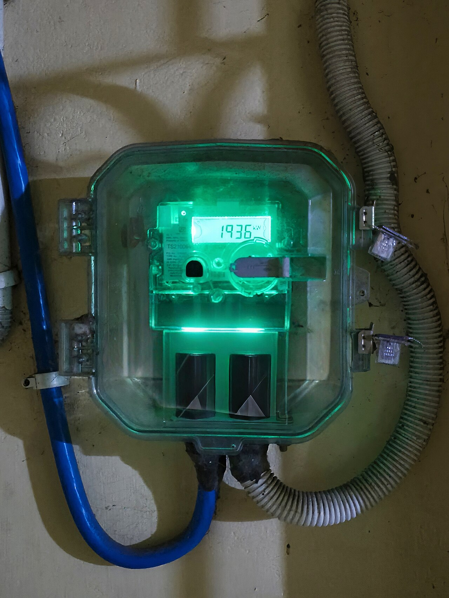

# Práctica 1.2 - Indicadores e inversión responsable en Telefónica

**Sostenibilidad aplicada al sistema productivo**\
2.º de Formación Profesional — Grado Medio y Grado Superior

---

## Contexto y objetivos

<figure class="content-photo"><figcaption>Un contador permite registrar consumo, pero para valorar una mejora hay que comparar periodos, actividad y alcance de los datos. Fotografía ilustrativa: <a href="https://commons.wikimedia.org/wiki/File:Smart_Electrical_Meter.jpg">Aliva Sahoo, CC BY-SA 4.0</a>.</figcaption></figure>

Continuáis el análisis de la Práctica 1.1 como si prepararais una nota breve para un equipo que estudia inversiones responsables. No vais a elaborar aún un plan de sostenibilidad empresarial: ese trabajo corresponde a una unidad posterior vinculada al RA6. Aquí debéis escoger métricas comparables, explicar para qué sirven los estándares de reporte y señalar qué información faltaría antes de tomar una decisión.

<figure class="study-figure"><figcaption>En esta segunda práctica, prestad especial atención al alcance del dato y a las reservas que deben acompañar la conclusión. Pulsa para ampliar.</figcaption></figure>

<figure class="study-figure"><figcaption>Este ejemplo es hipotético, no un dato de Telefónica. Usad la misma lógica para distinguir métrica, denominador y perímetro en los indicadores reales de la práctica. Pulsa para ampliar.</figcaption></figure>

## Fuentes del caso

Usad los datos y las fuentes F1 y F2, con sus apartados y páginas localizados, de la Práctica 1.1. Para el reporte, podéis consultar los [estándares GRI](https://www.globalreporting.org/how-to-use-the-gri-standards/gri-standards-english-language/) y la [información de la Comisión Europea sobre los ESRS y sus revisiones](https://finance.ec.europa.eu/financial-markets/company-reporting-and-auditing/company-reporting/corporate-sustainability-reporting_en). No es necesario leer íntegramente estos documentos: debéis comprender por qué un criterio público de reporte mejora la interpretación de los datos y por qué su aplicación depende de la empresa y de la normativa vigente.

## 1. Métricas y rendición de cuentas

### 1.1. Objetivo

Seleccionar datos que puedan seguirse en el tiempo y reconocer los límites de una cifra aislada.

### 1.2. Trabajo solicitado

1. Escoged **tres datos** del caso: al menos uno ambiental y uno social o de gobernanza.
2. Indicad qué mide cada uno, su ámbito geográfico y cómo comprobaríais si mejora o empeora el año siguiente. Si el dato no permite esa comparación sin información adicional, explicadlo. Redactad **35–50 palabras por métrica**.
3. Decidid si «tolerancia cero frente a la corrupción» puede utilizarse directamente como KPI. Proponed qué información pediríais para evaluar la aplicación de esa política en **70–100 palabras**.
4. Explicad en **80–110 palabras** por qué un estándar de reporte como GRI o ESRS ayuda a comparar empresas y por qué no garantiza, por sí mismo, que una empresa sea sostenible. Distinguid un estándar que puede emplearse voluntariamente de una obligación de reporte aplicable solo a determinadas empresas.

### 1.3. Entrega

#### Análisis de tres métricas (35–50 palabras por métrica)

| Nº del dato | Qué mide | Ámbito | Comparación necesaria | Información que falta |
|---:|---|---|---|---|
| | | | | |
| | | | | |
| | | | | |

#### Información para comprobar la política anticorrupción (70–100 palabras)

#### Utilidad y límite de los estándares (80–110 palabras)

La comparación solo es válida si la magnitud, el método y el ámbito se mantienen o si las diferencias se explican. Por ejemplo, una cifra de cobertura en España no equivale a la cobertura del grupo.

## 2. Nota de inversión responsable

### 2.1. Objetivo

Relacionar los riesgos ASG con una decisión de inversión sin presentar un juicio definitivo basado únicamente en un informe corporativo.

### 2.2. Trabajo solicitado

Imaginad que analizáis, a modo de ejercicio, una posible inversión en Telefónica. No debéis recomendar la compra de acciones ni calcular su rentabilidad financiera.

1. Seleccionad **dos asuntos ASG** que podrían influir en la decisión de un inversor y justificad su relevancia con datos del caso. Redactad **70–100 palabras por asunto**. En uno de ellos, explicad brevemente las dos caras de la doble materialidad: cómo puede afectar la actividad de la empresa a personas o al medioambiente y cómo puede afectar ese asunto a la propia empresa. Si una cara no se puede valorar con estos datos, indicadlo.
2. Indicad qué información adicional solicitaríais para cada asunto y dónde intentaríais contrastarla.
3. Explicad en **80–110 palabras** qué pueden aportar analistas, inversores, agencias de calificación e índices de sostenibilidad, y cuál es el límite de confiar únicamente en una calificación.
4. Cerrad la nota con una decisión provisional: **seguir investigando** o **descartar el caso por falta de información suficiente**. Justificadla en **90–120 palabras** sin afirmar que la empresa es completamente sostenible o insostenible.

### 2.3. Entrega

#### Análisis de dos asuntos ASG (70–100 palabras por asunto)

| Asunto ASG | Dato del caso y fuente | Riesgo u oportunidad | Información o contraste pendiente |
|---|---|---|---|
| | | | |
| | | | |

#### Papel y límites de los agentes de inversión responsable (80–110 palabras)

#### Decisión provisional y justificación (90–120 palabras)

## Entregas

- **Documento de análisis:** tabla de tres métricas, respuesta sobre anticorrupción y estándares, análisis de dos asuntos ASG y decisión provisional argumentada, con las extensiones indicadas. Los títulos y las referencias no cuentan dentro de los rangos de palabras.
- **Referencias:** señalad F1 o F2 y el apartado o la página del PDF para cada dato del caso; anotad cualquier fuente adicional utilizada para contrastarlo.

## Criterios de evaluación

| Criterio | Puntos | Indicadores de corrección |
|---|---:|---|
| Selección e interpretación de métricas | 2,5 | Tres datos pertinentes, ámbito identificado y comparación temporal razonada. |
| Rendición de cuentas | 1,5 | Distingue política de KPI, reporte voluntario de obligación aplicable y utilidad y límites de los estándares. |
| Análisis ASG para inversión | 2,0 | Dos asuntos relevantes sustentados con datos; reconoce impacto y riesgo u oportunidad para la empresa en uno de ellos. |
| Contraste y cautela | 1,5 | Identifica información pendiente, fuentes posibles y límites de las calificaciones. |
| Decisión provisional | 0,5 | Juicio argumentado y proporcionado a la información disponible. |
| Presentación gráfica | 1,0 | Tablas legibles, títulos claros y distribución visual que facilita comparar métricas y fuentes. |
| Redacción | 1,0 | Ideas ordenadas, terminología precisa, ortografía y puntuación cuidadas; respeta las extensiones solicitadas. |
| **Total** | **10** | |

## Puntos clave de revisión

- **No confundas reporte con desempeño:** publicar conforme a un estándar facilita la lectura, pero no demuestra todos los resultados.
- **Dos perspectivas:** un asunto puede afectar a las personas o al medioambiente y también tener consecuencias para la empresa; no supongáis que ambas están probadas por una misma cifra.
- **No confundas actividad con efecto:** saber cuántas auditorías se hicieron no revela qué encontraron.
- **Una calificación necesita contexto:** examinad su metodología y los datos que utiliza.
- **La decisión es provisional:** el ejercicio busca razonar con información incompleta, no dar asesoramiento financiero.
