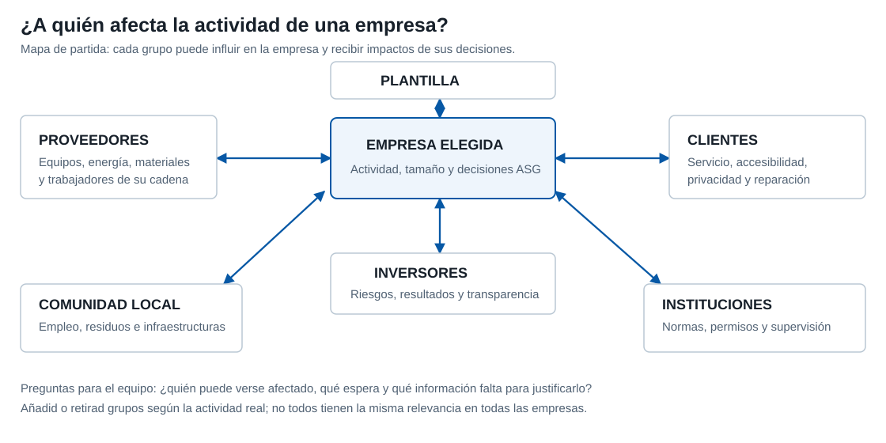

# Proyecto: Empresa, ASG y grupos de interés

**Sostenibilidad aplicada al sistema productivo**\
2.º de Formación Profesional — Grado Medio y Grado Superior

---

## Contexto y objetivos

Este trabajo inicia el proyecto **«El plan de sostenibilidad de tu empresa»**. Antes de proponer medidas, necesitáis comprender a qué se dedica la organización, qué tamaño puede tener, qué asuntos ambientales, sociales y de gobernanza (ASG) aparecen en su actividad y con quién se relaciona. La información reunida aquí será una primera versión: podréis corregirla cuando estudiemos nuevas unidades o encontréis mejores datos.

El trabajo se divide en dos tareas. En la primera seleccionaréis la empresa y analizaréis sus asuntos ASG para formular **reglas de decisión** razonables. En la segunda elaboraréis un mapa inicial de **grupos de interés** o *stakeholders* y explicaréis cuáles merecen más atención y por qué.

<figure class="study-figure"><figcaption>El mapa es un punto de partida, no una lista obligatoria. Adaptadlo a vuestra empresa y justificad a quién afectan sus decisiones. Como ejemplo real de identificación y prioridades, podéis consultar los <a href="https://www.telefonica.com/es/wp-content/uploads/sites/4/2025/06/compromiso-relacion-grupos-interes.pdf">grupos de interés publicados por Telefónica</a>. Pulsa para ampliar.</figcaption></figure>

## Fuentes y criterio de trabajo

Podéis recurrir a la web de la empresa, memorias e informes, registros públicos, prensa, publicaciones en redes sociales y, cuando sea posible, conversaciones con personas del sector. Anotad quién publica cada información, su fecha y el enlace o referencia que permite localizarla. Una afirmación de la propia empresa es una fuente, pero no demuestra por sí sola que sus políticas se apliquen o produzcan el resultado anunciado.

Si elegís una empresa **hipotética**, utilizad datos del sector para construir una propuesta verosímil y señalad qué es una estimación del equipo. No atribuyáis a una organización real prácticas, cifras o certificaciones que no hayáis podido comprobar. Si recogéis información presencial, pedid consentimiento y evitad incluir datos personales de terceros en la entrega.

## 1. Planifica y elige

### 1.1. Objetivo

Definir una empresa relacionada con vuestro futuro ámbito profesional y establecer una base suficiente para analizar su sostenibilidad.

### 1.2. Trabajo solicitado

1. Elegid una organización de la familia profesional de Electricidad y Electrónica que os interese. Puede dedicarse, por ejemplo, a instalaciones de telecomunicaciones o al mantenimiento de equipos y sistemas electrónicos. Explicad qué actividad realiza y por qué os gustaría trabajar en ese tipo de empresa en **150–200 palabras**.
2. Indicad si la empresa existe o es una propuesta hipotética. Describid sus productos o servicios, la zona en la que actúa y sus principales tipos de clientes.
3. Estimad su **número de trabajadores**. Si encontráis una cifra publicada, citad la fuente y el año; si no, explicad cómo habéis calculado una plantilla plausible a partir de la actividad, el tamaño y otros ejemplos del sector. No presentéis una estimación como cifra oficial. Dedicad **80–120 palabras** a la fuente o al cálculo.
4. Describid sus primeras relaciones con clientes, trabajadores, proveedores, organizaciones locales, agentes sociales y administraciones. La tarea 2 os permitirá ampliarlas y distinguir los grupos más relevantes.

### 1.3. Entrega

La memoria comenzará con dos apartados titulados **«Empresa y motivo de la elección»** (150–200 palabras) y **«Plantilla y criterio de estimación»** (80–120 palabras). Incorporad actividad, productos o servicios, ámbito, clientes y carácter real o hipotético en el primer apartado. Indicad las fuentes junto a los datos y señalad qué cifras son estimadas. Esta primera descripción delimita el caso; todavía no es el plan de sostenibilidad final.

## 2. Tarea 1 — Aspectos ASG y reglas de decisión

### 2.1. Objetivo

Identificar asuntos ambientales, sociales y de gobernanza de la empresa y traducirlos en criterios que podrían orientar sus decisiones.

### 2.2. Trabajo solicitado

1. Buscad **al menos un asunto relevante de cada dimensión ASG**. En la dimensión ambiental podéis examinar consumo de electricidad, materiales, reparaciones o residuos. En la social, condiciones de trabajo, conciliación, seguridad, accesibilidad o colaboración con entidades del entorno. En gobernanza, transparencia, prevención de conflictos de interés, trato a proveedores o canales de comunicación y denuncia.
2. Para cada asunto, indicad qué información habéis localizado. Si la empresa publica una política, distinguidla de un resultado medido. Si no hay información suficiente, escribid **«no consta en las fuentes consultadas»** en lugar de responder simplemente sí o no. Dedicad **100–140 palabras a cada dimensión ASG**.
3. Proponed una **regla de decisión** vinculada a cada asunto. Puede ser una regla que la empresa ya declara aplicar —con su fuente— o una mejora formulada por el equipo. Por ejemplo, comparar el consumo eléctrico antes de sustituir equipos o comprobar criterios laborales y ambientales antes de contratar a un proveedor.
4. Explicad qué ventaja podría aportar cada regla y qué dato necesitaríais para valorar si funciona. Dedicad **70–100 palabras a justificar cada regla**. Evitad afirmar beneficios seguros cuando todavía no se han medido.

### 2.3. Entrega

En la memoria, redactad tres apartados —**«Ambiental»**, **«Social»** y **«Gobernanza»**— de 100–140 palabras cada uno. Tras ellos, añadid **«Reglas de decisión»** y justificad cada una en 70–100 palabras. Incluid las fuentes en los pasajes pertinentes y distinguid lo que la empresa ya hace de lo que proponéis.

Preparad además una **presentación de tres o cuatro diapositivas** que muestre la empresa elegida, los asuntos ASG investigados, las reglas propuestas y las ventajas posibles. Usad títulos informativos, letra legible y gráficos o imágenes solo si ayudan a interpretar una idea; citad su procedencia. La presentación debe distinguir lo observado de lo que el equipo propone; no es necesario exponerla oralmente por ahora.

## 3. Tarea 2 — Grupos de interés

### 3.1. Objetivo

Reconocer quién puede influir en la empresa o verse afectado por ella y justificar cuáles son sus relaciones más importantes.

### 3.2. Trabajo solicitado

1. Revisad posibles categorías: propietarios, trabajadores, clientes, sindicatos, proveedores, inversores, acreedores, comunidades y organizaciones locales, medios de comunicación y administraciones. No todos deben aparecer. Incluid nombres concretos solo si son públicos y pertinentes; si un grupo no existe en vuestro caso o no podéis identificarlo, explicadlo sin inventar datos.
2. Seleccionad **entre cinco y siete grupos pertinentes**. Para cada uno, describid **qué relación mantiene** con la empresa, **qué puede esperar** de ella y cómo podría afectarle una decisión ambiental, laboral, comercial o de gobierno. Dedicad **35–50 palabras a cada grupo**.
3. Buscad una fuente para las relaciones comprobables. En una empresa hipotética, marcad la relación como supuesto del equipo y explicad por qué sería plausible.
4. Elegid **dos grupos prioritarios** y justificad cada elección en **70–100 palabras** mediante un posible impacto, riesgo u oportunidad para la empresa y para esos grupos.

### 3.3. Entrega

La memoria terminará con **«Grupos de interés»**, con un párrafo de 35–50 palabras por cada uno de los cinco a siete grupos elegidos, y **«Dos grupos prioritarios»**, con una justificación de 70–100 palabras por grupo. Incluid referencias o marcad los supuestos del equipo. No hay que completar una tabla: interesa una explicación propia y razonada de las relaciones que importan en vuestro caso.

## Entregas

- **Memoria de esta fase:** empresa, plantilla, tres dimensiones ASG, tres reglas de decisión, cinco a siete grupos de interés y dos grupos prioritarios, con las extensiones indicadas. Las citas y la lista de fuentes no cuentan dentro de los rangos de palabras.
- **Presentación breve:** tres o cuatro diapositivas sobre los asuntos ASG, sus reglas de decisión y posibles ventajas.
- **Relación de fuentes:** enlaces o referencias junto a cada dato, con fecha cuando esté disponible; identificad por separado los supuestos y propuestas del equipo.

Esta entrega es **la primera parte del proyecto**. Guardadla para revisarla y completarla en las siguientes unidades; no tenéis que presentar todavía el plan final de diez páginas.

## Criterios de evaluación

| Criterio | Puntos | Indicadores de corrección |
|---|---:|---|
| Elección y delimitación de la empresa | 1,5 | Actividad y motivación claras; plantilla y ámbito explicados con fuente o estimación razonada. |
| Análisis ASG y reglas de decisión | 2,5 | Tres dimensiones presentes, información diferenciada de propuestas y ventajas justificadas. |
| Grupos de interés | 1,5 | Relaciones y expectativas pertinentes; prioridades justificadas, sin grupos inventados. |
| Fuentes y lectura crítica | 1,5 | Datos localizables, fechas y límites reconocidos; no confunde declaraciones con resultados. |
| Presentación gráfica | 1,5 | Memoria y diapositivas legibles, bien organizadas, con imágenes o gráficos pertinentes y acreditados. |
| Redacción | 1,5 | Explicaciones coherentes, precisas y propias; ortografía, puntuación, títulos y extensiones cuidados. |
| **Total** | **10** | |

## Puntos clave de revisión

- **Dato o estimación:** señalad siempre cuál de los dos estáis utilizando.
- **Política o resultado:** publicar una intención no demuestra que se haya aplicado con éxito.
- **Regla de decisión:** debe servir para orientar una actuación concreta y permitir una comprobación posterior.
- **Grupo de interés:** seleccionad los grupos pertinentes sin inventar nombres o relaciones; explicad las ausencias cuando proceda.
