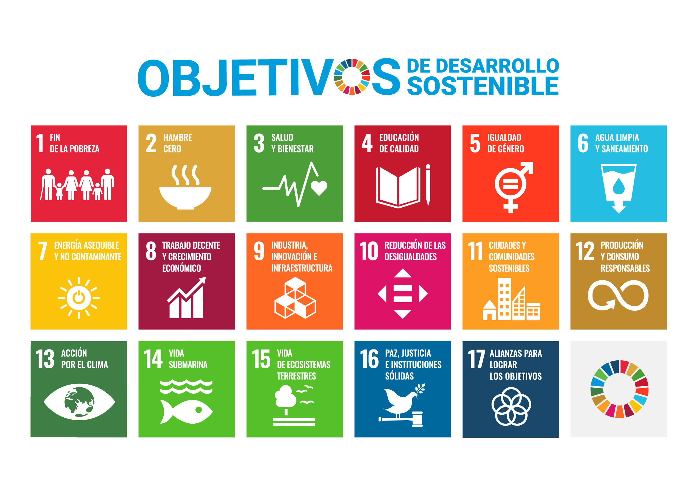
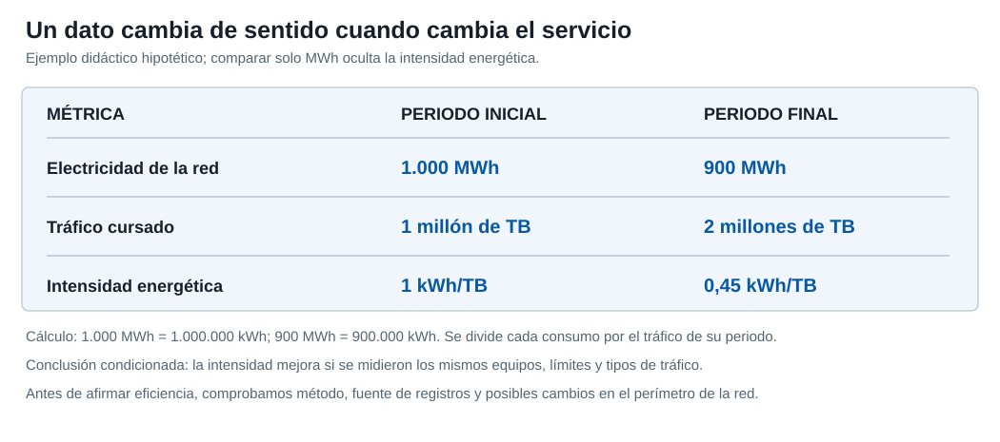

# La sostenibilidad en las organizaciones empresariales

**Sostenibilidad aplicada al sistema productivo**\
2.º de Formación Profesional — Grado Medio y Grado Superior

---

La sostenibilidad empresarial no consiste únicamente en reducir emisiones o reciclar residuos. Una organización sostenible debe analizar cómo afecta su actividad al medioambiente, a las personas y a la forma en que se gobierna, y debe ser capaz de medir esos efectos para tomar decisiones y rendir cuentas.

## 1. Sostenibilidad y desarrollo sostenible

Una actividad es **sostenible** cuando puede mantenerse en el tiempo sin trasladar costes ambientales, sociales o económicos inasumibles a otras personas, territorios o generaciones. El concepto de **desarrollo sostenible** añade una idea fundamental: satisfacer las necesidades actuales sin comprometer la capacidad de las generaciones futuras para satisfacer las suyas.

En una empresa, esta idea obliga a observar el proceso completo. No basta con que un producto consuma poca energía durante su uso si su fabricación requiere materias primas obtenidas de forma insostenible, genera residuos difíciles de gestionar o depende de condiciones laborales inadecuadas. Del mismo modo, una organización puede reducir emisiones y seguir presentando problemas graves de corrupción, seguridad, privacidad o derechos laborales.

> **Idea clave**
>
> La sostenibilidad empresarial combina resultados económicos con responsabilidad ambiental, social y de gobierno. Una mejora aislada no convierte automáticamente a una empresa en sostenible.

### 1.1. Principales marcos internacionales

La sostenibilidad empresarial se desarrolla dentro de varios marcos internacionales que orientan a gobiernos y organizaciones.

La **Agenda 2030**, aprobada por Naciones Unidas en 2015, establece 17 **Objetivos de Desarrollo Sostenible (ODS)** y 169 metas. Los ODS abarcan cuestiones ambientales, sociales y económicas y funcionan como una referencia común para orientar políticas públicas y estrategias empresariales.

El **Acuerdo de París** es el principal marco internacional frente al cambio climático. Su objetivo es limitar el aumento de la temperatura global mediante la reducción de emisiones de gases de efecto invernadero y la adaptación a los efectos del cambio climático.

El acuerdo fija la meta de mantener el calentamiento **muy por debajo de 2 °C** respecto a la era preindustrial y proseguir los esfuerzos para limitarlo a **1,5 °C**. Los países comunican sus contribuciones climáticas y revisan periódicamente el progreso colectivo. No es una certificación que una empresa pueda obtener por sí misma: las empresas contribuyen a sus objetivos a través de decisiones verificables sobre energía, emisiones, transporte y compras.

El **Pacto Mundial de las Naciones Unidas** traslada la sostenibilidad al ámbito empresarial mediante principios relacionados con derechos humanos, trabajo, medioambiente y lucha contra la corrupción.

Estos marcos no sustituyen a la legislación, pero ayudan a definir qué asuntos deben considerar las organizaciones y sirven de referencia para establecer objetivos, indicadores y compromisos.

Conviene distinguir tres niveles que a menudo aparecen mezclados. Una **agenda internacional**, como la Agenda 2030, propone objetivos compartidos; un **tratado**, como el Acuerdo de París, compromete a los Estados que son parte; y una **ley o reglamento** concreta obligaciones aplicables en un territorio y a determinadas organizaciones. Adherirse voluntariamente al Pacto Mundial tampoco equivale a cumplir toda la normativa ambiental, laboral y mercantil.

El [Marco de Cooperación de Naciones Unidas para el Desarrollo Sostenible](https://unsdg.un.org/2030-agenda/cooperation-framework) sirve para planificar, ejecutar y evaluar la colaboración de la Organización de las Naciones Unidas (ONU) con cada país en relación con los ODS. Es una herramienta de cooperación institucional, no una norma de obligado cumplimiento para una pequeña empresa española.

En España, el marco de energía y clima se desarrolla, entre otros instrumentos, mediante la [Ley 7/2021 de cambio climático y transición energética](https://www.boe.es/eli/es/l/2021/05/20/7/con) y el [Plan Nacional Integrado de Energía y Clima 2023–2030](https://www.miteco.gob.es/es/energia/estrategia-normativa/pniec-23-30.html). Este último es una herramienta de planificación nacional, no una lista de obligaciones idénticas para todas las empresas. Antes de decidir qué exigencias afectan a una organización hay que examinar su actividad, tamaño, ubicación y normativa específica.

Puedes consultar los textos de referencia en [Naciones Unidas — Agenda 2030 y ODS](https://www.un.org/sustainabledevelopment/es/sustainable-development-goals/), la [Convención Marco de Naciones Unidas — Acuerdo de París](https://unfccc.int/es/most-requested/que-es-el-acuerdo-de-paris) y los [diez principios del Pacto Mundial](https://unglobalcompact.org/what-is-gc/mission/principles).

### 1.2. Agenda 2030 y ODS

Los 17 ODS no tienen la misma importancia para todas las empresas. Cada organización debe identificar cuáles están realmente relacionados con su actividad y con sus impactos.

Una empresa de telecomunicaciones, por ejemplo, puede estar especialmente relacionada con:

- **ODS 7 — Energía asequible y no contaminante:** consumo eléctrico de redes, centros de datos y edificios.
- **ODS 8 — Trabajo decente y crecimiento económico:** condiciones laborales propias y de proveedores.
- **ODS 9 — Industria, innovación e infraestructura:** desarrollo de redes e infraestructuras digitales.
- **ODS 10 — Reducción de las desigualdades:** acceso a conectividad y reducción de la brecha digital.
- **ODS 12 — Producción y consumo responsables:** compra de equipos, reutilización, reparación y gestión de residuos electrónicos.
- **ODS 13 — Acción por el clima:** reducción de emisiones y adaptación al cambio climático.

No se trata de asociar una empresa con el mayor número posible de ODS. La relación debe poder justificarse a partir de su actividad, sus impactos y sus decisiones.

Los [17 objetivos y sus metas oficiales](https://sdgs.un.org/goals) permiten estudiar la Agenda completa sin confundir el nombre breve de un objetivo con todas sus metas. Esta tabla resume qué plantea cada ODS y una posible pregunta para analizar una organización; los ejemplos no afirman que cualquier empresa contribuya necesariamente a todos ellos.

| ODS | Qué persigue | Pregunta para una empresa |
|---|---|---|
| **1. Fin de la pobreza** | Reducir la pobreza y mejorar la protección de las personas vulnerables. | ¿Sus empleos y servicios favorecen o dificultan el acceso a recursos básicos? |
| **2. Hambre cero** | Mejorar el acceso a alimentos y promover sistemas alimentarios sostenibles. | ¿Afecta su actividad a la disponibilidad o al desperdicio de alimentos? |
| **3. Salud y bienestar** | Promover vidas saludables y bienestar. | ¿Previene accidentes y daños a la salud de trabajadores y usuarios? |
| **4. Educación de calidad** | Facilitar aprendizaje inclusivo durante toda la vida. | ¿Ofrece formación y acceso a herramientas educativas? |
| **5. Igualdad de género** | Eliminar discriminación y violencia contra mujeres y niñas. | ¿Existe igualdad efectiva en contratación, promoción y salarios? |
| **6. Agua limpia y saneamiento** | Garantizar agua y saneamiento gestionados de forma sostenible. | ¿Conoce su consumo de agua y evita vertidos perjudiciales? |
| **7. Energía asequible y no contaminante** | Ampliar el acceso a energía sostenible y eficiente. | ¿Cuánta energía consume y cómo mejora su eficiencia? |
| **8. Trabajo decente y crecimiento económico** | Impulsar empleo digno y actividad económica sostenible. | ¿Son seguras y justas las condiciones de trabajo, también en proveedores? |
| **9. Industria, innovación e infraestructura** | Desarrollar infraestructuras resilientes e innovación. | ¿Son sus instalaciones duraderas, accesibles y mantenibles? |
| **10. Reducción de las desigualdades** | Disminuir desigualdades dentro de los países y entre ellos. | ¿A quién deja fuera el precio, el diseño o la cobertura de su servicio? |
| **11. Ciudades y comunidades sostenibles** | Mejorar inclusión, seguridad y resiliencia de los asentamientos. | ¿Cómo afecta una obra o instalación a la comunidad local? |
| **12. Producción y consumo responsables** | Usar recursos de forma más responsable y reducir residuos. | ¿Puede reparar, reutilizar o recuperar los equipos que vende? |
| **13. Acción por el clima** | Reducir el riesgo climático y responder a sus efectos. | ¿Mide emisiones y adapta sus instalaciones a fenómenos extremos? |
| **14. Vida submarina** | Proteger mares, océanos y recursos marinos. | ¿Puede su cadena de suministro o gestión de residuos contaminar el mar? |
| **15. Vida de ecosistemas terrestres** | Proteger bosques, suelos y biodiversidad. | ¿Qué impacto tiene el despliegue de infraestructuras sobre el territorio? |
| **16. Paz, justicia e instituciones sólidas** | Promover instituciones responsables y acceso a la justicia. | ¿Evita corrupción y comunica sus decisiones con transparencia? |
| **17. Alianzas para lograr los objetivos** | Reforzar cooperación y medios de implementación. | ¿Con quién colabora para resolver un problema que no puede abordar sola? |

Una actuación empresarial puede ayudar a un objetivo y perjudicar a otro. Por ejemplo, ampliar la conectividad puede contribuir a los ODS 4, 9 y 10, pero requiere materiales y energía relacionados con los ODS 7, 12 y 13. La conclusión debe apoyarse en **datos de impacto**, no en una lista de iconos colocados en la memoria de la empresa.

<figure class="study-figure"><figcaption>Póster oficial de los 17 ODS en español. Fuente: <a href="https://www.un.org/sustainabledevelopment/es/news/communications-material/">Naciones Unidas, materiales de comunicación</a>. Esta publicación no ha sido aprobada por Naciones Unidas ni refleja necesariamente sus opiniones.</figcaption></figure>

### 1.3. Las cinco dimensiones de la Agenda

La Agenda 2030 reúne sus prioridades en cinco dimensiones, conocidas como las **5P** por las iniciales de sus nombres en inglés: *people* (personas), *planet* (planeta), *prosperity* (prosperidad), *peace* (paz) y *partnership* (alianzas). Estas dimensiones aparecen en el [preámbulo oficial de la Agenda 2030](https://sdgs.un.org/2030agenda); no sustituyen a los 17 objetivos ni asignan un ODS exclusivamente a una dimensión.

En una empresa de telecomunicaciones, **personas** puede significar empleos seguros y servicios accesibles; **planeta**, menor consumo energético y gestión responsable de residuos; **prosperidad**, infraestructuras útiles y actividad económica viable; **paz**, decisiones íntegras y respeto de derechos; y **alianzas**, colaboración con administraciones, proveedores y comunidades locales. Las dimensiones se refuerzan entre sí. Un despliegue rural que mejora el acceso digital deja de ser una buena solución si ignora los derechos de sus trabajadores o deteriora un entorno natural.

El [vídeo de Naciones Unidas sobre las cinco P](https://unsdg.un.org/es/latest/videos/5ps-sdgs-people-planet-prosperity-peace-and-partnership) ofrece otra representación de estas dimensiones. Úsalo para comprobar cómo se relacionan entre sí, no para asignar cada ODS a una sola categoría.

<figure class="content-photo"><figcaption>La transición energética puede reducir emisiones, pero también requiere infraestructuras, materiales y decisiones sobre su ubicación. Fotografía: <a href="https://commons.wikimedia.org/wiki/File:CdTe_PV_array_at_the_National_Wind_Technology_Center_(NWTC).jpg">Dennis Schroeder / Departamento de Energía de Estados Unidos, dominio público</a>.</figcaption></figure>

> **Comprueba que lo has entendido**
>
> Elige un servicio tecnológico y señala un posible beneficio social y un posible coste ambiental. ¿Qué dato necesitarías para comprobar cada afirmación?

### Vídeo — Agenda 2030 y Objetivos de Desarrollo Sostenible

**Los Objetivos de Desarrollo Sostenible: qué son y cómo alcanzarlos — Organización de las Naciones Unidas para la Educación, la Ciencia y la Cultura (UNESCO)**

https://www.youtube.com/watch?v=MCKH5xk8X-g

**Antes de verlo:** piensa en una actuación de una empresa de telecomunicaciones que podría vincularse a un ODS.

**Mientras lo ves:** identifica qué son los ODS y por qué un objetivo general necesita acciones concretas.

**Después:** escribe dos frases: una con el ODS elegido y otra con una actuación empresarial verificable. Esta respuesta te servirá para justificar la relación entre ODS y datos en la Práctica 1.1.

---

## 2. Aspectos ambientales, sociales y de gobernanza

Los criterios **ambientales, sociales y de gobernanza (ASG)** permiten analizar la sostenibilidad empresarial desde tres dimensiones. En inglés se utiliza la sigla **ESG** (*Environmental, Social and Governance*; ambiental, social y gobernanza).

| Dimensión | Qué analiza | Ejemplos |
|---|---|---|
| **Ambiental (A)** | Relación de la organización con el medioambiente y los recursos naturales. | Energía, emisiones, agua, materiales, residuos, contaminación, biodiversidad. |
| **Social (S)** | Relación con trabajadores, clientes, proveedores y sociedad. | Condiciones laborales, igualdad, salud y seguridad, derechos humanos, accesibilidad, formación. |
| **Gobernanza (G)** | Forma en la que se dirige, controla y supervisa la organización. | Ética, transparencia, anticorrupción, protección de datos, control interno, responsabilidades. |

La clasificación ayuda a ordenar la información, pero las tres dimensiones están relacionadas. Una decisión sobre proveedores, por ejemplo, puede tener consecuencias ambientales por el origen de los materiales, sociales por las condiciones de trabajo y de gobernanza por los mecanismos utilizados para controlar la cadena de suministro.

La dimensión **ambiental** no se limita a contar toneladas de CO₂. Debe examinar de dónde proceden la energía y las materias primas, qué ocurre durante la fabricación y el uso del producto, y cómo se gestionan los residuos al final de su vida útil. En una instalación de telecomunicaciones importa el consumo eléctrico de los equipos, pero también el cableado, las baterías, los desplazamientos de mantenimiento y la reparación frente a la sustitución. La consecuencia ambiental puede producirse en la propia empresa o en un proveedor.

La dimensión **social** incluye condiciones laborales, prevención de riesgos, igualdad, formación, derechos humanos y relación con usuarios y comunidades. Una buena política de conciliación es valiosa, pero no compensa una siniestralidad elevada entre el personal instalador. En servicios digitales también cuentan la accesibilidad, la privacidad y la posibilidad real de uso por personas con menos recursos o conectividad.

La **gobernanza** pregunta quién toma las decisiones, quién supervisa su cumplimiento y cómo se detectan y corrigen las malas prácticas. Son ejemplos un código ético, controles anticorrupción, una política de compras, canales para comunicar incidencias y criterios transparentes para informar de resultados. La [explicación de los diez principios del Pacto Mundial de la ONU](https://unglobalcompact.org/what-is-gc/mission/principles) muestra por qué una buena práctica en una dimensión no neutraliza un daño grave en otra.

<figure class="content-photo"><figcaption>Los residuos electrónicos ilustran un impacto ambiental que debe analizarse junto con las decisiones de compra, reparación y gestión de proveedores. Fotografía: <a href="https://commons.wikimedia.org/wiki/File:Basura_electrónica.jpg">Dolapeart, Creative Commons Atribución-CompartirIgual 4.0 (CC BY-SA 4.0)</a>.</figcaption></figure>

### 2.1. Riesgos y oportunidades ASG

Un **riesgo ASG** es una situación ambiental, social o de gobernanza que puede perjudicar a la organización o a sus grupos de interés. Una **oportunidad ASG** aparece cuando una mejora de sostenibilidad también puede crear valor, reducir costes, evitar problemas o abrir nuevas posibilidades de negocio.

En telecomunicaciones son riesgos ASG relevantes el elevado consumo energético, las brechas de datos, la dependencia de proveedores con malas prácticas, la generación de residuos electrónicos o la falta de acceso digital en determinadas zonas.

También existen oportunidades. Una red más eficiente reduce consumo y costes; la reparación y reutilización de equipos disminuye residuos y compras; una mejor accesibilidad amplía el número de usuarios; y una cadena de suministro controlada reduce riesgos legales y reputacionales.

Las ventajas deben analizarse, no darse por seguras. Una mejora puede facilitar financiación, atraer trabajadores, reforzar la confianza del cliente o disminuir costes operativos, pero el resultado depende de la inversión necesaria, el plazo, la calidad de la implantación y la existencia de datos. Una política ASG escrita que no cambia la práctica diaria no produce por sí sola esos beneficios.

| Decisión | Posible ventaja | Qué habría que comprobar |
|---|---|---|
| Reparar equipos antes de sustituirlos. | Menos compras y residuos electrónicos. | Vida útil, coste de reparación y cantidad de residuos evitados. |
| Formar al personal instalador en seguridad. | Menos accidentes y mayor calidad del trabajo. | Accidentes y horas de formación antes y después. |
| Auditar proveedores de componentes. | Menor riesgo de incumplimientos en la cadena de suministro. | Número de proveedores revisados y problemas corregidos. |

Al comunicar estas decisiones hay que evitar el **lavado verde**: afirmar que toda la empresa es sostenible a partir de una medida parcial, omitir impactos negativos o usar términos como «ecológico» sin método ni datos. Una comunicación fiable indica el alcance de la medida, el periodo, la fuente y sus límites.

<aside class="study-card" aria-label="Caso profesional: renovación de una red">

CASO PROFESIONAL

<h3>Renovar una red antigua</h3>

Una empresa sustituye equipos de red por modelos más eficientes. La compra exige una inversión inicial y genera equipos retirados que debe gestionar.

<strong>Decisión a evaluar:</strong> comparar durante varios años el consumo eléctrico, las averías, el coste total y el destino de los equipos retirados. Solo así puede justificarse si la renovación mejora al mismo tiempo el desempeño ambiental y el económico.

</aside>

### Vídeo — Criterios ESG / ASG

**¿Qué son los criterios ESG y por qué son importantes? — Fundación Microfinanzas Banco Bilbao Vizcaya Argentaria (BBVA)**

https://www.youtube.com/watch?v=ssY-e8qaAR4

**Antes de verlo:** recuerda la diferencia entre las dimensiones A, S y G de la tabla anterior.

**Mientras lo ves:** anota un ejemplo de cada dimensión y señala a quién podría afectar.

**Después:** clasifica un ejemplo del sector de telecomunicaciones y justifica en una frase por qué lo has situado en esa dimensión. La clasificación puede abarcar más de una dimensión si explicas la relación.

---

## 3. Grupos de interés

Los **grupos de interés** o *stakeholders* son personas, grupos u organizaciones que pueden afectar a una empresa o verse afectados por sus decisiones.

Entre los más habituales se encuentran:

- trabajadores;
- clientes;
- propietarios y accionistas;
- inversores y entidades financieras;
- proveedores;
- Administraciones públicas;
- sindicatos;
- comunidad local;
- organizaciones sociales;
- medios de comunicación.

Los intereses pueden ser distintos e incluso entrar en conflicto. Un accionista puede valorar una reducción de costes, mientras que un trabajador puede estar más preocupado por la seguridad laboral y un cliente por la calidad del servicio y la protección de sus datos.

Una primera clasificación distingue los grupos **internos** —propietarios, dirección y empleados— de los **externos** —clientes, proveedores, acreedores, sindicatos, administraciones, comunidad local y medios—. La distinción ayuda a ordenar el análisis, pero no determina por sí sola la importancia de cada grupo. Un proveedor crítico o una comunidad afectada por una instalación puede tener más relevancia para una decisión concreta que un grupo interno con poca relación con ella.

<figure class="content-photo"><figcaption>Consultar a distintas personas ayuda a conocer intereses y posibles impactos. Una reunión no representa por sí sola a todos los grupos afectados por la empresa. Fotografía: <a href="https://commons.wikimedia.org/wiki/File:Team_Meeting.jpg">woodleywonderworks, CC BY 2.0</a>.</figcaption></figure>

Para pasar de la lista a un análisis útil, identifica **qué espera** cada grupo, **cómo puede influir** en la empresa y **cómo puede verse afectado** por sus decisiones. Preguntar solo «¿quién tiene interés?» deja fuera personas que quizá no participan en una reunión, pero reciben el impacto. La información puede obtenerse de memorias, contratos, consultas, quejas, entrevistas y fuentes públicas. Si no se dispone de datos, debe indicarse como una limitación, no inventarse una respuesta.

### 3.1. Aspectos relevantes para cada grupo de interés

La empresa debe identificar qué cuestiones ASG son realmente importantes para sus grupos de interés y qué riesgos u oportunidades generan.

| Stakeholder | Interés habitual | Ejemplo de aspecto ASG |
|---|---|---|
| Propietarios y dirección | Continuidad, control y estrategia de la empresa. | Supervisión de riesgos, ética, decisiones de inversión. |
| Trabajadores | Empleo estable, seguridad, desarrollo profesional. | Accidentes, formación, igualdad. |
| Clientes | Calidad, precio, privacidad y continuidad del servicio. | Brechas de datos, accesibilidad, calidad. |
| Proveedores | Relación comercial estable y criterios claros. | Auditorías, derechos laborales, plazos de pago. |
| Inversores | Rentabilidad, riesgo y continuidad del negocio. | Emisiones, litigios, corrupción, gobierno corporativo. |
| Acreedores | Capacidad de pago y gestión prudente. | Endeudamiento, transparencia y riesgos de continuidad. |
| Sindicatos | Representación y condiciones de los trabajadores. | Negociación, seguridad y conciliación. |
| Administración | Cumplimiento normativo e impacto económico y social. | Fiscalidad, regulación, empleo, medioambiente. |
| Comunidad local | Impacto sobre el territorio y calidad de vida. | Infraestructuras, empleo, residuos, emisiones. |
| Medios y organizaciones sociales | Información fiable y efectos sobre la sociedad. | Transparencia, inclusión y respuesta a problemas públicos. |

El objetivo no es satisfacer cualquier demanda de cualquier grupo, sino reconocer los asuntos relevantes, analizar sus consecuencias y tomar decisiones justificadas.

En un proyecto de despliegue de red, los **empleados** pueden pedir condiciones seguras y formación; los **clientes**, continuidad y privacidad; los **proveedores**, previsibilidad en las compras; la **comunidad local**, una obra con molestias limitadas; la **administración**, cumplimiento de permisos; y los **acreedores**, capacidad de pago. Una decisión razonada debe explicar qué intereses se han tenido en cuenta y qué compensaciones o medidas correctoras propone.

### 3.2. Materialidad y doble materialidad

Un asunto ASG es **material** cuando su importancia justifica que la empresa lo analice, gestione y comunique. La relevancia no se decide solo por lo que resulta cómodo medir o por la opinión de un único grupo de interés: también hay que considerar los impactos reales o posibles de la actividad y los riesgos y oportunidades para el negocio.

La **doble materialidad** observa el asunto desde dos perspectivas. La *materialidad de impacto* pregunta cómo afecta la empresa a las personas o al medioambiente. La *materialidad financiera* pregunta cómo puede afectar ese asunto a la situación, los resultados o las perspectivas de la empresa. Un asunto puede ser relevante desde una perspectiva, desde la otra o desde ambas.

Por ejemplo, una brecha de datos puede perjudicar la privacidad de los clientes y, al mismo tiempo, generar costes, sanciones y pérdida de confianza para la empresa. Para valorar su importancia habría que conocer a quién afectó, la gravedad del daño, los controles existentes y las posibles consecuencias para la organización; no bastaría con contar incidentes.

Esta forma de analizar los asuntos se recoge en los [estándares europeos de información sobre sostenibilidad (ESRS, *European Sustainability Reporting Standards*)](https://finance.ec.europa.eu/financial-markets/company-reporting-and-auditing/company-reporting/corporate-sustainability-reporting_en). No equivale a afirmar que todas las empresas están obligadas a publicar el mismo informe.

### Vídeo — Stakeholders o grupos de interés

**Los grupos de interés en la empresa — Guerras y Navas: Estrategia Empresarial**

https://www.youtube.com/watch?v=DkJGc1rFvDY

**Antes de verlo:** piensa en dos grupos de interés de una empresa que instala redes, fibra o sistemas de seguridad electrónica.

**Mientras lo ves:** identifica qué espera cada grupo de la organización y si esas expectativas pueden entrar en conflicto.

**Después:** redacta una relación «grupo de interés — expectativa — riesgo u oportunidad» para un caso de telecomunicaciones. Puedes reutilizarla en la Práctica 1.1.

---

## 4. Medición de la sostenibilidad

Una política de sostenibilidad solo puede evaluarse si existen datos que permitan comprobar su evolución. Para ello se utilizan **indicadores** e **indicadores clave de desempeño (KPI, *Key Performance Indicators*)**.

Un KPI debe relacionarse con un objetivo concreto y permitir comparar la situación en distintos momentos.

| Dimensión | Posible indicador |
|---|---|
| Ambiental | Toneladas de CO₂ emitidas. |
| Ambiental | Consumo anual de electricidad. |
| Ambiental | Porcentaje de electricidad renovable sobre el consumo eléctrico de instalaciones propias. |
| Ambiental | Porcentaje de residuos reutilizados o reciclados. |
| Social | Tasa de accidentes laborales. |
| Social | Horas de formación por trabajador. |
| Social | Porcentaje de mujeres en puestos directivos. |
| Gobernanza | Número de proveedores auditados. |
| Gobernanza | Incidentes graves de protección de datos. |
| Gobernanza | Casos confirmados de corrupción. |

Un indicador aislado puede resultar engañoso. Reducir el consumo total de electricidad puede parecer una mejora, pero la comparación no sería completa si al mismo tiempo la empresa ha reducido a la mitad su actividad. Por eso los datos deben interpretarse dentro de su contexto y, cuando sea necesario, utilizar indicadores relativos.

### 4.1. De un objetivo a un KPI comprobable

Una **métrica** es un dato que se mide; un **KPI** es una métrica elegida para evaluar un objetivo prioritario. «Consumir menos energía» es una intención. «Reducir el consumo eléctrico de la red por terabyte de datos transmitidos entre 2026 y 2028» ya permite definir un indicador, un periodo y una comparación. Antes de calcularlo hay que decidir qué instalaciones entran en el dato, de dónde proceden los registros y si se utilizará energía medida o estimada.

<figure class="study-figure"><figcaption>Los datos son hipotéticos: el consumo pasa de 1.000 a 900 megavatios hora (MWh), el tráfico de uno a dos millones de terabytes (TB) y la intensidad de 1 a 0,45 kilovatios hora por terabyte (kWh/TB). La intensidad por servicio añade información que no ofrece el consumo absoluto; aun así, hay que confirmar que ambos periodos incluyen el mismo perímetro. Pulsa para ampliar.</figcaption></figure>

Un KPI útil debe incluir **nombre, unidad, periodo, perímetro, método, valor inicial, meta y fuente**. La meta no debe elegirse después de ver el resultado. Cuando cambia el perímetro —por ejemplo, al incorporar otra empresa o ampliar la red— hay que explicarlo para que la evolución no parezca mejor o peor de lo que es.

| Objetivo | KPI y unidad | Cálculo orientativo | Precaución |
|---|---|---|---|
| Reducir la intensidad energética de una red. | kWh por terabyte transmitido. | Electricidad consumida por la red ÷ terabytes transmitidos. | Comparar el mismo perímetro de equipos y periodo. |
| Mejorar la recuperación de equipos retirados. | Porcentaje de equipos recuperados. | Equipos reutilizados o enviados a gestión autorizada ÷ equipos retirados × 100. | Distinguir reutilización, reciclaje y simple recogida. |
| Reducir accidentes laborales. | Accidentes con baja por horas trabajadas. | Accidentes con baja ÷ horas trabajadas, con la escala indicada. | Incluir correctamente personal propio y contratado. |
| Revisar la cadena de suministro. | Porcentaje de proveedores evaluados. | Proveedores evaluados ÷ proveedores incluidos en el plan × 100. | Explicar cuáles entran en el plan y qué significa «evaluado». |

Los ejemplos del libro —**huella de carbono, consumo energético, distancias de transporte, residuos e impacto social**— son buenas familias de medidas, pero no existe un conjunto de cinco indicadores universalmente «más eficaz». La elección depende de los impactos materiales de cada empresa. Si una empresa apenas transporta mercancías pero consume mucha electricidad, medir kilómetros recorridos puede resultar menos útil que medir energía por servicio prestado.

La **huella de carbono** requiere un método de cálculo, no solo una cifra final. El [Protocolo de Gases de Efecto Invernadero (GHG Protocol, *Greenhouse Gas Protocol*)](https://ghgprotocol.org/corporate-standard?page=1) diferencia emisiones directas de fuentes propias o controladas (**alcance 1**), emisiones indirectas de energía adquirida (**alcance 2**) y otras emisiones de la cadena de valor (**alcance 3**). Una empresa de telecomunicaciones que anuncia menos emisiones en sus oficinas no ha demostrado necesariamente que también disminuyan las de fabricación de equipos, proveedores y uso de sus servicios. Debe indicar qué alcances incluye y cómo ha obtenido los datos.

Los indicadores **sociales** deben relacionarse con derechos y experiencias reales: accidentes, formación, igualdad, accesibilidad, satisfacción y condiciones en la cadena de suministro. Los de **gobernanza** pueden medir formación anticorrupción, incidencias investigadas, plazos de respuesta o proveedores con controles completados. Una cifra de «cero incidencias» no prueba automáticamente que no exista ningún problema: también puede señalar que el sistema de detección es insuficiente.

<aside class="study-card" aria-label="Ejemplo de interpretación de un indicador energético">

LECTURA DE DATOS

<h3>¿Una reducción del 10 % demuestra eficiencia?</h3>

El consumo anual de electricidad baja de 1.000 a 900 MWh. La reducción absoluta es del 10 %, pero todavía no sabemos por qué se produjo.

<strong>Interpretación:</strong> si el tráfico de datos se duplicó sin cambiar el perímetro de red, la intensidad energética por unidad de servicio mejoró aún más. Si se vendió una parte de la red, primero hay que reconstruir el perímetro antes de atribuir la reducción a una medida de eficiencia.

</aside>

### 4.2. Rendición de cuentas y estándares

La **rendición de cuentas** implica que una organización debe explicar qué objetivos se ha fijado, qué resultados ha obtenido y con qué criterios los ha medido.

Para que la información sea comparable existen marcos y estándares de reporte. Entre los más utilizados se encuentran los estándares de la **Iniciativa Global de Reporte (GRI, *Global Reporting Initiative*)** y, en la Unión Europea (UE), los **ESRS**, vinculados a la normativa europea de información sobre sostenibilidad.

La utilidad de un estándar común es sencilla: si cada empresa define de forma distinta conceptos como emisiones, residuos, igualdad o riesgos, comparar resultados entre organizaciones resulta difícil y puede favorecer comunicaciones poco transparentes.

Los [estándares GRI](https://www.globalreporting.org/how-to-use-the-gri-standards/gri-standards-english-language/) pueden utilizarse para comunicar los impactos de una organización, independientemente de su tamaño. No son, por sí mismos, una obligación general para todas las empresas. En la Unión Europea, las empresas comprendidas en el ámbito de la normativa de información corporativa sobre sostenibilidad deben informar conforme a los **ESRS**. Tampoco debe confundirse una obligación de *informar* con una prueba de que la empresa tenga un buen desempeño.

Las reglas europeas cambian con el tiempo: el primer conjunto de [ESRS se aprobó mediante el Reglamento Delegado (UE) 2023/2772](https://eur-lex.europa.eu/legal-content/ES/TXT/?uri=CELEX%3A32023R2772), y la [Comisión Europea recoge las modificaciones y el proceso de simplificación de 2025–2026](https://finance.ec.europa.eu/financial-markets/company-reporting-and-auditing/company-reporting/corporate-sustainability-reporting_en). Antes de concluir que una empresa concreta está obligada a reportar, hay que comprobar la norma y su ámbito de aplicación en ese momento. Un método de medición claro, el perímetro del dato y la doble materialidad ayudan a interpretar el informe, pero publicarlo no garantiza por sí solo un buen desempeño.

> **Idea clave**
>
> Medir sostenibilidad no consiste en acumular cifras. Un buen indicador debe estar relacionado con un objetivo, utilizar un criterio claro y permitir interpretar si la situación mejora, empeora o permanece estable.

---

## 5. Inversión socialmente responsable

La **inversión socialmente responsable (ISR)** incorpora información ambiental, social y de gobernanza a las decisiones de inversión.

Un inversor puede valorar la rentabilidad esperada de una empresa y, al mismo tiempo, analizar su exposición a riesgos climáticos, conflictos laborales, corrupción, sanciones, problemas de privacidad o deficiencias de gobierno corporativo. Estos factores pueden tener consecuencias económicas reales.

En este proceso intervienen distintos agentes:

- **inversores**, que deciden dónde colocar su capital;
- **analistas**, que estudian resultados financieros y no financieros;
- **agencias de calificación o rating ESG**, que evalúan determinados aspectos de sostenibilidad;
- **índices de sostenibilidad**, que agrupan empresas según criterios definidos;
- **entidades financieras**, que pueden vincular préstamos o emisiones de deuda a objetivos de sostenibilidad.

Las calificaciones o los índices no convierten automáticamente una empresa en sostenible. Utilizan metodologías concretas y deben interpretarse junto con información adicional.

La ISR puede aplicarse de varias formas: **excluir** determinadas actividades por criterios definidos, **integrar** factores ASG en el análisis junto a rentabilidad y riesgo, **seleccionar** empresas con mejor comportamiento relativo o invertir con un **objetivo ambiental o social específico**. También existen bonos verdes o sociales destinados a financiar ciertos proyectos. Ninguna estrategia elimina los riesgos financieros habituales ni permite prescindir de la documentación del producto.

No debe confundirse un **fondo que incorpora criterios ASG** con un **fondo solidario** que entrega parte de sus comisiones a una entidad benéfica. Pueden coincidir, pero describen mecanismos distintos. La [infografía de finanzas sostenibles de la Comisión Nacional del Mercado de Valores (CNMV)](https://www.cnmv.es/DocPortal/Publicaciones/Infografias/Infografia_Finanzas_sostenibles.pdf) compara fondos con criterios ASG, fondos solidarios y bonos verdes o sociales, y recuerda que hay que leer la información del producto y comprobar que se ajusta al perfil del inversor.

Para analizar una afirmación de ISR, pregunta **qué se financia**, **qué criterios de selección se aplican**, **quién verifica la información** y **qué riesgos permanecen**. Una empresa puede emitir un bono para instalar equipos más eficientes y seguir teniendo problemas laborales o de privacidad. Del mismo modo, obtener una buena calificación ASG de una agencia no equivale a que todos sus impactos sean positivos.

---

## 6. Aplicación al sector tecnológico y de telecomunicaciones

La sostenibilidad en telecomunicaciones afecta a todo el ciclo de actividad: fabricación de equipos, despliegue de infraestructuras, consumo energético, mantenimiento, tratamiento de datos, condiciones de trabajo, relación con proveedores y gestión del residuo electrónico.

Algunos asuntos especialmente relevantes son:

- consumo eléctrico de redes, centros de datos y equipos;
- emisiones asociadas a energía, transporte y cadena de suministro;
- reutilización y reciclaje de routers, terminales, baterías, cableado y equipos de red;
- duración, reparación y actualización de los dispositivos;
- cobertura y brecha digital;
- accesibilidad de productos y servicios;
- privacidad y ciberseguridad;
- condiciones laborales en proveedores;
- transparencia y cumplimiento normativo.

Caracterizar la sostenibilidad del sector exige analizar estos aspectos de forma conjunta. Una solución tecnológica puede aportar beneficios sociales importantes y, al mismo tiempo, generar nuevos consumos, residuos o riesgos que también deben medirse.

<figure class="content-photo"><figcaption>El despliegue de redes implica materiales, consumo energético, mantenimiento y decisiones sobre su vida útil. Fotografía: <a href="https://commons.wikimedia.org/wiki/File:Yellow_Network_Cables_Patchpanel_rear.jpg">Matthäus Wander, CC BY 4.0</a>.</figcaption></figure>

Para conocer otros casos empresariales del entorno, la [Fundación Empresa Familiar de Castilla y León](https://fundacionefcl.org/) presenta una Guía de Sostenibilidad para Formación Profesional (FP) con vídeos, retos y ejemplos de empresas de la comunidad. Como apoyo abierto para profundizar en teoría y actividades por familias profesionales, el [Centro Nacional de Educación Ambiental (CENEAM) reúne una guía didáctica del módulo](https://www.miteco.gob.es/es/ceneam/recursos/materiales/gia-didactica-sostenibilidad-fp.html). Estos recursos amplían el caso de la unidad; no sustituyen la lectura crítica de las fuentes originales de cada empresa.

Para ampliar con otros materiales docentes, [Educación en Sostenibilidad ofrece un tema introductorio del módulo y actividades sobre ODS, ASG, grupos de interés, doble materialidad, indicadores e inversión responsable](https://educacionensostenibilidad.com/sostenibilidad-aplicada-al-sistema-productivo/).

## Síntesis de la unidad

Analizar la sostenibilidad de una organización significa relacionar sus impactos con los marcos de desarrollo sostenible, identificar los asuntos ambientales, sociales y de gobernanza que realmente son relevantes, conocer a los grupos de interés afectados y medir los resultados mediante indicadores comparables. La sostenibilidad empresarial no se demuestra con una declaración o una acción aislada, sino con decisiones coherentes, datos verificables y una gestión capaz de reconocer tanto riesgos como oportunidades.
